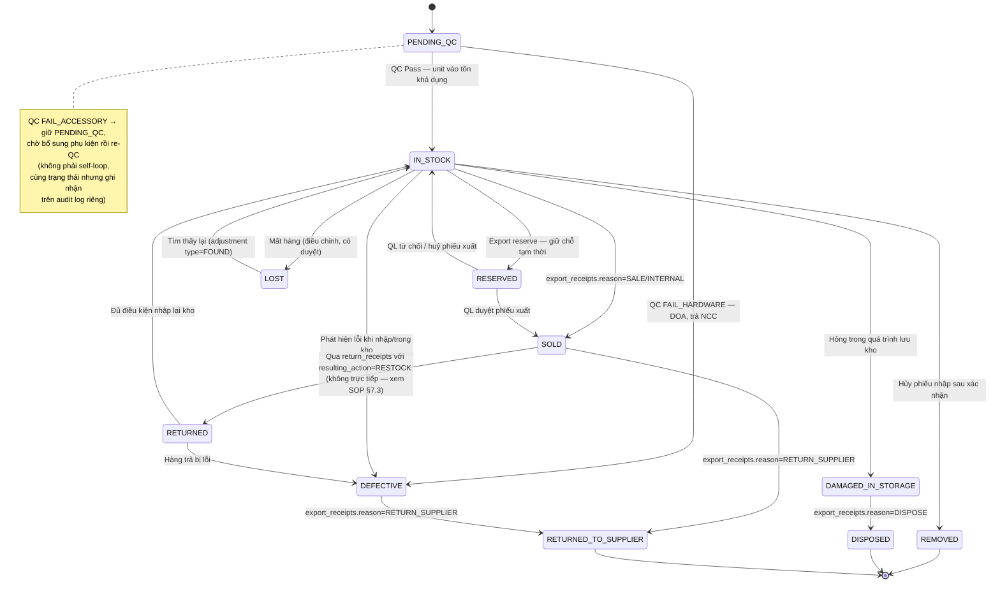

# Domain Model — Hệ thống Quản lý Kho Linh Kiện Máy Tính

---

## 1. Entity-Relationship Diagram

```mermaid
erDiagram
    %% ===== AUTH =====
    roles ||--o{ users : "has"
    users ||--o{ refresh_tokens : "has"
    users ||--o{ password_reset_tokens : "has"
    users ||--o{ import_receipts : "created_by"
    users ||--o{ import_receipts : "approved_by"
    users ||--o{ export_receipts : "created_by"
    users ||--o{ stock_checks : "created_by"
    users ||--o{ stock_checks : "approved_by"
    users ||--o{ stock_adjustments : "created_by"
    users ||--o{ stock_adjustments : "approved_by"
    users ||--o{ product_unit_status_logs : "changed_by"
    users ||--o{ export_receipts : "approved_by"
    users ||--o{ purchase_orders : "created_by"
    users ||--o{ return_receipts : "created_by"
    users ||--o{ return_receipts : "approved_by"
    users ||--o{ price_adjustments : "created_by"
    users ||--o{ price_adjustments : "approved_by"

    roles {
        bigint id PK
        varchar50 name UK "ADMIN | MANAGER | SALES | STOCK"
        int level "1=ADMIN | 2=MANAGER | 3=SALES/STOCK — dùng trong UserRoleSecurity.canUpdate() (hierarchical user mgmt), không dùng cho feature-level permissions"
        varchar255 description
        timestamp created_at
        timestamp updated_at
    }
    users {
        bigint id PK
        varchar100 username UK
        varchar255 full_name
        varchar255 email UK
        varchar255 password "bcrypt hash"
        bigint role_id FK
        varchar20 status "NEW | ACTIVE | INACTIVE"
        timestamp last_login
        int gender
        date date_of_birth
        varchar20 phone_number UK
        boolean is_password_reset
        boolean is_active "thay thế is_deleted — đảo logic"
        timestamp created_at
        timestamp updated_at
    }
    refresh_tokens {
        bigint id PK
        bigint user_id FK
        varchar255 token UK
        timestamp expiry_date
        timestamp created_at
    }
    password_reset_tokens {
        bigint id PK
        bigint user_id FK
        varchar255 token UK
        timestamp expiry_date
        boolean used
        timestamp created_at
    }

    %% ===== CATALOG =====
    brands ||--o{ products : "has"
    categories ||--o{ products : "has"
    categories ||--o{ category_zones : "zone_mapping"
    suppliers ||--o{ import_receipts : "supplies"

    brands {
        bigint id PK
        varchar100 name UK "ASUS | Gigabyte | Samsung..."
        text description
        boolean is_active
        timestamp created_at
        timestamp updated_at
    }
    categories {
        bigint id PK
        varchar100 name "CPU | RAM | GPU | Mainboard..."
        text description
        boolean is_active
        varchar20 qc_level "FULL | SAMPLING | SKIP — default FULL"
        timestamp created_at
        timestamp updated_at
    }
    %% category_zones: mapping tĩnh category → zone ưu tiên, dùng cho auto-assign location lúc QC pass.
    %% Giả định: 1 category → 1 zone_code chính (không hỗ trợ multi-zone ưu tiên ở phase này).
    category_zones {
        bigint id PK
        bigint category_id FK
        varchar10 zone_code "'A' | 'B' | 'C' | 'D' | 'E' — khớp locations.zone_code. 1 ký tự chữ hoa, quy ước A–E mặc định."
    }
    suppliers {
        bigint id PK
        varchar200 name
        varchar100 contact_person
        varchar20 phone
        varchar255 email
        text address
        varchar50 tax_code
        text note
        boolean is_active
        timestamp created_at
        timestamp updated_at
    }
    products ||--o{ product_images : "has"
    products ||--o{ product_units : "has"
    products ||--o{ import_receipt_items : "appears_in"
    products ||--o{ export_receipt_items : "appears_in"

    products {
        bigint id PK
        varchar255 name "'RTX 3060 ASUS Dual OC 12GB'"
        varchar100 sku UK
        varchar100 barcode UK "nullable — không phải SP nào cũng có barcode gốc"
        bigint brand_id FK
        bigint category_id FK
        text description
        varchar20 unit "PIECE | METER | BOX | SET | KG"
        varchar20 tracking_type "SERIALIZED | BULK"
        decimal15_2 sell_price
        int min_stock "warn threshold"
        boolean is_active
        timestamp created_at
        timestamp updated_at
    }
    product_images {
        bigint id PK
        bigint product_id FK
        varchar500 url "Cloudinary URL"
        boolean is_primary
        int sort_order
        timestamp created_at
    }
    products ||--o{ sell_price_history : "price_changes"
    sell_price_history {
        bigint id PK
        bigint product_id FK
        decimal15_2 old_price
        decimal15_2 new_price
        bigint changed_by FK
        timestamp changed_at
    }
    warehouses ||--o{ locations : "contains"
    locations ||--o{ product_units : "stores_at"

    warehouses {
        bigint id PK
        varchar255 name UK "'Kho chính'"
        varchar32 code UK "'MAIN' — unique, dùng cho API/import"
        text address "nullable — địa chỉ kho vật lý"
        boolean is_active "DEFAULT TRUE"
        timestamp created_at
        timestamp updated_at
    }
    locations {
        bigint id PK
        bigint warehouse_id FK "mặc định warehouse mặc định"
        varchar10 zone_code "'A' | 'B' | 'C' | 'D' | 'E' — quy ước A–E mặc định, mở rộng A–Z. 1 ký tự chữ hoa. Service layer khuyến nghị validate format."
        varchar10 shelf_code "'01' | '02' — nullable, optional khi nhập (chỉ bắt buộc zone_code)"
        varchar10 bin_code "'01A' — nullable, optional khi nhập (chỉ bắt buộc zone_code)"
        varchar50 full_code UK "'A-01-01A' — denormalized từ 3 cột trên"
        %% UNIQUE (zone_code, shelf_code, bin_code) — composite UK song song với full_code UK, tránh 2 record trùng vị trí vật lý nhưng full_code bị nhập lệch.
        varchar255 description
        boolean is_active
        int max_capacity "nullable — sức chứa tối đa (số đơn vị), NULL = không giới hạn. Validation mềm — xem §1.1 mục max_capacity"
        timestamp created_at
        timestamp updated_at
    }
    warehouses ||--o{ import_receipts : "stored_in"
    warehouses ||--o{ export_receipts : "from"
    warehouses ||--o{ stock_adjustments : "at"
    warehouses ||--o{ stock_checks : "at"
    customers ||--o{ export_receipts : "buys"
    customers {
        bigint id PK
        varchar200 name
        varchar20 phone
        varchar255 email
        text address
        text note
        boolean is_active
        timestamp created_at
        timestamp updated_at
    }

    %% ===== SYSTEM SETTINGS (ADMIN only) =====
    users ||--o{ system_settings : "updated_by"

    system_settings {
        varchar100 setting_key PK "tên cài đặt, snake_case — vd: 'product_max_images', 'dead_stock_threshold_days'"
        text setting_value "giá trị dạng JSON string — service layer tự parse"
        text description "giải thích ý nghĩa của setting"
        bigint updated_by FK "FK → users — chỉ ADMIN được phép sửa"
        timestamp updated_at
    }

    %% ===== PURCHASE ORDER =====
    suppliers ||--o{ purchase_orders : "places"
    purchase_orders ||--o{ purchase_order_items : "contains"
    purchase_orders ||--o{ import_receipts : "references"

    purchase_orders {
        bigint id PK
        varchar32 po_code UK "'PO-20260706-001'"
        bigint supplier_id FK
        decimal15_2 total_amount
        varchar20 status "DRAFT | PARTIAL | COMPLETED | CANCELLED"
        date expected_date
        text note
        bigint created_by FK
        timestamp created_at
        timestamp updated_at
    }
    purchase_order_items {
        bigint id PK
        bigint po_id FK
        bigint product_id FK
        decimal15_2 quantity "số lượng đặt"
        decimal15_2 unit_price "đơn giá dự kiến"
        decimal15_2 received_quantity "đã nhập — cập nhật tự động khi duyệt import receipt"
        timestamp created_at
    }

    %% ===== INVENTORY =====
    import_receipts ||--o{ import_receipt_items : "contains"
    import_receipt_items ||--o{ product_units : "produces"

    import_receipts {
        bigint id PK
        varchar50 receipt_code UK "'IMP-20260706-001'"
        bigint supplier_id FK
        bigint purchase_order_id FK "nullable — link PO nếu có"
        bigint warehouse_id FK
        decimal15_2 total_amount
        varchar20 status "PENDING | PENDING_APPROVAL | COMPLETED | CANCELLED"
        text note
        bigint created_by FK
        bigint approved_by FK "nullable — bắt buộc khác created_by; set khi status chuyển pending_approval→completed"
        timestamp created_at
        timestamp updated_at
    }
    import_receipt_items {
        bigint id PK
        bigint receipt_id FK
        bigint product_id FK
        decimal15_2 quantity "serialized: integer, bulk: decimal"
        decimal15_2 unit_price
        int warranty_months
        varchar100 supplier_batch_no "nullable — mã lô NCC"
        timestamp created_at
    }
    export_receipts ||--o{ export_receipt_items : "contains"

    export_receipts {
        bigint id PK
        varchar50 receipt_code UK "'EXP-20260706-001'"
        bigint customer_id FK "nullable — CHỈ bắt buộc khi reason='sale'; internal/return_supplier/dispose không có khách hàng thật"
        bigint warehouse_id FK
        decimal15_2 total_amount
        decimal15_2 total_cogs "tổng cost_price của unit thực xuất"
        varchar20 status "PENDING_APPROVAL | COMPLETED | CANCELLED | EXCEPTION"
        varchar50 reason "SALE | INTERNAL | RETURN_SUPPLIER | DISPOSE"
        bigint source_import_receipt_id FK "nullable — chỉ dùng cho reason=return_supplier"
        varchar30 supplier_status "nullable — SENT | CONFIRMED_RECEIVED | PROCESSING | RESOLVED; chỉ dùng cho reason=return_supplier"
        varchar30 supplier_result "nullable — FULL_REFUND | PARTIAL_REFUND | REPLACEMENT | REJECTED; set khi supplier_status=RESOLVED"
        timestamp supplier_status_updated_at "nullable"
        text note
        bigint created_by FK
        bigint approved_by FK "nullable — cùng nguyên tắc 4-eyes với import_receipts (ADR 7.9); bắt buộc khác created_by nếu status=completed"
        timestamp created_at
        timestamp updated_at
    }
    %% export_receipts là NGUỒN DUY NHẤT kích hoạt các transition sau trên product_units (không có đường tắt nào khác):
    %%   - reason='SALE'            -> product_units.status: IN_STOCK -> SOLD
    %%   - reason='INTERNAL'        -> product_units.status: IN_STOCK -> SOLD
    %%   - reason='RETURN_SUPPLIER' -> product_units.status: SOLD -> RETURNED_TO_SUPPLIER
    %%   - reason='DISPOSE'         -> product_units.status: DAMAGED_IN_STORAGE -> DISPOSED
    %% export_receipts đã thêm approved_by — đồng bộ 4-eyes với import_receipts/stock_checks/stock_adjustments.
    export_receipt_items ||--o{ export_receipt_item_units : "tracks"
    export_receipt_items {
        bigint id PK
        bigint receipt_id FK
        bigint product_id FK
        decimal15_2 quantity "serialized: integer, bulk: decimal"
        decimal15_2 unit_price
        timestamp created_at
    }
    product_units ||--o{ export_receipt_item_units : "sold_as"
    product_units ||--o{ stock_check_items : "checked_in"
    product_units ||--o{ product_unit_status_logs : "history"

    product_units {
        bigint id PK
        varchar100 serial_number UK "serial hoặc lot number cho bulk"
        bigint product_id FK
        varchar20 tracking_type "SERIALIZED | BULK — copy từ products.tracking_type tại thời điểm tạo unit, phòng khi product đổi tracking_type sau này (giữ nguyên lịch sử của lô hàng đã nhập)"
        decimal15_2 initial_quantity "bulk only: qty nhập"
        decimal15_2 remaining_quantity "bulk only: qty còn lại"
        bigint import_receipt_item_id FK
        bigint location_id FK
        varchar30 status "PENDING_QC|IN_STOCK|RESERVED|SOLD|DEFECTIVE|DAMAGED_IN_STORAGE|LOST|UNDER_REPAIR|SENT_TO_MANUFACTURER|RETURNED|RETURNED_TO_SUPPLIER|REMOVED|DISPOSED"
        timestamp imported_at "FIFO milestone"
        int warranty_months "copy từ import_receipt_items tại thời điểm nhập — cố ý duplicate để giữ nguyên chính sách BH gốc dù products/import sau này đổi"
        date warranty_start_date "activated on sale"
        date warranty_expires_at
        decimal15_2 cost_price "snapshot từ import_receipt_item.unit_price tại thời điểm nhập"
        boolean is_warranty_active DEFAULT TRUE
        varchar50 warranty_seal_code "nullable — mã tem bảo hành do shop/NPP cấp"
        decimal15_2 reserved_quantity DEFAULT 0 "bulk only: số lượng đang reserve chờ duyệt"
        timestamp created_at
    }
    export_receipt_item_units {
        bigint id PK
        bigint export_receipt_item_id FK
        bigint product_unit_id FK
        decimal15_2 quantity "serialized: 1, bulk: partial qty"
        decimal15_2 sell_price
        timestamp created_at
    }

    %% ===== PRICE ADJUSTMENT =====
    import_receipt_items ||--o{ price_adjustments : "adjusted_by"
    price_adjustments {
        bigint id PK
        bigint import_receipt_item_id FK
        decimal15_2 old_unit_price
        decimal15_2 new_unit_price
        text reason
        varchar30 status "PENDING_APPROVAL | APPROVED | REJECTED"
        bigint created_by FK
        bigint approved_by FK "nullable"
        text approval_note
        timestamp created_at
        timestamp updated_at
    }

    %% ===== RETURN =====
    export_receipts ||--o{ return_receipts : "original"
    customers ||--o{ return_receipts : "returns"
    return_receipts ||--o{ return_receipt_items : "contains"
    product_units ||--o{ return_receipt_items : "returned"
    return_receipts {
        bigint id PK
        varchar32 receipt_code UK
        bigint customer_id FK
        bigint original_export_receipt_id FK
        varchar20 reason "CHANGE_MIND | DEFECTIVE | WRONG_ITEM"
        varchar20 status "PENDING_APPROVAL | COMPLETED | CANCELLED"
        bigint created_by FK
        bigint approved_by FK "nullable"
        timestamp created_at
        timestamp approved_at
    }
    return_receipt_items {
        bigint id PK
        bigint return_receipt_id FK
        bigint product_unit_id FK "nullable — NULL nếu bulk"
        decimal15_2 quantity "cho bulk"
        varchar20 condition "GOOD | DEFECTIVE"
        varchar20 resulting_action "RESTOCK | SCRAP"
    }

    product_unit_status_logs {
        bigint id PK
        bigint product_unit_id FK
        varchar30 from_status
        varchar30 to_status "NULL nếu là bản ghi tạo mới (in_stock ban đầu)"
        varchar30 source_type "IMPORT_RECEIPT | EXPORT_RECEIPT | STOCK_ADJUSTMENT | STOCK_CHECK | RELOCATE"
        bigint source_id "id của record gây ra thay đổi (polymorphic, không đặt FK cứng)"
        bigint changed_by FK "user thực hiện thao tác"
        timestamp created_at
    }
    users ||--o{ audit_logs : "user_id"

    audit_logs {
        bigint id PK
        bigint user_id FK "người thực hiện hành động"
        varchar100 username "denormalized — giữ lại khi user bị xoá"
        varchar45 ip_address
        varchar36 request_id
        varchar100 action "IMPORT_RECEIPT_CREATED | EXPORT_RECEIPT_APPROVED | ..."
        varchar100 entity_name "ImportReceipt | ExportReceipt | ProductUnit | ..."
        varchar100 entity_id
        json old_value
        json new_value
        varchar20 status "SUCCESS | FAILED"
        text error_msg
        timestamp created_at
    }
    %% Đã tạo ở migration V2. Schema này khớp 03-known-issues-tech-debt.md §7.2.

    %% ===== STOCK CHECK =====
    stock_checks ||--o{ stock_check_items : "has"

    stock_checks {
        bigint id PK
        varchar50 check_code UK "'SC-20260706-001'"
        bigint warehouse_id FK
        varchar20 status "PENDING | IN_PROGRESS | COMPLETED | APPROVED | REJECTED"
        text note
        bigint created_by FK
        bigint approved_by FK "nullable — bắt buộc khác created_by, cùng nguyên tắc với import_receipts (ADR 7.9)"
        text approval_note
        timestamp created_at
        timestamp updated_at
    }
    warehouses ||--o{ stock_check_schedules : "schedules"
    stock_check_schedules {
        bigint id PK
        bigint warehouse_id FK
        varchar10 zone_code "'A' | 'B' | 'C' — NULL nếu toàn kho"
        varchar50 frequency "DAILY | WEEKLY | MONTHLY | QUARTERLY"
        date next_run_date
        boolean is_active DEFAULT TRUE
        bigint created_by FK
        timestamp created_at
        timestamp updated_at
    }
    %% Thứ tự trạng thái dự kiến (chưa có state machine riêng như product_units):
    %% pending -> in_progress (đang đếm) -> completed (đã đếm xong, chờ duyệt) -> approved | rejected
    stock_check_items {
        bigint id PK
        bigint stock_check_id FK
        bigint product_unit_id FK
        varchar30 expected_status
        varchar30 actual_status
        decimal15_2 counted_quantity "CHỈ dùng cho bulk — số lượng đếm thực tế của lot, so với remaining_quantity kỳ vọng; NULL với serialized"
        varchar50 difference "MATCH | MISSING | UNEXPECTED | PARTIAL_SHORTAGE"
        text note
    }
    product_units ||--o{ stock_adjustments : "adjusted_as_unit"
    products ||--o{ stock_adjustments : "adjusted_as_product"

    stock_adjustments {
        bigint id PK
        varchar50 adjust_code UK "'ADJ-20260706-001'"
        bigint warehouse_id FK
        varchar30 type "DAMAGED | LOST | FOUND"
        bigint product_unit_id FK "BẮT BUỘC với serialized và với bulk (chọn đúng lot cần trừ/cộng remaining_quantity)"
        bigint product_id FK "dùng khi FOUND phát hiện hàng thừa nhưng chưa rõ serial cụ thể (product_unit_id NULL) — xem SOP §5.1 và US-21/RQ-36"
        decimal15_2 quantity "chỉ có giá trị khi product_unit_id NULL — xem ghi chú product_id ở trên"
        text reason
        varchar20 status "PENDING | APPROVED | REJECTED"
        bigint created_by FK
        bigint approved_by FK "nullable — bắt buộc khác created_by, cùng nguyên tắc với import_receipts (ADR 7.9)"
        text approval_note
        timestamp created_at
        timestamp updated_at
    }

### 1.1 Ánh xạ kho vật lý → Locations

#### Vấn đề: "Tạo vô hạn location"

Model cho phép tạo không giới hạn `zone_code`/`shelf_code`/`bin_code`. Nếu không có quy ước, người dùng có thể tạo 50 zone trong khi kho thật chỉ có 3 dãy — dữ liệu trở nên vô nghĩa.

**Giải pháp:** Không phải DB constraint — áp business rules tại Service layer.

#### Zone convention (quy ước đặt tên zone)

Zone code là **1 ký tự chữ hoa A–Z**. Khuyến nghị mapping theo mặt bằng thực tế:

| Zone | Loại hàng | Vị trí kho lý tưởng | Ghi chú |
|------|-----------|-------------------|---------|
| A | CPU, RAM — giá trị cao, kích thước nhỏ | Gần quầy thu ngân, có tủ khóa | Dễ kiểm soát mất cắp |
| B | Mainboard, VGA — kích thước lớn, giá trị cao | Kệ giữa kho, tầm mắt | Cần ESD handling |
| C | Ổ cứng, PSU — kích thước vừa | Kệ giữa-dưới | |
| D | Phụ kiện (cáp, quạt, tản nhiệt) — giá trị thấp | Kệ cuối kho, có thể không chia bin | Thường mua bulk |
| E | Hàng lỗi/hỏng chờ xử lý (defective, chờ trả NCC) | Khu vực riêng biệt | Cách ly khỏi hàng tốt |

> Service layer **không chặn** zone A-Z, nhưng UI dropdown chỉ hiển thị A–E làm gợi ý. QL vẫn có thể nhập tay nếu cần mở rộng.

Nếu sau này kho mở rộng >26 zone, cần nâng cấp lên zone code 2 ký tự — chưa làm ở phase 1.

#### Shelf & Bin convention

| Cấp | Format | Bắt buộc? | Ví dụ |
|-----|--------|-----------|-------|
| `zone_code` | 1 chữ hoa `A-Z` | ✅ Luôn bắt buộc | `A` |
| `shelf_code` | 2 số `00-99` | ❌ Có thể NULL | `01` |
| `bin_code` | 3 ký tự `000-ZZZ` | ❌ Có thể NULL | `01A` |

Khi nào cho NULL?
- **Chỉ có zone, không chia shelf/bin:** kho nhỏ, 1 zone chỉ có 1 kệ dài. VD: Zone D (phụ kiện) — 1 kệ, không cần chia. Khi nhập, chọn `Zone D` là đủ.
- **Có zone + shelf, không có bin:** 1 kệ không ngăn riêng. VD: Zone C có shelf 01, nhưng các hộp linh kiện xếp chung, không thể gán bin. Khi nhập, chọn `C-01`.
- **Đầy đủ zone + shelf + bin:** kho chuẩn, mỗi ô riêng.

#### `full_code` sinh thế nào

| Tình huống | `full_code` |
|-----------|-------------|
| Chỉ zone | `A` |
| Zone + shelf | `A-01` |
| Zone + shelf + bin | `A-01-01A` |

Công thức: `trim(zone_code) + if(shelf_code != null) then '-' + shelf_code else '' + if(bin_code != null) then '-' + bin_code else ''`

#### `max_capacity` tính bằng gì?

- **Serialized:** số lượng `ProductUnit` tối đa chứa được. VD: 1 bin chứa tối đa 50 hộp RAM → `max_capacity = 50`.
- **Bulk:** số lượng lot tối đa, **không phải** số mét/kg. VD: 1 zone có thể chứa 10 cuộn cáp (10 lot) → `max_capacity = 10`.
- `max_capacity` NULL = không giới hạn. Validation là **mềm** — vượt vẫn cho nhập nhưng warning.

#### Ví dụ layout kho 100m²

```
KHO LINH KIỆN (100m²) — mặt bằng nhìn từ trên xuống
← Cửa vào

┌──────────────────────────────────────────────────────┐
│  KHU NHẬN HÀNG          │  ZONE A (CPU/RAM)          │
│  (không có location)    │  ┌──────┬──────┬──────┐   │
│                         │  │A-001 │A-002 │A-003 │   │
│  Bàn nhập + QC          │  │50 cái│50 cái│50 cái│   │
│                         │  └──────┴──────┴──────┘   │
├─────────────────────────┼────────────────────────────┤
│  ZONE B (MB/VGA)        │  ZONE C (HDD/PSU)          │
│  ┌────────┬────────┐   │  ┌────────┬────────┐      │
│  │B-01    │B-02    │   │  │C-01    │C-02    │      │
│  │shelf:30│shelf:30│   │  │shelf:40│shelf:40│      │
│  └────────┴────────┘   │  └────────┴────────┘      │
├─────────────────────────┴────────────────────────────┤
│  ZONE D (cáp/phụ kiện) — 1 kệ dài, không chia bin  │
│  ┌──────────────────────────────────────────────┐   │
│  │ D-01 (20 lot)                                │   │
│  └──────────────────────────────────────────────┘   │
├─────────────────────────────────────────────────────┤
│  ZONE E (hàng lỗi/defective)                        │
│  ┌──────────────────────────────────────────────┐   │
│  │ E-01 — chờ xử lý (không giới hạn)            │   │
│  └──────────────────────────────────────────────┘   │
└─────────────────────────────────────────────────────┘
                        → Cửa sau (giao hàng)
```

#### Validation khuyến nghị (Service layer)

| Rule | Mô tả |
|------|-------|
| Zone code `A-Z` | Chỉ 1 ký tự chữ hoa. Không số, không ký tự đặc biệt. |
| Shelf code `NN` | 2 số. NULL được. |
| Bin code `NNN` | 3 ký tự (số/chữ hoa). NULL được. |
| `full_code` unique | DB đã enforce. |
| Không vô hiệu hoá location có hàng | Service check trước khi `is_active = false`. |
| Location phải mapping category | Gợi ý: mỗi location nên có ít nhất 1 `category_zones` mapping. Nếu không, cảnh báo khi tạo location (không chặn cứng). |

#### Quy trình tạo locations lần đầu

QL làm theo thứ tự:
1. Xác định mặt bằng kho thật → vẽ sơ đồ zone (A, B, C, D, E).
2. Trong mỗi zone, đếm shelf, bin.
3. Ghi nhận `max_capacity` từng bin.
4. Vào hệ thống → tạo locations theo thứ tự: tất cả zone trước → shelf/bin sau.

> **Không cho phép** tạo location có shelf_code nhưng chưa tạo zone_code tương ứng. Service kiểm tra zone tồn tại trước.

---

## 2. State Machine — Trạng thái `product_units`



**Quy tắc chuyển trạng thái:**
| Từ | Sang | Điều kiện/Kích hoạt |
|---|---|---|
| `PENDING_QC` | `IN_STOCK` | QC Pass — unit đủ điều kiện nhập kho, chuyển vào tồn khả dụng (SOP §2.2 B3) |
| `PENDING_QC` | `DEFECTIVE` | QC FAIL_HARDWARE — lỗi phần cứng thật, chuyển DEFECTIVE ngay, ghi chú "DOA - phát hiện lúc nhập", đi nhánh trả NCC nhanh (SOP §2.2 B3) |
| `PENDING_QC` | (giữ nguyên) | QC FAIL_ACCESSORY — thiếu phụ kiện, không chuyển status (vẫn `PENDING_QC`), ghi chú thiếu gì, chờ bổ sung rồi re-QC. Ghi audit log riêng cho lần QC này (SOP §2.2 B3) |
| `IN_STOCK` | `RESERVED` | Reserve transaction ngắn — `SELECT ... FOR UPDATE`, đổi status, commit ngay. Phiếu xuất chuyển `PENDING_APPROVAL` (SOP §3.2 B3) |
| `IN_STOCK` | `SOLD` | Tạo `export_receipts` với `reason='SALE'` hoặc `'INTERNAL'` |
| `IN_STOCK` | `DEFECTIVE` | Phát hiện lỗi khi nhập hoặc trong kho |
| `IN_STOCK` | `DAMAGED_IN_STORAGE` | Hỏng trong quá trình lưu kho (điều chỉnh) |
| `IN_STOCK` | `LOST` | Mất hàng (điều chỉnh tồn, có duyệt) |
| `IN_STOCK` | `REMOVED` | Hủy phiếu nhập sau khi đã xác nhận (unit chưa từng xuất kho — xem điều kiện chi tiết bên dưới) |
| `RESERVED` | `SOLD` | QL duyệt phiếu xuất |
| `RESERVED` | `IN_STOCK` | QL từ chối / hủy phiếu xuất — giải phóng reserve |
| `SOLD` | `RETURNED` | Trả hàng |
| `SOLD` | `RETURNED_TO_SUPPLIER` | `export_receipts.reason = 'RETURN_SUPPLIER'` |
| `DEFECTIVE` | `RETURNED_TO_SUPPLIER` | `export_receipts.reason = 'RETURN_SUPPLIER'` |
| `RETURNED` | `IN_STOCK` | Hàng trả đủ điều kiện nhập lại kho |
| `RETURNED` | `DEFECTIVE` | Hàng trả bị lỗi |
| `LOST` | `IN_STOCK` | Tìm lại được hàng đã báo mất — qua `stock_adjustments` với `type='FOUND'` |
| `DAMAGED_IN_STORAGE` | `DISPOSED` | Tạo `export_receipts` với `reason='DISPOSE'` — xác nhận hàng hỏng trong kho không thể sửa/trả NCC, thanh lý nội bộ |

> **`REMOVED`, `DISPOSED`, `RETURNED_TO_SUPPLIER` là state cuối (terminal)** — không có transition đi ra.
> - `REMOVED` ≠ `DISPOSED`: `REMOVED` chỉ dành cho **hủy phiếu nhập** (unit chưa từng rời `IN_STOCK`); `DISPOSED` chỉ dành cho **thanh lý hàng hỏng đã xác nhận trong kho** (luôn đi qua `export_receipts`, có phiếu, có thể tính giá vốn hao hụt). Hai state này **không dùng thay thế cho nhau**.
> - Nếu hủy phiếu nhập bị nhấn nhầm, giải pháp là tạo lại phiếu nhập mới, **không** revert `REMOVED → IN_STOCK`, để giữ tính một chiều của hành động hủy và không phá vỡ audit trail (xem `product_unit_status_logs` ở mục 1).
> - **Điều kiện `IN_STOCK → REMOVED` hoặc `PENDING_QC → REMOVED` (đầy đủ)**: chỉ cho phép hủy phiếu nhập khi **toàn bộ** `product_units` sinh ra từ phiếu đó đang ở `IN_STOCK` (chưa xuất) **hoặc** `PENDING_QC` (FAIL_ACCESSORY chưa xử lý xong): (a) `SERIALIZED` — chưa từng xuất hiện trong `export_receipt_item_units`; (b) `BULK` — `remaining_quantity = initial_quantity` (chưa bị xuất dù chỉ một phần). Nếu phiếu nhập có unit đã rời một trong hai trạng thái này (dù chỉ 1 trong 50), **không cho hủy phiếu** — chỉ có thể xử lý riêng lẻ những unit còn `IN_STOCK`/`PENDING_QC` qua `stock_adjustments`, giữ nguyên phiếu nhập gốc ở trạng thái `COMPLETED`.

> `PENDING_QC`, `RESERVED`, `REMOVED`, `DISPOSED`, `DEFECTIVE`, `LOST`, `DAMAGED_IN_STORAGE`, `SENT_TO_MANUFACTURER`, `UNDER_REPAIR`, `RETURNED`, `RETURNED_TO_SUPPLIER` **không tính vào tồn kho khả dụng** — loại trừ khỏi công thức COUNT/SUM bên dưới, chỉ `IN_STOCK` được tính.

> Tồn kho hiện tại của 1 sản phẩm:
>
> - `SERIALIZED`: COUNT `product_units` WHERE `product_id = ?` AND `status = 'IN_STOCK'`
> - `BULK`: SUM `remaining_quantity` của các `product_units` WHERE `product_id = ?` AND `status = 'IN_STOCK'`
>   Nếu query chậm (hàng nghìn serial), thêm cột denormalized `stock_count` trên `products` và cập nhật trigger khi nhập/xuất.
>
> **Quy tắc chuyển status cho `BULK`**: một `product_unit` (lot) dạng bulk giữ status `IN_STOCK` xuyên suốt kể cả khi bị xuất một phần; chỉ chuyển sang `SOLD` khi `remaining_quantity` giảm về đúng `0`. Điều này cần được Service layer đảm bảo mỗi lần trừ `remaining_quantity` trong export/adjustment (kiểm tra `remaining_quantity <= 0` sau khi trừ → set `status='SOLD'`), nếu không tồn kho `BULK` sẽ tính sai vì unit đã hết hàng nhưng vẫn còn `status='IN_STOCK'`.
>
> **Khi bulk unit rời `IN_STOCK` vì DAMAGED/LOST/DEFECTIVE/REMOVED:** `remaining_quantity` phải được set về `0` tại thời điểm chuyển status. Service layer cần enforce: trước khi set `status ≠ IN_STOCK` trên bulk unit, set `remaining_quantity = 0`. Nếu không, SUM tồn kho bulk sẽ sai vì vẫn cộng dồn quantity từ unit đã không còn `IN_STOCK`.

### 2.2 State Machine — PurchaseOrder

```
DRAFT → PARTIAL       : nhập lần đầu (có import receipt link)
PARTIAL → PARTIAL     : nhập thêm lần nữa
PARTIAL → COMPLETED   : tổng received = ordered
DRAFT/PARTIAL → CANCELLED : hủy toàn bộ
```

- `DRAFT`: chưa có phiếu nhập nào link tới.
- `PARTIAL`: đã nhận một phần (`received_quantity < quantity` ở ít nhất 1 dòng).
- `COMPLETED`: tất cả dòng đã nhận đủ.
- `CANCELLED`: không cho hủy nếu đã có phiếu nhập `COMPLETED` liên kết (xem US-47, `04-requirements-traceability.md`).

---

## 3. Quyết định kiến trúc

| Vấn đề                  | Quyết định                                                                                                                                                                                                                                 |
| ----------------------- | ------------------------------------------------------------------------------------------------------------------------------------------------------------------------------------------------------------------------------------------ |
| Quản lý tồn kho         | ✅ **Theo serial number** — mỗi sản phẩm vật lý có mã riêng (bảng `product_units`), phục vụ truy vết & bảo hành chi tiết                                                                                                                   |
| Xuất kho                | ✅ **FIFO tự động** — hệ thống tự chọn các `product_units` có `imported_at` sớm nhất để xuất, không cần nhân viên chọn thủ công                                                                                                            |
| Phạm vi kho             | ✅ **1 kho duy nhất ở giai đoạn đầu**, nhưng vẫn thiết kế sẵn `warehouse_id` để mở rộng sau — xem `02-sop-nghiep-vu.md` §9.1                                                                                                                                                                        |
| Quản lý vị trí kho      | ✅ **Location-based** — mỗi `product_unit` gán 1 vị trí (`location_id`). Khi nhập: chọn vị trí. Khi xuất: FIFO trong cùng vị trí hoặc lấy gần nhau nhất                                                                                    |
| Điều chỉnh tồn thủ công | ✅ Hỗ trợ 3 loại: `DAMAGED`, `LOST`, `FOUND` — tất cả đều cần duyệt + lý do + audit log                                                                                                                                                    |
| Ảnh sản phẩm            | ✅ **Nhiều ảnh / sản phẩm (gallery)** — tối đa 5 ảnh, đánh dấu 1 ảnh `is_primary` làm ảnh đại diện                                                                                                                                         |
| Đơn vị tính (UOM)       | ✅ Hỗ trợ: `PIECE`, `METER`, `BOX`, `SET`, `KG` — mặc định `PIECE`                                                                                                                                                                         |
| Tracking type           | ✅ **`SERIALIZED`** (mỗi đơn vị có serial riêng, tồn = COUNT) hoặc **`BULK`** (tồn = SUM remaining_quantity, dùng cho meter/kg). Mapping bắt buộc: `PIECE`/`BOX`/`SET` → SERIALIZED; `METER`/`KG` → BULK. Nếu sai → reject ở Service layer |
| Tồn âm                  | ✅ **Không cho phép** — SERIALIZED luôn chặn cứng (không có setting); BULK chặn cứng ở phase 1, có thể mở ở phase sau qua `system_settings` nếu cần                                                                                      |
| Kiểm kê lệch            | ✅ Chỉ Quản lý kho/Admin mới duyệt được, **bắt buộc nhập lý do**                                                                                                                                                                           |

> **Lưu ý kỹ thuật về FIFO + serial**: vì xuất kho tự động chọn theo `imported_at` sớm nhất, cần đảm bảo:
>
> - Cột `imported_at` trên `product_units` được set chính xác tại thời điểm tạo phiếu nhập (không phải lúc tạo record).
> - Khi tạo phiếu xuất, query `product_units` theo `product_id`, trạng thái `IN_STOCK`, `ORDER BY imported_at ASC LIMIT n`, sau đó cập nhật trạng thái sang `SOLD` trong cùng transaction để tránh race condition khi nhiều phiếu xuất tạo đồng thời (nên dùng `SELECT ... FOR UPDATE` hoặc optimistic locking).
> - Vì nhập 1 sản phẩm có thể tạo ra nhiều `product_units` cùng lúc (vd nhập 50 RAM), cần sinh 50 serial — serial có thể do nhà sản xuất cung cấp (nhập tay/import file) hoặc hệ thống tự sinh mã nội bộ nếu sản phẩm không có serial gốc (linh kiện rời, phụ kiện...).