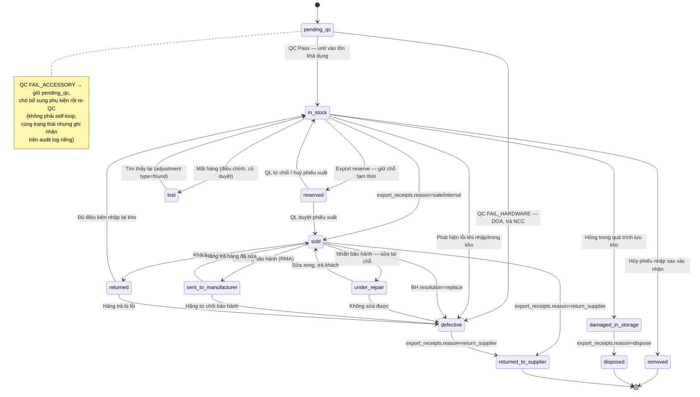

# Domain Model — Hệ thống Quản lý Kho Linh Kiện Máy Tính

> Gộp từ: `01-entity-model.md`, `07-warehouse-flow.md` (các file này đã bị xóa sau khi gộp — xem git history nếu cần tra lại quá trình phân tích gốc).

---

## 1. Entity-Relationship Diagram

```mermaid
erDiagram
    %% ===== AUTH =====
    roles ||--o{ users : "has"
    users ||--o{ refresh_tokens : "has"
    users ||--o{ password_reset_tokens : "has"
    users ||--o{ import_receipts : "created_by"
    users ||--o{ import_receipts : "approved_by"
    users ||--o{ export_receipts : "created_by"
    users ||--o{ stock_checks : "created_by"
    users ||--o{ stock_checks : "approved_by"
    users ||--o{ stock_adjustments : "created_by"
    users ||--o{ stock_adjustments : "approved_by"
    users ||--o{ warranty_requests : "handled_by"
    users ||--o{ product_unit_status_logs : "changed_by"

    roles {
        bigint id PK
        varchar50 name UK "ADMIN | MANAGER | SALES | STOCK"
        int level "1=ADMIN | 2=MANAGER | 3=SALES/STOCK — dùng trong UserRoleSecurity.canUpdate() (hierarchical user mgmt), không dùng cho feature-level permissions"
        varchar255 description
        timestamp created_at
        timestamp updated_at
    }
    users {
        bigint id PK
        varchar100 username UK
        varchar255 full_name
        varchar255 email UK
        varchar255 password "bcrypt hash"
        bigint role_id FK
        varchar20 status "NEW | ACTIVE | INACTIVE"
        timestamp last_login
        int gender
        date date_of_birth
        varchar20 phone_number UK
        boolean is_password_reset
        boolean is_active "thay thế is_deleted — đảo logic"
        timestamp created_at
        timestamp updated_at
    }
    refresh_tokens {
        bigint id PK
        bigint user_id FK
        varchar255 token UK
        timestamp expiry_date
        timestamp created_at
    }
    password_reset_tokens {
        bigint id PK
        bigint user_id FK
        varchar255 token UK
        timestamp expiry_date
        boolean used
        timestamp created_at
    }

    %% ===== CATALOG =====
    brands ||--o{ products : "has"
    categories ||--o{ products : "has"
    categories ||--o{ category_zones : "zone_mapping"
    suppliers ||--o{ import_receipts : "supplies"

    brands {
        bigint id PK
        varchar100 name UK "ASUS | Gigabyte | Samsung..."
        text description
        boolean is_active
        timestamp created_at
        timestamp updated_at
    }
    categories {
        bigint id PK
        varchar100 name "CPU | RAM | GPU | Mainboard..."
        text description
        boolean is_active
        timestamp created_at
        timestamp updated_at
    }
    %% category_zones: mapping tĩnh category → zone ưu tiên, dùng cho auto-assign location lúc QC pass.
    %% Giả định: 1 category → 1 zone_code chính (không hỗ trợ multi-zone ưu tiên ở phase này).
    category_zones {
        bigint id PK
        bigint category_id FK
        varchar10 zone_code "'A' | 'B' | 'C' — khớp locations.zone_code"
    }
    suppliers {
        bigint id PK
        varchar200 name
        varchar100 contact_person
        varchar20 phone
        varchar255 email
        text address
        varchar50 tax_code
        text note
        boolean is_active
        timestamp created_at
        timestamp updated_at
    }
    products ||--o{ product_images : "has"
    products ||--o{ product_units : "has"
    products ||--o{ import_receipt_items : "appears_in"
    products ||--o{ export_receipt_items : "appears_in"

    products {
        bigint id PK
        varchar255 name "'RTX 3060 ASUS Dual OC 12GB'"
        varchar100 sku UK
        varchar100 barcode UK "nullable — không phải SP nào cũng có barcode gốc"
        bigint brand_id FK
        bigint category_id FK
        text description
        varchar20 unit "piece | meter | box | set | kg"
        varchar20 tracking_type "serialized | bulk"
        decimal15_2 sell_price
        int min_stock "warn threshold"
        boolean is_active
        timestamp created_at
        timestamp updated_at
    }
    product_images {
        bigint id PK
        bigint product_id FK
        varchar500 url "Cloudinary URL"
        boolean is_primary
        int sort_order
        timestamp created_at
    }
    products ||--o{ sell_price_history : "price_changes"
    sell_price_history {
        bigint id PK
        bigint product_id FK
        decimal15_2 old_price
        decimal15_2 new_price
        bigint changed_by FK
        timestamp changed_at
    }
    warehouses ||--o{ locations : "contains"
    locations ||--o{ product_units : "stores_at"

    warehouses {
        bigint id PK
        varchar255 name UK "'Kho chính'"
        timestamp created_at
        timestamp updated_at
    }
    locations {
        bigint id PK
        bigint warehouse_id FK "mặc định warehouse mặc định"
        varchar10 zone_code "'A' | 'B' | 'C'"
        varchar10 shelf_code "'01' | '02'"
        varchar10 bin_code "'01A'"
        varchar50 full_code UK "'A-01-01A' — denormalized từ 3 cột trên"
        varchar255 description
        boolean is_active
        decimal15_2 max_capacity "nullable — sức chứa tối đa (số đơn vị), NULL = không giới hạn. Validation mềm khi vượt, không chặn cứng (theo SOP §2.2 B4 và UX §1.1)"
        timestamp created_at
        timestamp updated_at
    }
    %% Lưu ý: cần thêm UNIQUE constraint tổ hợp (zone_code, shelf_code, bin_code)
    %% song song với full_code UK, tránh 2 record trùng vị trí vật lý nhưng full_code bị nhập lệch.
    warehouses ||--o{ import_receipts : "stored_in"
    warehouses ||--o{ export_receipts : "from"
    warehouses ||--o{ stock_adjustments : "at"
    warehouses ||--o{ stock_checks : "at"
    customers ||--o{ export_receipts : "buys"
    customers ||--o{ warranty_requests : "requests"

    customers {
        bigint id PK
        varchar200 name
        varchar20 phone
        varchar255 email
        text address
        text note
        boolean is_active
        timestamp created_at
        timestamp updated_at
    }

    %% ===== PURCHASE ORDER =====
    suppliers ||--o{ purchase_orders : "places"
    purchase_orders ||--o{ purchase_order_items : "contains"
    purchase_orders ||--o{ import_receipts : "references"

    purchase_orders {
        bigint id PK
        varchar32 po_code UK "'PO-20260706-001'"
        bigint supplier_id FK
        decimal15_2 total_amount
        varchar20 status "DRAFT | PARTIAL | COMPLETED | CANCELLED"
        date expected_date
        text note
        bigint created_by FK
        timestamp created_at
        timestamp updated_at
    }
    purchase_order_items {
        bigint id PK
        bigint po_id FK
        bigint product_id FK
        decimal15_2 quantity "số lượng đặt"
        decimal15_2 unit_price "đơn giá dự kiến"
        decimal15_2 received_quantity "đã nhập — cập nhật tự động khi duyệt import receipt"
        timestamp created_at
    }

    %% ===== INVENTORY =====
    import_receipts ||--o{ import_receipt_items : "contains"
    import_receipt_items ||--o{ product_units : "produces"

    import_receipts {
        bigint id PK
        varchar50 receipt_code UK "'IMP-20260706-001'"
        bigint supplier_id FK
        bigint purchase_order_id FK "nullable — link PO nếu có"
        bigint warehouse_id FK
        decimal15_2 total_amount
        varchar20 status "pending | pending_approval | completed | cancelled"
        text note
        bigint created_by FK
        bigint approved_by FK "nullable — bắt buộc khác created_by; set khi status chuyển pending_approval→completed"
        timestamp created_at
        timestamp updated_at
    }
    import_receipt_items {
        bigint id PK
        bigint receipt_id FK
        bigint product_id FK
        decimal15_2 quantity "serialized: integer, bulk: decimal"
        decimal15_2 unit_price
        int warranty_months
        varchar100 supplier_batch_no "nullable — mã lô NCC"
        timestamp created_at
    }
    export_receipts ||--o{ export_receipt_items : "contains"

    export_receipts {
        bigint id PK
        varchar50 receipt_code UK "'EXP-20260706-001'"
        bigint customer_id FK "nullable — CHỈ bắt buộc khi reason='sale'; internal/return_supplier/dispose không có khách hàng thật"
        bigint warehouse_id FK
        decimal15_2 total_amount
        decimal15_2 total_cogs "tổng cost_price của unit thực xuất"
        varchar20 status "pending | pending_approval | completed | cancelled"
        varchar50 reason "sale | internal | return_supplier | dispose"
        bigint source_import_receipt_id FK "nullable — chỉ dùng cho reason=return_supplier"
        text note
        bigint created_by FK
        bigint approved_by FK "nullable — cùng nguyên tắc 4-eyes với import_receipts (ADR 7.9); bắt buộc khác created_by nếu status=completed"
        timestamp created_at
        timestamp updated_at
    }
    %% [CHỐT — giải quyết mâu thuẫn 2 cơ chế đã nêu ở review]
    %% export_receipts là NGUỒN DUY NHẤT kích hoạt các transition sau trên product_units (không có đường tắt nào khác):
    %%   - reason='sale'            -> product_units.status: in_stock -> sold
    %%   - reason='internal'        -> product_units.status: in_stock -> sold (dùng nội bộ, không phát sinh doanh thu nhưng vẫn trừ tồn qua phiếu xuất)
    %%   - reason='return_supplier' -> product_units.status: sold -> returned_to_supplier (không qua warranty, xử lý qua export_receipt riêng)
    %%   - reason='dispose'         -> product_units.status: damaged_in_storage -> disposed
    %% => Bỏ mọi transition "tự thân" không qua export_receipts. Mục 2 đã cập nhật lại theo đúng quy tắc này.
    %% export_receipts đã thêm approved_by — đồng bộ 4-eyes với import_receipts/stock_checks/stock_adjustments.
    export_receipt_items ||--o{ export_receipt_item_units : "tracks"
    export_receipt_items {
        bigint id PK
        bigint receipt_id FK
        bigint product_id FK
        decimal15_2 quantity "serialized: integer, bulk: decimal"
        decimal15_2 unit_price
        timestamp created_at
    }
    product_units ||--o{ export_receipt_item_units : "sold_as"
    product_units ||--o{ warranty_requests : "warranty_for"
    product_units ||--o| warranty_requests : "replacement_unit"
    product_units ||--o{ stock_check_items : "checked_in"
    product_units ||--o{ product_unit_status_logs : "history"

    product_units {
        bigint id PK
        varchar100 serial_number UK "serial hoặc lot number cho bulk"
        bigint product_id FK
        varchar20 tracking_type "serialized | bulk — copy từ products.tracking_type tại thời điểm tạo unit, phòng khi product đổi tracking_type sau này (giữ nguyên lịch sử của lô hàng đã nhập)"
        decimal15_2 initial_quantity "bulk only: qty nhập"
        decimal15_2 remaining_quantity "bulk only: qty còn lại"
        bigint import_receipt_item_id FK
        bigint location_id FK
        varchar30 status "pending_qc|in_stock|reserved|sold|defective|damaged_in_storage|lost|under_repair|sent_to_manufacturer|returned|returned_to_supplier|removed|disposed"
        timestamp imported_at "FIFO milestone"
        int warranty_months "copy từ import_receipt_items tại thời điểm nhập — cố ý duplicate để giữ nguyên chính sách BH gốc dù products/import sau này đổi"
        date warranty_start_date "activated on sale"
        date warranty_expires_at
        decimal15_2 cost_price "snapshot từ import_receipt_item.unit_price tại thời điểm nhập"
        boolean is_warranty_active DEFAULT TRUE
        varchar50 warranty_seal_code "nullable — mã tem bảo hành do shop/NPP cấp"
        decimal15_2 reserved_quantity DEFAULT 0 "bulk only: số lượng đang reserve chờ duyệt"
        timestamp created_at
    }
    export_receipt_item_units {
        bigint id PK
        bigint export_receipt_item_id FK
        bigint product_unit_id FK
        decimal15_2 quantity "serialized: 1, bulk: partial qty"
        decimal15_2 sell_price
        timestamp created_at
    }

    %% ===== PRICE ADJUSTMENT =====
    import_receipt_items ||--o{ price_adjustments : "adjusted_by"
    price_adjustments {
        bigint id PK
        bigint import_receipt_item_id FK
        decimal15_2 old_unit_price
        decimal15_2 new_unit_price
        text reason
        varchar30 status "pending_approval | approved | rejected"
        bigint created_by FK
        bigint approved_by FK "nullable"
        text approval_note
        timestamp created_at
        timestamp updated_at
    }

    %% ===== RETURN =====
    export_receipts ||--o{ return_receipts : "original"
    customers ||--o{ return_receipts : "returns"
    return_receipts ||--o{ return_receipt_items : "contains"
    product_units ||--o{ return_receipt_items : "returned"
    return_receipts {
        bigint id PK
        varchar32 receipt_code UK
        bigint customer_id FK
        bigint original_export_receipt_id FK
        varchar20 reason "change_mind | defective | wrong_item"
        varchar20 status "pending_approval | completed | cancelled"
        bigint created_by FK
        bigint approved_by FK "nullable"
        timestamp created_at
        timestamp approved_at
    }
    return_receipt_items {
        bigint id PK
        bigint return_receipt_id FK
        bigint product_unit_id FK "nullable — NULL nếu bulk"
        decimal15_2 quantity "cho bulk"
        varchar20 condition "good | defective"
        varchar20 resulting_action "restock | scrap | warranty_transfer"
    }

    %% warranty_requests.replacement_unit_id: khi resolution_type=replace, unit thay thế (in_stock→sold)
    %% đồng thời hệ thống tự động tạo export_receipt ngầm với reason='internal' và ghi chú 'warranty replacement'
    %% để đảm bảo giá vốn và doanh thu được ghi nhận đúng trên báo cáo tài chính.
    %% [bổ sung] Bảng audit trail — trước đây KHÔNG có nơi nào lưu lịch sử đổi status của product_units,
    %% dù status bị mutate từ ít nhất 5 nguồn khác nhau (export_receipts, import_receipts cancel,
    %% stock_adjustments, warranty_requests, stock_checks). Không có bảng này thì không thể trả lời
    %% "unit này đổi sang defective từ khi nào, do phiếu/quyết định nào".
    product_unit_status_logs {
        bigint id PK
        bigint product_unit_id FK
        varchar30 from_status
        varchar30 to_status "NULL nếu là bản ghi tạo mới (in_stock ban đầu)"
        varchar30 source_type "import_receipt | export_receipt | stock_adjustment | stock_check | warranty_request"
        bigint source_id "id của record gây ra thay đổi (polymorphic, không đặt FK cứng)"
        bigint changed_by FK "user thực hiện thao tác"
        timestamp created_at
    }

    %% ===== STOCK CHECK =====
    stock_checks ||--o{ stock_check_items : "has"

    stock_checks {
        bigint id PK
        varchar50 check_code UK "'SC-20260706-001'"
        bigint warehouse_id FK
        varchar20 status "pending | in_progress | completed | approved | rejected"
        text note
        bigint created_by FK
        bigint approved_by FK "nullable — bắt buộc khác created_by, cùng nguyên tắc với import_receipts (ADR 7.9)"
        text approval_note
        timestamp created_at
        timestamp updated_at
    }
    %% Thứ tự trạng thái dự kiến (chưa có state machine riêng như product_units):
    %% pending -> in_progress (đang đếm) -> completed (đã đếm xong, chờ duyệt) -> approved | rejected
    stock_check_items {
        bigint id PK
        bigint stock_check_id FK
        bigint product_unit_id FK
        varchar30 expected_status
        varchar30 actual_status
        decimal15_2 counted_quantity "CHỈ dùng cho bulk — số lượng đếm thực tế của lot, so với remaining_quantity kỳ vọng; NULL với serialized"
        varchar50 difference "match | missing | unexpected | partial_shortage"
        text note
    }
    product_units ||--o{ stock_adjustments : "adjusted_as_unit"
    products ||--o{ stock_adjustments : "adjusted_as_product"

    stock_adjustments {
        bigint id PK
        varchar50 adjust_code UK "'ADJ-20260706-001'"
        bigint warehouse_id FK
        varchar30 type "damaged | lost | found"
        bigint product_unit_id FK "BẮT BUỘC với serialized và với bulk (chọn đúng lot cần trừ/cộng remaining_quantity)"
        bigint product_id FK "chỉ dùng kèm quantity khi product KHÔNG serial hoá và KHÔNG track theo lot (trường hợp hiếm/tương lai); với schema hiện tại (mọi product đều có product_units) trường này nên để trống"
        decimal15_2 quantity "chỉ có giá trị khi product_unit_id NULL — xem ghi chú product_id ở trên"
        text reason
        varchar20 status "pending | approved | rejected"
        bigint created_by FK
        bigint approved_by FK "nullable — bắt buộc khác created_by, cùng nguyên tắc với import_receipts (ADR 7.9)"
        text approval_note
        timestamp created_at
        timestamp updated_at
    }

    %% ===== WARRANTY =====
    %% State machine: pending (SALES tạo) → received (STOCK nhận + kiểm tra) → under_evaluation (QL duyệt resolution) → resolved (terminal).
    %% Terminal outcomes stored in resolution_type (repaired/replaced/refunded/rejected).
    %% check_result/check_note do STOCK nhập ở bước kiểm tra (state=received).
    warranty_requests {
        bigint id PK
        varchar50 request_code UK "'WR-20260706-001'"
        bigint product_unit_id FK
        bigint customer_id FK
        text issue_description
        varchar30 resolution_type "replace | repair | refund | reject — xem bảng mapping sang product_units.status bên dưới mục 2"
        bigint replacement_unit_id FK "nullable — chỉ set khi resolution_type=replace; unit này chuyển in_stock→sold — xem mục 2.1 để biết cơ chế tạo export_receipt ngầm khi replace"
        varchar20 check_result NULL "CONFIRMED | REJECTED — STOCK nhập ở bước kiểm tra (state=received)"
        text check_note NULL
        varchar100 rma_number
        timestamp sent_to_partner_at
        timestamp expected_return_at
        text partner_note
        varchar20 status "pending | received | under_evaluation | resolved"
        bigint handled_by FK
        timestamp resolved_at
        text note
        timestamp created_at
        timestamp updated_at
    }
```

---

## 2. State Machine — Trạng thái `product_units`

> ⚠️ **Đã sửa so với bản trước**: (1) sơ đồ ASCII cũ và bảng transition bị lệch nhau — đã chuyển sang mermaid `stateDiagram-v2` để luôn khớp nhau; (2) bổ sung transition thiếu (`lost → in_stock`, `in_stock → reserved`); (3) tách `disposed` ra khỏi `removed` — trước đây 2 sự kiện khác nhau (hủy phiếu nhập vs. thanh lý hàng hỏng) bị gộp chung 1 status, gây khó tra cứu nguyên nhân; (4) mọi transition xuất unit ra khỏi kho (`sold`, `returned_to_supplier`, `disposed`) giờ **bắt buộc đi qua `export_receipts`** (xem ghi chú "CHỐT" ở mục 1), không còn transition "tự thân" nữa.



**Quy tắc chuyển trạng thái:**
| Từ | Sang | Điều kiện/Kích hoạt |
|---|---|---|
| `pending_qc` | `in_stock` | QC Pass — unit đủ điều kiện nhập kho, chuyển vào tồn khả dụng (SOP §2.2 B3) |
| `pending_qc` | `defective` | QC FAIL_HARDWARE — lỗi phần cứng thật, chuyển defective ngay, ghi chú "DOA - phát hiện lúc nhập", đi nhánh trả NCC nhanh (SOP §2.2 B3) |
| `pending_qc` | (giữ nguyên) | QC FAIL_ACCESSORY — thiếu phụ kiện, không chuyển status (vẫn `pending_qc`), ghi chú thiếu gì, chờ bổ sung rồi re-QC. Ghi audit log riêng cho lần QC này (SOP §2.2 B3) |
| `in_stock` | `reserved` | Reserve transaction ngắn — `SELECT ... FOR UPDATE`, đổi status, commit ngay. Phiếu xuất chuyển `pending_approval` (SOP §3.2 B3) |
| `in_stock` | `sold` | Tạo `export_receipts` với `reason='sale'` hoặc `'internal'` |
| `in_stock` | `defective` | Phát hiện lỗi khi nhập hoặc trong kho |
| `in_stock` | `damaged_in_storage` | Hỏng trong quá trình lưu kho (điều chỉnh) |
| `in_stock` | `lost` | Mất hàng (điều chỉnh tồn, có duyệt) |
| `in_stock` | `removed` | Hủy phiếu nhập sau khi đã xác nhận (unit chưa từng xuất kho — xem điều kiện chi tiết bên dưới) |
| `reserved` | `sold` | QL duyệt phiếu xuất |
| `reserved` | `in_stock` | QL từ chối / hủy phiếu xuất — giải phóng reserve |
| `sold` | `returned` | Khách trả hàng |
| `sold` | `under_repair` | Nhận bảo hành — sửa chữa tại chỗ |
| `sold` | `sent_to_manufacturer` | Gửi hãng bảo hành (RMA) — xuất phát từ unit **đã bán**, khớp với `warranty_requests.customer_id` |
| `sold` | `defective` | `warranty_requests.resolution_type = replace` khi xác định ngay unit lỗi không sửa được, không cần đi qua bước `returned` trung gian |
| `under_repair` | `sold` | Sửa xong, trả lại khách |
| `under_repair` | `defective` | Không sửa được |
| `sent_to_manufacturer` | `sold` | Hãng trả hàng đã sửa xong |
| `sent_to_manufacturer` | `defective` | Hãng từ chối BH |
| `sold` | `returned_to_supplier` | `export_receipts.reason = 'return_supplier'` — không qua warranty |
| `returned` | `in_stock` | Hàng trả đủ điều kiện nhập lại kho |
| `returned` | `defective` | Hàng trả bị lỗi |
| `lost` | `in_stock` | Tìm lại được hàng đã báo mất — qua `stock_adjustments` với `type='found'` |
| `damaged_in_storage` | `disposed` | Tạo `export_receipts` với `reason='dispose'` — xác nhận hàng hỏng trong kho không thể sửa/trả NCC, thanh lý nội bộ |

> **`removed`, `disposed`, `returned_to_supplier` là state cuối (terminal)** — không có transition đi ra.
> - `removed` ≠ `disposed`: `removed` chỉ dành cho **hủy phiếu nhập** (unit chưa từng rời `in_stock`); `disposed` chỉ dành cho **thanh lý hàng hỏng đã xác nhận trong kho** (luôn đi qua `export_receipts`, có phiếu, có thể tính giá vốn hao hụt). Hai state này **không dùng thay thế cho nhau**.
> - Nếu hủy phiếu nhập bị nhấn nhầm, giải pháp là tạo lại phiếu nhập mới, **không** revert `removed → in_stock`, để giữ tính một chiều của hành động hủy và không phá vỡ audit trail (xem `product_unit_status_logs` ở mục 1).
> - **Điều kiện `in_stock → removed` hoặc `pending_qc → removed` (đầy đủ)**: chỉ cho phép hủy phiếu nhập khi **toàn bộ** `product_units` sinh ra từ phiếu đó đang ở `in_stock` (chưa xuất) **hoặc** `pending_qc` (FAIL_ACCESSORY chưa xử lý xong): (a) `serialized` — chưa từng xuất hiện trong `export_receipt_item_units`; (b) `bulk` — `remaining_quantity = initial_quantity` (chưa bị xuất dù chỉ một phần). Nếu phiếu nhập có unit đã rời một trong hai trạng thái này (dù chỉ 1 trong 50), **không cho hủy phiếu** — chỉ có thể xử lý riêng lẻ những unit còn `in_stock`/`pending_qc` qua `stock_adjustments`, giữ nguyên phiếu nhập gốc ở trạng thái `completed`.

> `pending_qc`, `reserved`, `removed`, `disposed`, `defective`, `lost`, `damaged_in_storage`, `sent_to_manufacturer`, `under_repair`, `returned`, `returned_to_supplier` **không tính vào tồn kho khả dụng** — loại trừ khỏi công thức COUNT/SUM bên dưới, chỉ `in_stock` được tính.

> Tồn kho hiện tại của 1 sản phẩm:
>
> - `serialized`: COUNT `product_units` WHERE `product_id = ?` AND `status = 'in_stock'`
> - `bulk`: SUM `remaining_quantity` của các `product_units` WHERE `product_id = ?` AND `status = 'in_stock'`
>   Nếu query chậm (hàng nghìn serial), thêm cột denormalized `stock_count` trên `products` và cập nhật trigger khi nhập/xuất.
>
> **Quy tắc chuyển status cho `bulk`**: một `product_unit` (lot) dạng bulk giữ status `in_stock` xuyên suốt kể cả khi bị xuất một phần; chỉ chuyển sang `sold` khi `remaining_quantity` giảm về đúng `0`. Điều này cần được Service layer đảm bảo mỗi lần trừ `remaining_quantity` trong export/adjustment (kiểm tra `remaining_quantity <= 0` sau khi trừ → set `status='sold'`), nếu không tồn kho `bulk` sẽ tính sai vì unit đã hết hàng nhưng vẫn còn `status='in_stock'`.

> **Khi bulk unit rời `in_stock` vì damaged/lost/defective/removed:** `remaining_quantity` phải được set về `0` tại thời điểm chuyển status. Service layer cần enforce: trước khi set `status ≠ in_stock` trên bulk unit, set `remaining_quantity = 0`. Nếu không, SUM tồn kho bulk sẽ sai vì vẫn cộng dồn quantity từ unit đã không còn `in_stock`.

### 2.1 Mapping `warranty_requests.resolution_type` → transition của `product_units`

> `resolution_type` có 4 giá trị. `rma` được hấp thụ vào `repair` (gửi NCC là sub-case của sửa chữa). `return_supplier` không còn là resolution của warranty — xử lý qua export_receipt riêng.

| `resolution_type` | Transition trên unit gốc (`product_unit_id`) | Transition trên `replacement_unit_id` (nếu có) |
|---|---|---|
| `repair` | `sold → under_repair` → (`under_repair → sold` khi sửa xong) hoặc `sent_to_manufacturer` nếu gửi NCC | — |
| `replace` | `sold → defective` (unit lỗi coi như xử lý xong, không hoàn kho) | `in_stock → sold` (unit thay thế giao cho khách) |
| `refund` | `sold → returned` (hoàn tiền, unit nhận lại từ khách) | — |
| `reject` | **Không đổi status** — unit vẫn giữ nguyên `sold`, chỉ đóng `warranty_requests.status = 'resolved'` với `resolution_type='reject'` (từ chối yêu cầu BH) | — |

> Với `replace`: unit thay thế được chuyển `in_stock → sold` qua `warranty_requests`, đồng thời hệ thống **tự động tạo `export_receipt` ngầm** với `reason='internal'` và ghi chú `'warranty replacement for WR-xxx'` để đảm bảo giá vốn được ghi nhận. `export_receipt_item_units` ghi nhận unit thay thế với `sell_price = 0` (không phát sinh doanh thu) nhưng vẫn trừ giá vốn (cost of goods sold). Cách này giúp (1) không ảnh hưởng doanh thu báo cáo, (2) vẫn trừ đúng giá vốn, (3) FIFO tracking chính xác cho lần xuất kế tiếp.

### 2.2 State Machine — PurchaseOrder

```
DRAFT → PARTIAL       : nhập lần đầu (có import receipt link)
PARTIAL → PARTIAL     : nhập thêm lần nữa
PARTIAL → COMPLETED   : tổng received = ordered
DRAFT/PARTIAL → CANCELLED : hủy toàn bộ
```

- `DRAFT`: chưa có phiếu nhập nào link tới.
- `PARTIAL`: đã nhận một phần (`received_quantity < quantity` ở ít nhất 1 dòng).
- `COMPLETED`: tất cả dòng đã nhận đủ.
- `CANCELLED`: không cho hủy nếu đã có phiếu nhập `COMPLETED` liên kết (xem US-47, `04-requirements-traceability.md`).

---

## 3. Quyết định kiến trúc

| Vấn đề                  | Quyết định                                                                                                                                                                                                                                 |
| ----------------------- | ------------------------------------------------------------------------------------------------------------------------------------------------------------------------------------------------------------------------------------------ |
| Quản lý tồn kho         | ✅ **Theo serial number** — mỗi sản phẩm vật lý có mã riêng (bảng `product_units`), phục vụ truy vết & bảo hành chi tiết                                                                                                                   |
| Xuất kho                | ✅ **FIFO tự động** — hệ thống tự chọn các `product_units` có `imported_at` sớm nhất để xuất, không cần nhân viên chọn thủ công                                                                                                            |
| Phạm vi kho             | ✅ **1 kho duy nhất ở giai đoạn đầu**, nhưng vẫn thiết kế sẵn `warehouse_id` để mở rộng sau — xem `02-sop-nghiep-vu.md` §9.1                                                                                                                                                                        |
| Quản lý vị trí kho      | ✅ **Location-based** — mỗi `product_unit` gán 1 vị trí (`location_id`). Khi nhập: chọn vị trí. Khi xuất: FIFO trong cùng vị trí hoặc lấy gần nhau nhất                                                                                    |
| Điều chỉnh tồn thủ công | ✅ Hỗ trợ 3 loại: `damaged`, `lost`, `found` — tất cả đều cần duyệt + lý do + audit log                                                                                                                                                    |
| Ảnh sản phẩm            | ✅ **Nhiều ảnh / sản phẩm (gallery)** — tối đa 5 ảnh, đánh dấu 1 ảnh `is_primary` làm ảnh đại diện                                                                                                                                         |
| Đơn vị tính (UOM)       | ✅ Hỗ trợ: `piece`, `meter`, `box`, `set`, `kg` — mặc định `piece`                                                                                                                                                                         |
| Tracking type           | ✅ **`serialized`** (mỗi đơn vị có serial riêng, tồn = COUNT) hoặc **`bulk`** (tồn = SUM remaining_quantity, dùng cho meter/kg). Mapping bắt buộc: `piece`/`box`/`set` → serialized; `meter`/`kg` → bulk. Nếu sai → reject ở Service layer |
| Tồn âm                  | ✅ **Không cho phép** — mặc định chặn, có thể bật trong cài đặt hệ thống nếu cần                                                                                                                                                           |
| Kiểm kê lệch            | ✅ Chỉ Quản lý kho/Admin mới duyệt được, **bắt buộc nhập lý do**                                                                                                                                                                           |

> **Lưu ý kỹ thuật về FIFO + serial**: vì xuất kho tự động chọn theo `imported_at` sớm nhất, cần đảm bảo:
>
> - Cột `imported_at` trên `product_units` được set chính xác tại thời điểm tạo phiếu nhập (không phải lúc tạo record).
> - Khi tạo phiếu xuất, query `product_units` theo `product_id`, trạng thái `in_stock`, `ORDER BY imported_at ASC LIMIT n`, sau đó cập nhật trạng thái sang `sold` trong cùng transaction để tránh race condition khi nhiều phiếu xuất tạo đồng thời (nên dùng `SELECT ... FOR UPDATE` hoặc optimistic locking).
> - Vì nhập 1 sản phẩm có thể tạo ra nhiều `product_units` cùng lúc (vd nhập 50 RAM), cần sinh 50 serial — serial có thể do nhà sản xuất cung cấp (nhập tay/import file) hoặc hệ thống tự sinh mã nội bộ nếu sản phẩm không có serial gốc (linh kiện rời, phụ kiện...).