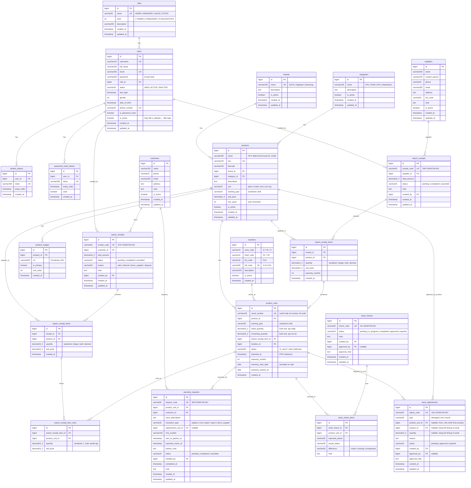

# Domain Model — Hệ thống Quản lý Kho Linh Kiện Máy Tính

> File này là bản copy phần domain từ `plan-du-an-quan-ly-kho.md`, tách riêng để dễ đọc và review.

---

## 1. Entity-Relationship Diagram



---

## 2. State Machine — Trạng thái `product_units`

```
                    ┌──────────────────────────────┐
                    │         in_stock              │
                    └──────┬───────────┬────────────┘
                           │           │
              ┌────────────┼────────────┼───────────────────┐
              │            │            │                   │
              ▼            ▼            ▼                   ▼
           sold      defective    damaged_in_storage      lost
              │            │            │
              │            ├──────────────────┐
              │            ▼                  ▼
              │     returned_to_      sent_to_manufacturer
              │     supplier               │
              │                         ┌──┴──┐
              ▼                         ▼     ▼
          returned                 sold   defective
              │                    (sửa   (không
              └──► in_stock        xong)  sửa được)
              (nếu trả lại kho,
              giữ nguyên
              imported_at gốc)
```

**Quy tắc chuyển trạng thái:**
| Từ | Sang | Điều kiện/Kích hoạt |
|---|---|---|
| `in_stock` | `sold` | Xuất kho (bán hàng / nội bộ) |
| `in_stock` | `defective` | Phát hiện lỗi khi nhập hoặc trong kho |
| `in_stock` | `damaged_in_storage` | Hỏng trong quá trình lưu kho (điều chỉnh) |
| `in_stock` | `lost` | Mất hàng (điều chỉnh tồn, có duyệt) |
| `sold` | `returned` | Khách trả hàng |
| `sold` | `under_repair` | Nhận bảo hành — sửa chữa |
| `sold` | `sent_to_manufacturer` | Gửi hãng bảo hành (RMA) |
| `under_repair` | `sold` | Sửa xong, trả lại khách |
| `under_repair` | `defective` | Không sửa được |
| `sent_to_manufacturer` | `sold` | Hãng trả hàng đã sửa xong |
| `sent_to_manufacturer` | `defective` | Hãng từ chối BH |
| `defective` | `returned_to_supplier` | Trả nhà cung cấp |
| `returned` | `in_stock` | Hàng trả đủ điều kiện nhập lại kho |
| `returned` | `defective` | Hàng trả bị lỗi |
| `in_stock` | `removed` | Hủy phiếu nhập sau khi đã xác nhận (unit chưa từng xuất kho) |

> **`removed` là state cuối (terminal)** — không có transition đi ra khỏi `removed`. Nếu hủy phiếu nhập bị nhấn nhầm, giải pháp là tạo lại phiếu nhập mới, **không** revert `removed → in_stock` (để giữ tính một chiều của hành động hủy, tránh phá vỡ audit trail).
> `removed` **không tính vào tồn kho khả dụng** — loại trừ khỏi công thức COUNT/SUM bên dưới, tương tự `defective`, `lost`, `damaged_in_storage`.

> Tồn kho hiện tại của 1 sản phẩm:
>
> - `serialized`: COUNT `product_units` WHERE `product_id = ?` AND `status = 'in_stock'`
> - `bulk`: SUM `remaining_quantity` của các `product_units` WHERE `product_id = ?` AND `status = 'in_stock'`
>   Nếu query chậm (hàng nghìn serial), thêm cột denormalized `stock_count` trên `products` và cập nhật trigger khi nhập/xuất.

---

## 3. Quyết định kiến trúc

| Vấn đề                  | Quyết định                                                                                                                                                                                                                                 |
| ----------------------- | ------------------------------------------------------------------------------------------------------------------------------------------------------------------------------------------------------------------------------------------ |
| Quản lý tồn kho         | ✅ **Theo serial number** — mỗi sản phẩm vật lý có mã riêng (bảng `product_units`), phục vụ truy vết & bảo hành chi tiết                                                                                                                   |
| Xuất kho                | ✅ **FIFO tự động** — hệ thống tự chọn các `product_units` có `imported_at` sớm nhất để xuất, không cần nhân viên chọn thủ công                                                                                                            |
| Phạm vi kho             | ✅ **Chỉ 1 kho duy nhất** — không cần bảng/khái niệm `warehouse_id`                                                                                                                                                                        |
| Quản lý vị trí kho      | ✅ **Location-based** — mỗi `product_unit` gán 1 vị trí (`location_id`). Khi nhập: chọn vị trí. Khi xuất: FIFO trong cùng vị trí hoặc lấy gần nhau nhất                                                                                    |
| Điều chỉnh tồn thủ công | ✅ Hỗ trợ 3 loại: `damaged`, `lost`, `found` — tất cả đều cần duyệt + lý do + audit log                                                                                                                                                    |
| Ảnh sản phẩm            | ✅ **Nhiều ảnh / sản phẩm (gallery)** — tối đa 5 ảnh, đánh dấu 1 ảnh `is_primary` làm ảnh đại diện                                                                                                                                         |
| Đơn vị tính (UOM)       | ✅ Hỗ trợ: `piece`, `meter`, `box`, `set`, `kg` — mặc định `piece`                                                                                                                                                                         |
| Tracking type           | ✅ **`serialized`** (mỗi đơn vị có serial riêng, tồn = COUNT) hoặc **`bulk`** (tồn = SUM remaining_quantity, dùng cho meter/kg). Mapping bắt buộc: `piece`/`box`/`set` → serialized; `meter`/`kg` → bulk. Nếu sai → reject ở Service layer |
| Tồn âm                  | ✅ **Không cho phép** — mặc định chặn, có thể bật trong cài đặt hệ thống nếu cần                                                                                                                                                           |
| Kiểm kê lệch            | ✅ Chỉ Quản lý kho/Admin mới duyệt được, **bắt buộc nhập lý do**                                                                                                                                                                           |

> **Lưu ý kỹ thuật về FIFO + serial**: vì xuất kho tự động chọn theo `imported_at` sớm nhất, cần đảm bảo:
>
> - Cột `imported_at` trên `product_units` được set chính xác tại thời điểm tạo phiếu nhập (không phải lúc tạo record).
> - Khi tạo phiếu xuất, query `product_units` theo `product_id`, trạng thái `in_stock`, `ORDER BY imported_at ASC LIMIT n`, sau đó cập nhật trạng thái sang `sold` trong cùng transaction để tránh race condition khi nhiều phiếu xuất tạo đồng thời (nên dùng `SELECT ... FOR UPDATE` hoặc optimistic locking).
> - Vì nhập 1 sản phẩm có thể tạo ra nhiều `product_units` cùng lúc (vd nhập 50 RAM), cần sinh 50 serial — serial có thể do nhà sản xuất cung cấp (nhập tay/import file) hoặc hệ thống tự sinh mã nội bộ nếu sản phẩm không có serial gốc (linh kiện rời, phụ kiện...).

---
