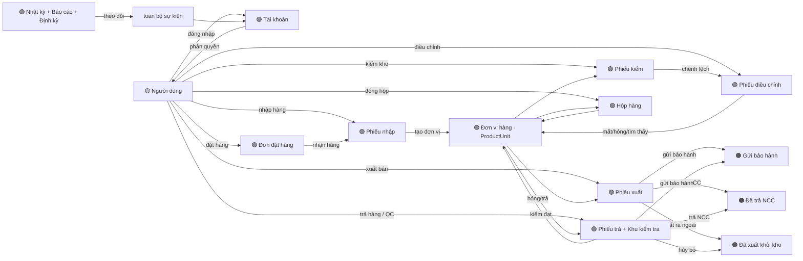
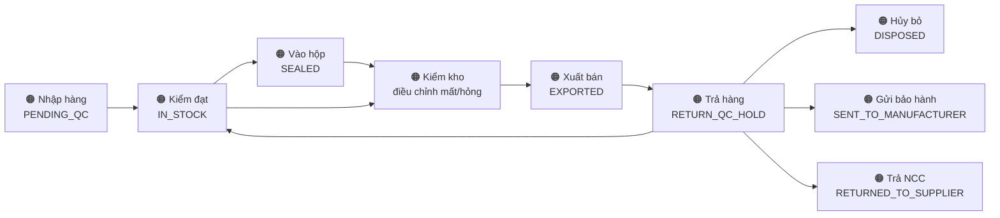
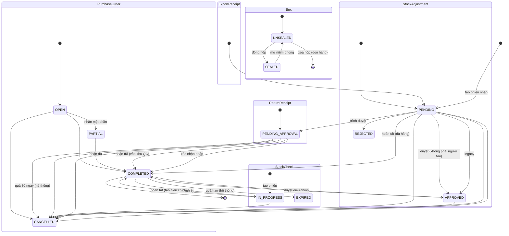

# Event Storming — Phần mềm quản lý kho (dawn)

> Bản đồ toàn bộ nghiệp vụ hệ thống theo phương pháp Event Storming, dựng từ mã nguồn thực tế (backend + frontend) và tài liệu `domain-gap-analysis.md`.
> Cập nhật: 2026-08-10 · Bounded contexts: 10 · Aggregates: 13 · Sự kiện: ~70 · Hotspot còn mở: 0 · Bản non-IT: có (ngay dưới đây)

---

# Đọc nhanh cho người không làm IT

> Phần này kể lại toàn bộ cách hệ thống hoạt động bằng tiếng Việt đời thường, không cần biết lập trình.
> Ai muốn xem bản kỹ thuật đầy đủ (tên sự kiện, luồng trạng thái) thì lướt xuống phần "Ký hiệu" ở dưới.

## 1. Hệ thống này giúp gì?

Giúp quản lý kho hàng (máy móc, sản phẩm) chính xác và minh bạch:

- Luôn biết **đang có bao nhiêu hàng, hàng ở đâu, hàng còn bán được hay không**.
- **Ai làm gì với từng chiếc máy** đều có lịch sử — từ lúc nhập kho đến lúc bán, trả, hủy.
- **Không ai tự ý sửa sổ** — mọi thay đổi phải qua đúng quy trình và có người duyệt.

## 2. Một chiếc máy đi qua những "chặng" nào?

1. **Nhập hàng** — Mua hàng về, nhân viên lập phiếu nhập → quản lý duyệt xong thì máy mới chính thức được tính vào kho.
2. **Kiểm tra chất lượng (QC)** — Máy mới về phải kiểm: đạt → sẵn sàng bán; không đạt → hủy, trả nhà cung cấp, hoặc gửi bảo hành.
3. **Đóng hộp** — Nhiều máy có thể gom vào một hộp niêm phong để dễ chuyển kho. Hộp đã niêm phong không xóa được; muốn lấy hàng ra phải mở niêm phong.
4. **Kiểm kho** — Định kỳ đếm lại hàng thực tế: thiếu → phiếu điều chỉnh ghi "mất"; dư → ghi "tìm thấy". Quản lý duyệt xong mới áp dụng vào sổ.
5. **Xuất bán** — Bán cho khách: lập phiếu xuất, phải chọn đủ đúng số lượng thì phiếu mới hoàn tất được.
6. **Trả hàng / bảo hành** — Khách trả lại: máy vào khu kiểm tra. Kiểm đạt → bán lại; hỏng → hủy, gửi bảo hành hoặc trả nhà cung cấp.

## 3. Ai làm được việc gì?

4 loại tài khoản: **Quản trị** (kỹ thuật, giám sát toàn hệ thống) · **Quản lý** (chủ/trưởng kho) · **Thủ kho** (nhân viên kho) · **Bán hàng** (nhân viên bán hàng).

| Việc | Quản trị | Quản lý | Thủ kho | Bán hàng |
|---|---|---|---|---|
| Xem báo cáo, lập tài khoản | ✅ | ✅ | ❌ | ❌ |
| Thao tác hộp: đóng/mở/di chuyển/xóa | ✅ | ✅ | ✅ | ❌ |
| Lập phiếu nhập | ✅ | ✅ | ✅ | ❌ |
| Duyệt phiếu nhập, duyệt điều chỉnh | ✅ | ✅ | ❌ | ❌ |
| Xuất bán, lập phiếu trả | ✅ | ✅ | ✅ | ✅ |
| Hủy phiếu xuất | ✅ | ✅ | ✅ | ✅ |
| Kiểm tra QC (đạt/hủy/gửi BH/trả NCC) | ❌ | ✅ | ✅ | ❌ |
| Tạo/sửa danh mục (hãng, nhóm, NCC) | ✅ | ✅ | ❌ | ❌ |

## 4. Những quy tắc hệ thống tự lo (không cần người nhắc)

| Việc xảy ra | Hệ thống tự làm | Để tránh |
|---|---|---|
| Đăng nhập sai 5 lần liên tiếp | Khóa tài khoản | Kẻ xấu dò mật khẩu |
| Phiếu nhập chưa duyệt | Chưa tính vào kho | Hàng "ảo" trong sổ |
| Phiếu xuất thiếu hàng | Không cho hoàn tất | Tồn kho sai lệch |
| Kiểm kho thấy thiếu/dư | Tự tạo phiếu điều chỉnh chờ duyệt | Sửa sổ tùy tiện |
| Phiếu trả treo quá 30 ngày | Tự hủy + báo email người lập | Phiếu mơ hồ tồn đọng |
| Phiếu kiểm kho treo quá 1 ngày | Tự đóng, mở lại được | Phiếu treo mãi mãi |
| Khai báo hàng hỏng | Bắt buộc chụp ảnh kèm theo | Hủy hàng không có bằng chứng |

## 5. Từ điển nhanh (hệ thống gọi gì = nghĩa gì)

| Hệ thống gọi | Nghĩa đời thường |
|---|---|
| Phiếu nhập (ImportReceipt) | Giấy ghi nhận hàng mua về nhập kho |
| Phiếu xuất (ExportReceipt) | Giấy xuất hàng: bán / hủy / bảo hành / trả nhà cung cấp |
| Phiếu trả (ReturnReceipt) | Giấy nhận hàng khách trả lại |
| Đơn đặt hàng (PurchaseOrder) | Đơn mua hàng nhà cung cấp, nhận được nhiều đợt |
| Đơn vị hàng (ProductUnit) | 1 chiếc máy, hoặc 1 lô hàng đếm theo số lượng |
| Hộp (Box) | Hộp gom nhiều máy, có niêm phong |
| Kiểm kho (StockCheck) | Phiếu đếm lại hàng thực tế so với sổ |
| Điều chỉnh (StockAdjustment) | Sửa tồn kho khi thiếu/dư/hỏng/tìm thấy |
| Trạng thái (Status) | Tình trạng của phiếu hoặc máy: chờ duyệt, đã xong, đã hủy... |
| Vai trò (Role) | Chức danh tài khoản: quản trị, quản lý, thủ kho, bán hàng |
| Policy | Quy tắc hệ thống tự động thực thi |

---

# Bản kỹ thuật (dành cho lập trình viên)

## Ký hiệu

| Ký hiệu | Ý nghĩa |
|---|---|
| 🟠 **SỰ KIỆN** | Domain event — chuyện đã xảy ra, ghi vào quá khứ, không thay đổi được |
| 🔵 **LỆNH** | Command — ý định của con người/hệ thống muốn thay đổi trạng thái |
| 🟢 **AGGREGATE** | Thực thể gộp + state machine (trạng thái cho phép) |
| 🟡 **VAI TRÒ** | Actor — ai phát ra lệnh (MANAGER / STOCK / SALES / ADMIN / Hệ thống) |
| 🟣 **POLICY** | Quy tắc tự động — "khi sự kiện X → làm lệnh Y" |
| 🔴 **HOTSPOT** | Điểm nóng — vấn đề còn mở (số = mục trong `domain-gap-analysis.md`) |
| 🔷 **NGOÀI** | Hệ thống bên ngoài — email, lưu file đám mây |

---

## Bức tranh tổng thể

**Sự kiện xương sống — vòng đời một đơn vị hàng (1 máy / 1 lô):**

---

## 1. Đăng nhập & Tài khoản (AuthContext)

- 🟢 **Aggregates**: `User` (ACTIVE/INACTIVE/PENDING_ACTIVATION) · `Role` (ADMIN/MANAGER/STOCK/SALES) · `RefreshToken` · `PasswordResetToken`
- 🟡 **Actor**: người dùng, quản trị viên

**Sự kiện** 🟠
| Sự kiện | Ghi chú |
|---|---|
| UserRegistered | tài khoản ở trạng thái chờ kích hoạt |
| UserActivated | kích hoạt/đăng nhập lần đầu theo quy trình |
| UserLoggedIn / SessionRefreshed | JWT + refresh token |
| UserLocked | quá 5 lần đăng nhập sai |
| PasswordResetRequested / PasswordResetCompleted | qua email |
| UserPasswordChanged | đổi mật khẩu bản thân |
| UserDeactivated / UserActivatedByAdmin | vô hiệu hóa tài khoản |
| UserRejectedOnInactiveSession | filter chặn tài khoản INACTIVE ở mọi request |

**Lệnh** 🔵: đăng nhập, đăng ký, làm mới token, quên mật khẩu, đặt lại mật khẩu, đổi mật khẩu, tạo/sửa/vô hiệu hóa tài khoản, đổi quyền.

**Policy** 🟣
- 5 lần sai → khóa tài khoản.
- Mọi request kiểm tra tài khoản còn ACTIVE.
- Đặt lại mật khẩu ADMIN: chỉ ADMIN cấp cao hơn được làm (phân cấp).
- Quyền đổi mật khẩu bản thân tách khỏi quyền quản lý kho.

🔷 **Ngoài**: `MailService` (email quên mật khẩu). ✅ **Đã đóng**: 13.1 (ADMIN vào màn hình quản lý chính — thêm ADMIN vào ROLE_MANAGER/CAN_MANAGE_CATALOG), 13.4 (ADMIN không tạo phiếu xuất/trả — CAN_CREATE_TRANSACTION loại ADMIN).

---

## 2. Danh mục (CatalogContext)

- 🟢 **Aggregates**: `Brand` · `Category` (+ `CategoryZone` = vùng tồn kho) · `Product` (+ `ProductImage`) · `Supplier`
- 🟡 **Actor**: quản lý, nhân viên bán hàng (xem)

**Sự kiện** 🟠
| Sự kiện | Ghi chú |
|---|---|
| BrandCreated/Updated | |
| CategoryCreated/Updated | |
| CategoryZoneAssigned | sản phẩm gắn vùng tồn kho mặc định |
| ProductCreated/Updated | SKU, theo dõi SERIALIZED hay BULK |
| ProductImageUploaded/Removed | |
| SupplierCreated/Updated | |
| SupplierStatusChanged | kích hoạt/vô hiệu hóa NCC |

**Lệnh** 🔵: CRUD hãng, nhóm hàng, vùng nhóm hàng, sản phẩm, ảnh, nhà cung cấp.

✅ **Đã đóng**: 13.1 (ADMIN vào được màn hình danh mục), 13.2 (SALES xem được hãng/nhóm/NCC — GET danh mục về CAN_OPERATE).

---

## 3. Kho & Vị trí (WarehouseContext)

- 🟢 **Aggregates**: `Warehouse` · `Location` (ô) · `ProductUnit` (đơn vị hàng: SERIALIZED/BULK)
- 🟡 **Actor**: quản lý (cấu trúc kho), nhân viên kho (thao tác hàng)

**Sự kiện** 🟠
| Sự kiện | Ghi chú |
|---|---|
| LocationCreated/Updated | |
| ProductUnitImported | tạo máy/lô, IN_STOCK hoặc PENDING_QC |
| ProductUnitMoved | đổi vị trí (Relocate) |
| ProductUnitStatusChanged | mọi chuyển trạng thái máy |
| ProductUnitStatusLogged | ghi `ProductUnitStatusLog` |

**Policy** 🟣
- `LocationCapacityValidator`: không xếp vượt dung lượng ô.
- Chuyển vị trí kéo theo hàng trong hộp niêm phong (chuyển hộp cùng hàng) — đã sửa (3.1).

---

## 4. Mua hàng & Nhập kho (PurchasingContext)

- 🟢 **Aggregates**: `PurchaseOrder` (OPEN → PARTIAL → COMPLETED, CANCELLED) · `ImportReceipt` (DRAFT → PENDING_APPROVAL → COMPLETED, CANCELLED) · `ImportReceiptItem`
- 🟡 **Actor**: quản lý (tạo/duyệt), nhân viên kho (nhập hàng)

**Sự kiện** 🟠
| Sự kiện | Ghi chú |
|---|---|
| PurchaseOrderCreated | |
| PurchaseOrderPartiallyReceived / Completed | nhận theo từng đợt |
| ImportReceiptCreated | DRAFT |
| ImportReceiptSubmittedForApproval | PENDING_APPROVAL |
| ImportReceiptApprovedAndConfirmed | hoàn tất: tạo đơn vị hàng vào kho |
| ImportReceiptCancelled | hủy: dọn hàng ra khỏi hộp đã mở, trả về vị trí hộp |
| UnitsAddedToStock | hàng BULK tách một phần → hộp: copy đầy đủ bảo hành (7.1) |
| ImportReceiptPrinted | phiếu nhập |

**Policy** 🟣
- Phiếu nhập phải qua duyệt (PENDING_APPROVAL) trước khi xác nhận nhập.
- Hủy phiếu: dọn đơn vị hàng ra khỏi hộp UNSEALED và trả về vị trí cũ.

✅ **Đã đóng**: 13.6 (tạo phiếu nhập về ROLE_MANAGER, nhân viên kho chỉ xác nhận nhập).

---

## 5. Bán hàng & Xuất kho (SalesContext)

- 🟢 **Aggregates**: `Customer` · `ExportReceipt` (PENDING → COMPLETED, CANCELLED; APPROVED chỉ còn cho phiếu legacy) · `ExportReceiptItem` + `ExportReceiptItemUnit` · `ExportReceiptStatusHistory` (timeline)
- 🟡 **Actor**: nhân viên bán hàng, nhân viên kho, quản lý, quản trị viên

**Sự kiện** 🟠
| Sự kiện | Ghi chú |
|---|---|
| ExportReceiptCreated | PENDING, kiểm tra khách hàng tồn tại + hoạt động |
| ExportReceiptFulfilled | hoàn tất: máy → EXPORTED, trừ kho, bắt buộc đủ số lượng yêu cầu |
| ExportReceiptCancelled | |
| ExportReceiptStatusChanged | ghi lịch sử trạng thái từ lần tạo |
| UnitExported | máy rời kho |
| UnitsDisposed | xuất hủy (chọn được hàng PENDING_QC/RETURN_QC_HOLD) |
| WarrantyUnitsSent | gửi bảo hành qua phiếu xuất |
| UnitsReturnedToSupplier | trả NCC qua phiếu xuất (chọn tay NCC) |

**Policy** 🟣
- Khách hàng phải tồn tại và không bị vô hiệu hóa khi tạo phiếu.
- Chặn xuất khi số lượng thực ≠ số lượng yêu cầu (đã sửa).
- Chặn hoàn tất khi chọn thiếu máy so với phiếu (đã sửa).
- Danh sách máy khả dụng loại máy trong hộp niêm phong + đang trong phiếu kiểm mở (đã sửa).
- Lý do DISPOSE được chọn hàng ở khu kiểm tra (đã sửa).
- Ô số lượng chặn nhập 0 (đã sửa).

✅ **Đã đóng**: 9.2, 9.3, 11.1, 11.2, 13.3 (đã xử lý 2026-08-09 — xem domain-gap-analysis mục tương ứng).

---

## 6. Trả hàng & Kiểm tra chất lượng (ReturnsQcContext)

- 🟢 **Aggregates**: `ReturnReceipt` (PENDING_APPROVAL → COMPLETED, CANCELLED) · `ReturnReceiptItem` · hàng chờ QC (PENDING_QC, RETURN_QC_HOLD, REJECTED_RETURN, PENDING_DISPOSAL)
- 🟡 **Actor**: nhân viên bán hàng (lập phiếu trả), nhân viên kho (kiểm tra), quản lý (duyệt), quản trị viên

**Sự kiện** 🟠
| Sự kiện | Ghi chú |
|---|---|
| ReturnReceiptCreated | PENDING_APPROVAL; chặn tạo 2 phiếu trả cùng máy |
| ReturnReceiptCompleted | máy → RETURN_QC_HOLD (vào khu kiểm tra) |
| ReturnReceiptCancelled | |
| QcPassed | kiểm đạt: máy về vị trí bán được, IN_STOCK |
| DisposeConfirmed | hủy bỏ hàng (PENDING_DISPOSAL → DISPOSED) |
| WarrantyUnitHandled | gửi bảo hành: SENT_TO_MANUFACTURER / WAITING_RMA_EXPORT / RMA_REPAIRED_RETURNED / RMA_UNREPAIRABLE / UNDER_REPAIR |
| UnitReturnedToSupplier | RETURNED_TO_SUPPLIER (chọn tay NCC) |
| QcNoSellableLocation | lỗi khi kiểm đạt không còn vị trí bán được |

**Policy** 🟣
- Kiểm đạt chỉ vào vị trí bán được; hết vị trí → lỗi rõ ràng (đã sửa).
- Một máy chỉ trong một phiếu trả đang mở (đã sửa — race/duplicate).
- Hủy bỏ phải qua bước xác nhận (dispose-confirm).
- Trả NCC phải chọn tay nhà cung cấp (đã sửa).

✅ **Đã đóng**: 9.3, 11.6, 13.8 (đã xử lý 2026-08-09 — xem domain-gap-analysis mục tương ứng).

---

## 7. Hộp hàng (BoxContext)

- 🟢 **Aggregates**: `Box` (SEALED/UNSEALED) + đơn vị hàng trong hộp
- 🟡 **Actor**: nhân viên kho, quản lý (CAN_OPERATE_STOCK)

**Sự kiện** 🟠
| Sự kiện | Ghi chú |
|---|---|
| BoxSealed | đóng hộp; copy bảo hành khi gom lô tách |
| BoxUnsealed | mở niêm phong |
| BoxMoved | di chuyển hộp sang ô |
| BoxDeleted | chỉ hộp UNSEALED, kèm xác nhận; dọn hàng về vị trí hộp |
| UnitBoxed / UnitUnboxed | đưa máy vào/ra hộp |

**Policy** 🟣
- Không đóng hộp máy đang nằm trong phiếu kiểm đang mở (`BOX_UNIT_IN_STOCK_CHECK`).
- Hộp SEALED không xóa, không làm phạm vi kiểm kho, không hiện để chọn xuất.
- Số lượng gom vào hộp phải ≥ 1 (`BOX_UNIT_QTY_ZERO`).
- Quyền: đóng/mở/di chuyển/xóa hộp = thao tác kho, không phải quyền xem (đã sửa).

---

## 8. Kiểm kho (StockCheckContext)

- 🟢 **Aggregates**: `StockCheck` (IN_PROGRESS → COMPLETED → APPROVED/CANCELLED/EXPIRED; PENDING đã loại bỏ) · `StockCheckItem` (+ lịch sử `StockCheckItemHistory`) · `StockCheckBoxConfirm`
- 🟡 **Actor**: nhân viên kho (tạo/kiểm), quản lý (duyệt điều chỉnh)

**Sự kiện** 🟠
| Sự kiện | Ghi chú |
|---|---|
| StockCheckCreated | phạm vi ZONE/CATEGORY/BOX; lập tức IN_PROGRESS; chặn máy trong phiếu kiểm khác đang mở |
| StockCheckItemRecorded | ghi trạng thái thực tế + số lượng + ảnh; BULK tính theo số đếm thực |
| BoxConfirmed | xác nhận nguyên hộp niêm phong trong khu vực |
| StockCheckCompleted | tự tạo điều chỉnh chênh lệch (thiếu → LOST, dư → FOUND) |
| StockCheckReopened | mở lại phiếu COMPLETED: chặn nếu có điều chỉnh đã duyệt; xóa điều chỉnh chưa duyệt |
| StockCheckAdjustmentApproved/Rejected | phê duyệt từng điều chỉnh (người tạo không tự duyệt) |
| StockCheckExpired | phiếu treo quá hạn bị tự hủy |
| SerialsImported / AutoFilled | nhập danh sách serial / tự điền serial chưa kiểm |

**Policy** 🟣
- Máy không nằm trong 2 phiếu kiểm đang mở cùng lúc (đã sửa).
- Hộp SEALED không được chọn làm phạm vi (đã sửa).
- DAMAGED_IN_STORAGE bắt buộc ảnh (BE chặn + FE nhắc viền đỏ).
- Người tạo phiếu không tự duyệt điều chỉnh của mình.
- BULK thiếu/dư: điều chỉnh theo chênh lệch số lượng thực (không phải đếm "1").

✅ **Đã đóng**: 11.4 (phiếu EXPIRED mở lại được — reopen nhận COMPLETED/EXPIRED).

---

## 9. Điều chỉnh tồn kho & giá (AdjustmentContext)

- 🟢 **Aggregates**: `StockAdjustment` (PENDING → APPROVED/REJECTED/CANCELLED; loại DAMAGED/LOST/FOUND) + `AdjustmentUnit` · `PriceAdjustment` · `SellPriceHistory`
- 🟡 **Actor**: nhân viên kho (tạo), quản lý (duyệt)

**Sự kiện** 🟠
| Sự kiện | Ghi chú |
|---|---|
| AdjustmentCreated | điều chỉnh tay từng máy / theo lô |
| AdjustmentApproved | áp dụng: máy → LOST/REMOVED/DISPOSED hoặc khôi phục FOUND |
| AdjustmentRejected / Cancelled | |
| UnitFound | tìm thấy/khôi phục máy |
| PriceAdjusted | thay đổi giá nhập → cập nhật giá vốn hàng tồn |
| SellPriceChanged | ghi lịch sử giá bán |

**Policy** 🟣
- Người tạo không tự duyệt, không tự từ chối phiếu của mình.
- Chặn điều chỉnh mất/hỏng với máy đã bán, đã xóa, đang trong hộp niêm phong, đang trong phiếu kiểm mở.
- Máy ở khu kiểm tra (RETURN_QC_HOLD/PENDING_QC): cho phép mất/hỏng nhưng phải chặn/cho phép nhất quán với khôi phục.
- Điều chỉnh giá có quy tắc chặn lô chưa nhập xong (siết một phần).

✅ **Đã đóng**: 10.1, 10.2, 10.4, 10.5, 10.6, 10.7, 10.9 (đã xử lý 2026-08-09 — xem domain-gap-analysis mục tương ứng).

---

## 10. Báo cáo, vận hành tự động & hệ thống (ReportingSystemContext)

- 🟢 **Aggregates**: `AuditLog` · `ScheduledTaskService` · Dashboard/report views
- 🟡 **Actor**: quản lý, quản trị viên, hệ thống (định kỳ)

**Sự kiện** 🟠
| Sự kiện | Ghi chú |
|---|---|
| AuditLogged | nhật ký mọi thao tác + sự kiện |
| FileUploaded | ảnh hàng hóa, ảnh kiểm kho (Cloudinary) |
| StockCheckExpired | phiếu kiểm quá hạn (định kỳ) |
| ReturnReceiptAutoCancelled | phiếu trả chờ duyệt > 30 ngày (định kỳ) |
| LowStockAlert / DeadStockAlert | cảnh báo hàng sắp hết / tồn lâu (chỉ vào nhật ký) |
| ReportGenerated | tồn kho, giá trị kho, hàng chết, hoạt động, tổng quan kiểm kho |

🔷 **Ngoài**: `MailService` (email quên mật khẩu), `CloudinaryService` (ảnh), scheduled tasks (định kỳ).

✅ **Đã đóng**: 11.3, 11.5, 11.8, 11.9, 13.7 (đã xử lý 2026-08-09 — xem domain-gap-analysis mục tương ứng).

---

## Quyền & Hiển thị (xuyên suốt — CrossCuttingContext)

🟡 **Vai trò**: ADMIN (giám sát) · MANAGER (quản lý kho) · STOCK (nhân viên kho) · SALES (nhân viên bán hàng)

| Quyền thực tế | ADMIN | MANAGER | STOCK | SALES |
|---|---|---|---|---|
| Xem báo cáo, quản lý tài khoản | ✅ | ✅ | ❌ | ❌ |
| Thao tác kho (đóng hộp, chuyển hộp, xóa hộp) | ✅ | ✅ | ✅ | ❌ |
| Tạo phiếu nhập | ✅ | ✅ | ✅ | ❌ |
| Hủy phiếu xuất | ✅ | ✅ | ✅ | ✅ |
| Kiểm tra QC: kiểm đạt / hủy hàng / gửi BH / trả NCC | ❌ | ✅ | ✅ | ❌ |
| Duyệt điều chỉnh / phiếu nhập | ✅ | ✅ | ❌ | ❌ |

✅ **Đã đóng**: 12.1, 12.2, 13.1, 13.2, 13.3, 13.4, 13.5, 13.6, 13.7, 13.8 (đã xử lý 2026-08-09/10 — xem domain-gap-analysis mục tương ứng).

---

## Tổng hợp state machine (sự kiện ↔ trạng thái hợp lệ)

---

## Các policy tự động quan trọng nhất (nhìn tổng)

| Khi sự kiện | Thì (policy) | Kết quả |
|---|---|---|
| StockCheckCompleted có chênh lệch | 🟣 tạo StockAdjustment PENDING | điều chỉnh chờ duyệt |
| StockAdjustment APPROVED | 🟣 ghi đè trạng thái máy (LOST/REMOVED/DISPOSED/FOUND) | kho + lịch sử đúng |
| ImportReceiptCancelled | 🟣 dọn máy khỏi hộp UNSEALED | hộp không chứa hàng ảo |
| Phiếu trả chờ duyệt quá 30 ngày | 🟣 tự hủy + email báo người tạo | người tạo biết lý do phiếu biến mất |
| Phiếu kiểm treo quá 1 ngày | 🟣 tự hủy → EXPIRED | mở lại được (reopen) |
| Đăng nhập sai 5 lần | 🟣 khóa tài khoản | chống dò mật khẩu |
| BULK thiếu/dư khi kiểm | 🟣 chênh lệch theo số lượng thực | điều chỉnh đúng đơn vị |
| Chọn DAMAGED_IN_STORAGE | 🟣 bắt buộc ảnh | bằng chứng hỏng hóc |

---

## Đối chiếu với `domain-gap-analysis.md`

- **Đã xử lý và đóng** (✅): toàn bộ 117 mục của `domain-gap-analysis.md` (13 section) — đã đối chiếu code 2026-08-10, 2 lệch nhỏ còn lại (cảnh báo vô hiệu hóa khách có lịch sử, guard /catalog-settings) đã sửa cùng ngày.
- **Còn mở** (🔴/🟠/🟡): không còn hotspot nghiệp vụ. Các mục 🟡 UX nhỏ còn lại theo dõi ở `ux-gap-analysis.md`.
