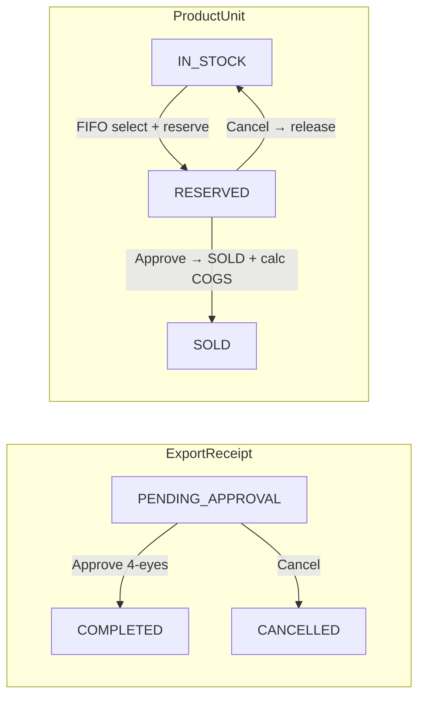
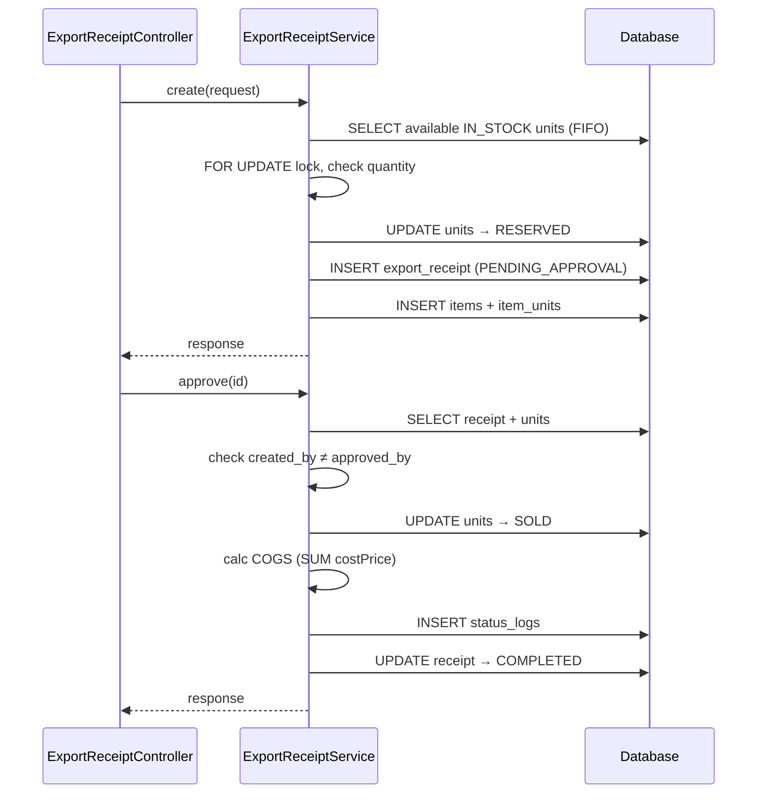
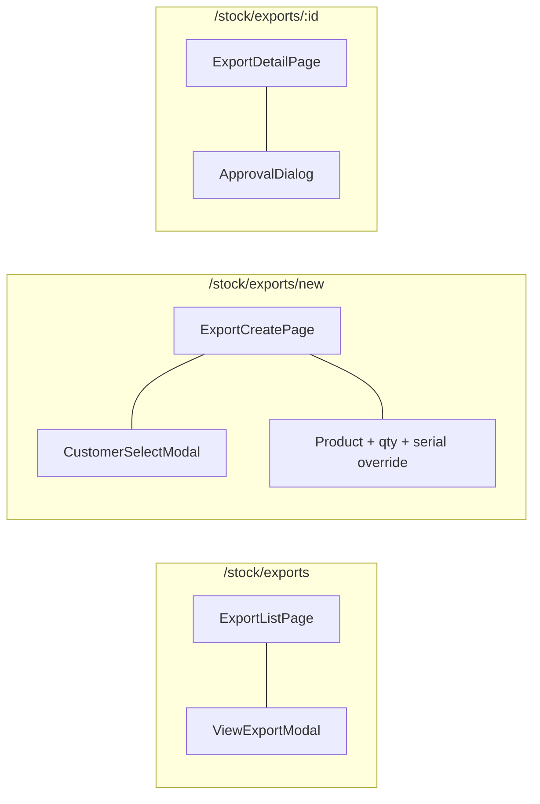

# 02 — Export Flow

## BE

### Controller — `ExportReceiptController`

| Method | Endpoint | Role Guard |
|--------|----------|------------|
| `GET` | `/export-receipt` | `CAN_OPERATE` |
| `GET` | `/export-receipt/{id}` | `CAN_OPERATE` |
| `POST` | `/export-receipt` | `CAN_OPERATE` |
| `PUT` | `/export-receipt/{id}/approve` | `CAN_APPROVE` |
| `PUT` | `/export-receipt/{id}/cancel` | `CAN_APPROVE` |

### Service — `ExportReceiptService`

| Method | Logic |
|--------|-------|
| `create` | Gen code `EXP-YYYYMMDD-NNNN`, FIFO select (`ORDER BY imported_at ASC`), reserve units (`IN_STOCK→RESERVED`), save receipt + items + item_units |
| `approve` | Check `created_by ≠ approved_by`, units `RESERVED→SOLD`, calc COGS from unit cost prices, set `COMPLETED` |
| `cancel` | Units `RESERVED→IN_STOCK`, set `CANCELLED` |

### State Machine

### Sequence

## FE

### Routes

| Path | Component | Guard |
|------|-----------|-------|
| `/stock/exports` | `ExportListPage` | `CAN_OPERATE` |
| `/stock/exports/new` | `ExportCreatePage` | `CAN_OPERATE` |
| `/stock/exports/:id` | `ExportDetailPage` | `CAN_OPERATE` |

### Pages

| Page | File | Chức năng |
|------|------|-----------|
| `ExportListPage` | `features/stock/pages/export-list-page.tsx` | Dùng `ReceiptListPage`, columns: customer, reason, totalAmount, status |
| `ExportCreatePage` | `features/stock/pages/export-create-page.tsx` | Chọn customer, thêm SP + qty, auto FIFO pick serial, có override serial |
| `ExportDetailPage` | `features/stock/pages/export-detail-page.tsx` | Chi tiết + `ApprovalDialog` |

### Hooks

| Hook | Mutation |
|------|----------|
| `useExportList` | — |
| `useExportCreate` | `POST /export-receipt` |
| `useExportApprove` | `PUT /export-receipt/{id}/approve` |
| `useExportCancel` | `PUT /export-receipt/{id}/cancel` |

### Service — `services/export-service.ts`

| Function | API |
|----------|-----|
| `getAll(params)` | `GET /export-receipt` |
| `getById(id)` | `GET /export-receipt/{id}` |
| `create(data)` | `POST /export-receipt` |
| `approve(id)` | `PUT /export-receipt/{id}/approve` |
| `cancel(id)` | `PUT /export-receipt/{id}/cancel` |

### Component Tree

