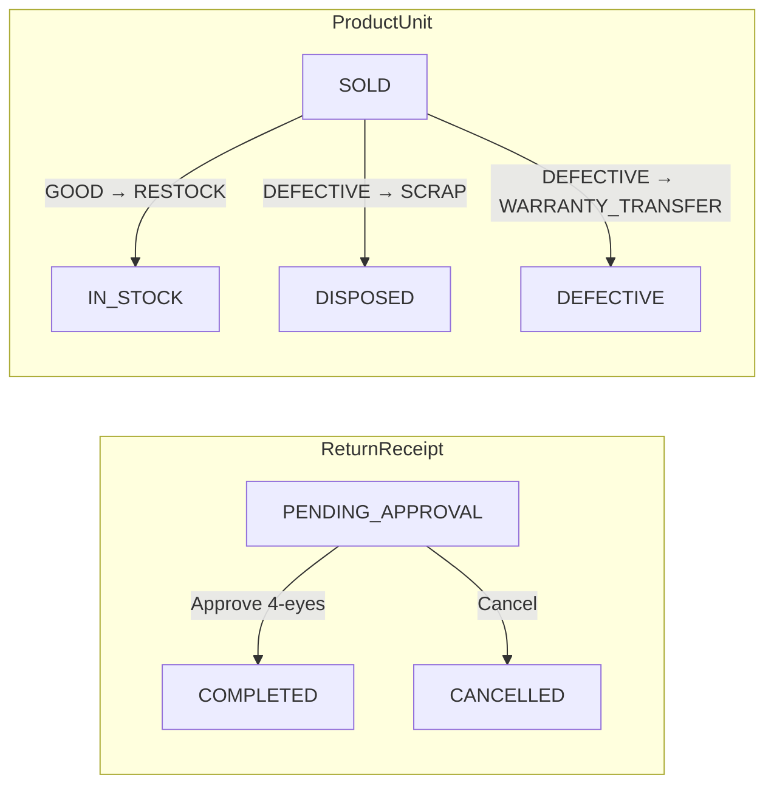
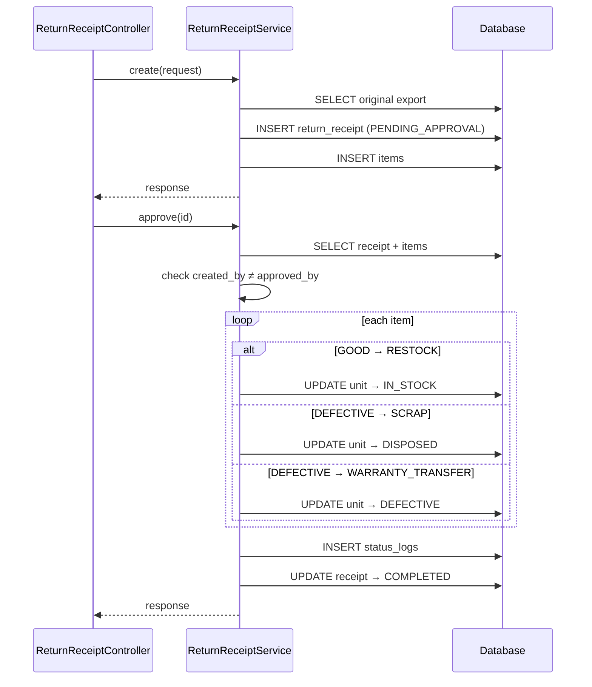
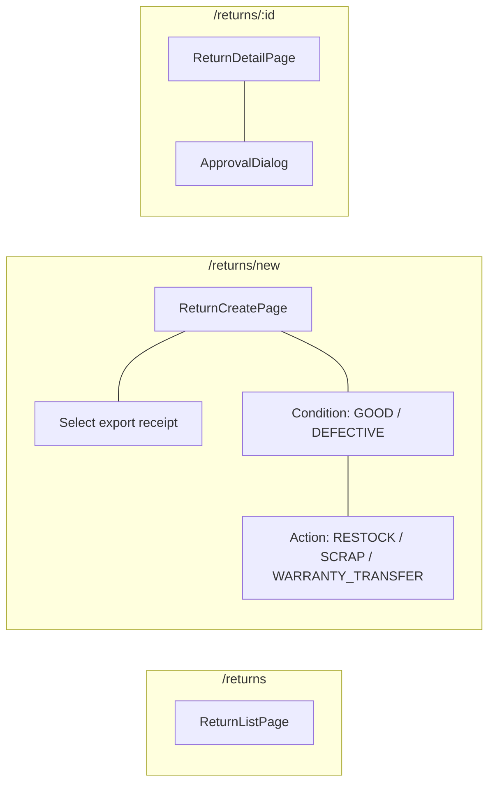

# 03 — Return Flow

## BE

### Controller — `ReturnReceiptController` (`/api/v1/return-receipts`)

| Method | Endpoint | Role Guard |
|--------|----------|------------|
| `GET` | `/return-receipts` | `CAN_OPERATE` |
| `GET` | `/return-receipts/{id}` | `CAN_OPERATE` |
| `POST` | `/return-receipts` | `CAN_OPERATE` |
| `PUT` | `/return-receipts/{id}/approve` | `CAN_APPROVE` |
| `PUT` | `/return-receipts/{id}/cancel` | `CAN_APPROVE` |

### Service — `ReturnReceiptService`

| Method | Logic |
|--------|-------|
| `create` | Gen code, link to original export, save receipt + items with condition + resulting action |
| `approve` | For each item: `GOOD→RESTOCK` → unit `SOLD→IN_STOCK`; `DEFECTIVE→SCRAP` → `SOLD→DISPOSED`; `DEFECTIVE→WARRANTY_TRANSFER` → `SOLD→DEFECTIVE`. Enforce 4-eyes |
| `cancel` | Set `CANCELLED` |

### State Machine

### Sequence

## FE

### Routes

| Path | Component | Guard |
|------|-----------|-------|
| `/returns` | `ReturnListPage` | `CAN_OPERATE` |
| `/returns/new` | `ReturnCreatePage` | `CAN_OPERATE` |
| `/returns/:id` | `ReturnDetailPage` | `CAN_OPERATE` |

### Pages

| Page | File | Chức năng |
|------|------|-----------|
| `ReturnListPage` | `features/stock/pages/return-list-page.tsx` | Dùng `ReceiptListPage` |
| `ReturnCreatePage` | `features/stock/pages/return-create-page.tsx` | Chọn export gốc → chọn reason → pick condition GOOD/DEFECTIVE → resulting action |
| `ReturnDetailPage` | `features/stock/pages/return-detail-page.tsx` | Chi tiết + `ApprovalDialog` |

### Hooks

| Hook | Mutation |
|------|----------|
| `useReturnList` | — |
| `useReturnCreate` | `POST /return-receipts` |
| `useReturnApprove` | `PUT /return-receipts/{id}/approve` |
| `useReturnCancel` | `PUT /return-receipts/{id}/cancel` |

### Service — `services/return-service.ts`

| Function | API |
|----------|-----|
| `getAll(params)` | `GET /return-receipts` |
| `getById(id)` | `GET /return-receipts/{id}` |
| `create(data)` | `POST /return-receipts` |
| `approve(id)` | `PUT /return-receipts/{id}/approve` |
| `cancel(id)` | `PUT /return-receipts/{id}/cancel` |

### Component Tree

