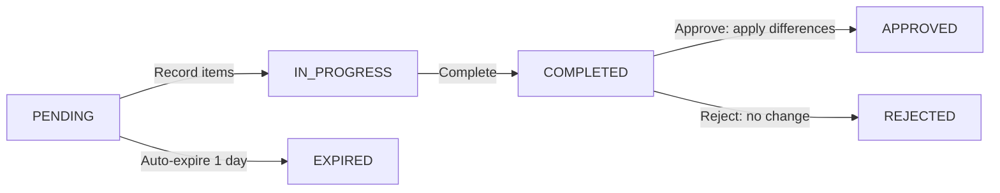
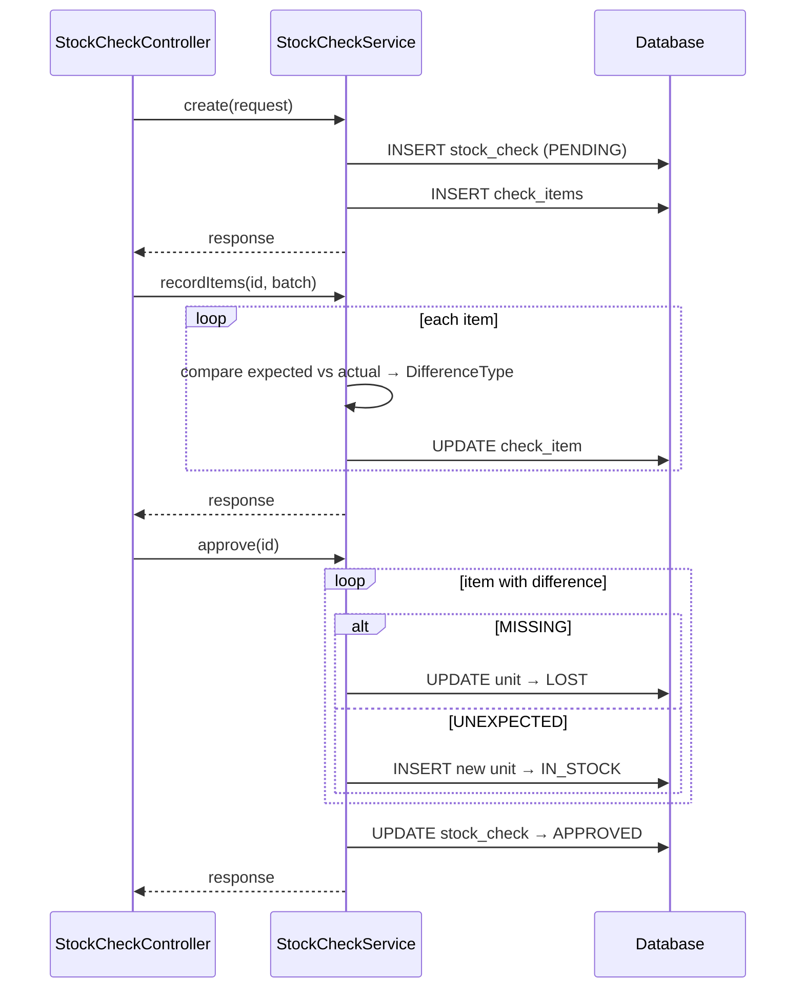
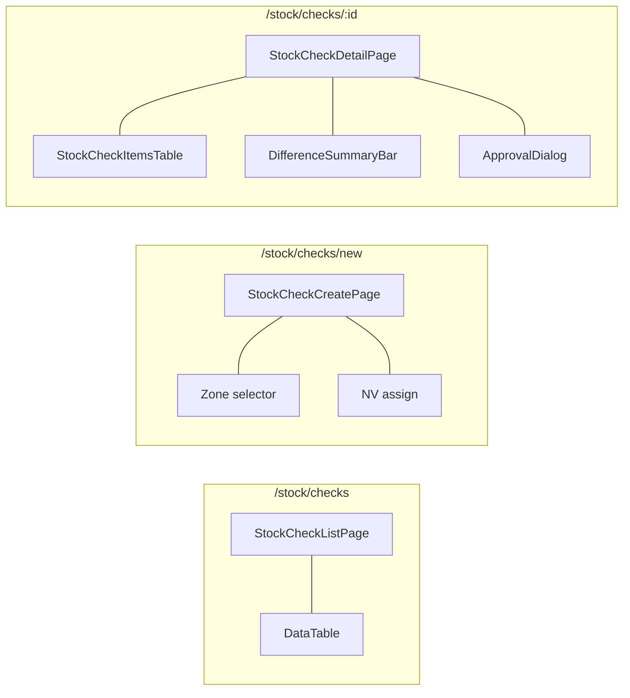

# 04 — Stock Check Flow

## BE

### Controller — `StockCheckController` (`/api/v1`)

| Method | Endpoint | Role Guard |
|--------|----------|------------|
| `GET` | `/stock-check/my` | `CAN_OPERATE_STOCK` |
| `GET` | `/stock-check` | `CAN_VIEW_INVENTORY` |
| `GET` | `/stock-check/{id}` | `CAN_VIEW_INVENTORY` |
| `POST` | `/stock-check` | `CAN_OPERATE_STOCK` |
| `PUT` | `/stock-check/{id}/items` | `CAN_OPERATE_STOCK` |
| `PUT` | `/stock-check/{id}/complete` | `CAN_OPERATE_STOCK` |
| `PUT` | `/stock-check/{id}/approve` | `CAN_APPROVE` |
| `PUT` | `/stock-check/{id}/reject` | `CAN_APPROVE` |

### Service — `StockCheckService`

| Method | Logic |
|--------|-------|
| `create` | Gen code, select units to check, save `PENDING` |
| `recordItems` | Per unit: record `actualStatus`, `countedQuantity`, auto-calc `difference` (MATCH/MISSING/UNEXPECTED/PARTIAL_SHORTAGE) |
| `complete` | Set `COMPLETED` |
| `approve` | `MISSING`→create LOST adjustment, `UNEXPECTED`→create FOUND unit. Enforce 4-eyes |
| `reject` | Set `REJECTED` — no changes |

### State Machine

### Sequence

## FE

### Routes

| Path | Component | Guard |
|------|-----------|-------|
| `/stock/checks` | `StockCheckListPage` | `CAN_VIEW_INVENTORY` |
| `/stock/checks/new` | `StockCheckCreatePage` | `CAN_OPERATE_STOCK` |
| `/stock/checks/:id` | `StockCheckDetailPage` | `CAN_VIEW_INVENTORY` |

### Pages

| Page | File | Chức năng |
|------|------|-----------|
| `StockCheckListPage` | `features/stock/pages/stock-check-list-page.tsx` | List + filter by status, my checks tab |
| `StockCheckCreatePage` | `features/stock/pages/stock-check-create-page.tsx` | Chọn zone + NV → auto-list IN_STOCK units |
| `StockCheckDetailPage` | `features/stock/pages/stock-check-detail-page.tsx` | `StockCheckItemsTable`: record actualStatus per unit. Complete → approve/reject. Difference summary bar |

### Hooks

| Hook | Mutation |
|------|----------|
| `useStockCheckList` | — |
| `useStockCheckCreate` | `POST /stock-check` |
| `useRecordItems` | `PUT /stock-check/{id}/items` |
| `useCompleteCheck` | `PUT /stock-check/{id}/complete` |
| `useApproveCheck` | `PUT /stock-check/{id}/approve` |
| `useRejectCheck` | `PUT /stock-check/{id}/reject` |

### Service — `services/stock-check-service.ts`

| Function | API |
|----------|-----|
| `getAll(params)` | `GET /stock-check` |
| `getMy(params)` | `GET /stock-check/my` |
| `getById(id)` | `GET /stock-check/{id}` |
| `create(data)` | `POST /stock-check` |
| `recordItems(id, items)` | `PUT /stock-check/{id}/items` |
| `complete(id)` | `PUT /stock-check/{id}/complete` |
| `approve(id, note)` | `PUT /stock-check/{id}/approve` |
| `reject(id, note)` | `PUT /stock-check/{id}/reject` |

### Component Tree

