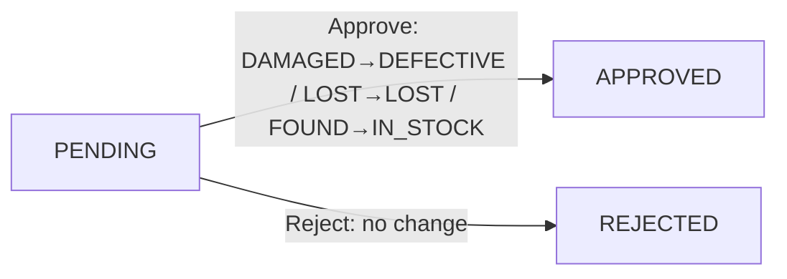
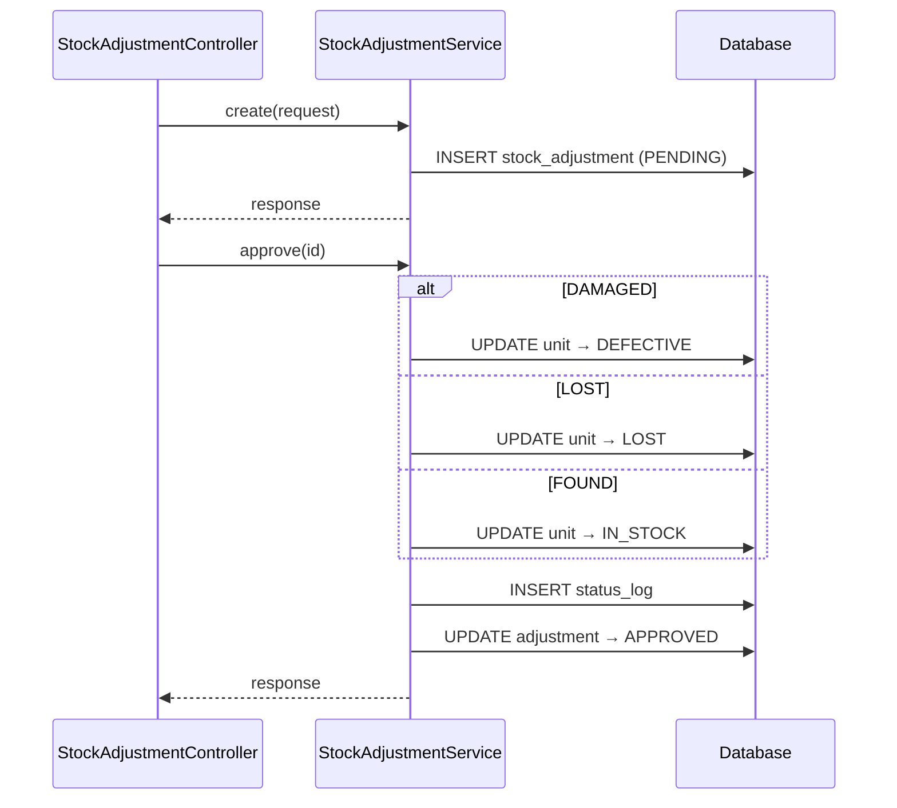
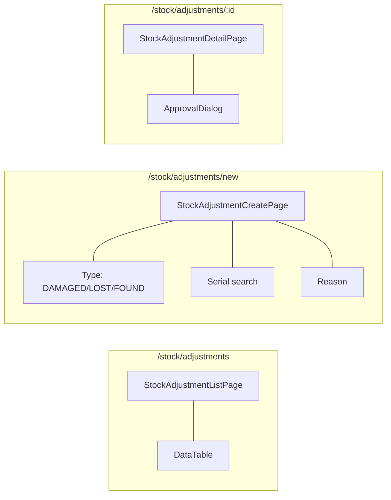

# 05 — Stock Adjustment Flow

## BE

### Controller — `StockAdjustmentController` (`/api/v1/stock-adjustment`)

| Method | Endpoint | Role Guard |
|--------|----------|------------|
| `GET` | `/stock-adjustment/my` | `CAN_OPERATE_STOCK` |
| `GET` | `/stock-adjustment` | `CAN_VIEW_INVENTORY` |
| `GET` | `/stock-adjustment/{id}` | `CAN_VIEW_INVENTORY` |
| `POST` | `/stock-adjustment` | `CAN_OPERATE_STOCK` |
| `PUT` | `/stock-adjustment/{id}/approve` | `CAN_APPROVE` |
| `PUT` | `/stock-adjustment/{id}/reject` | `CAN_APPROVE` |

### Service — `StockAdjustmentService`

| Method | Logic |
|--------|-------|
| `create` | Gen code `ADJ-YYYYMMDD-NNNN`, type `DAMAGED/LOST/FOUND`, save `PENDING` |
| `approve` | `DAMAGED→DEFECTIVE`, `LOST→LOST`, `FOUND→IN_STOCK`. Enforce 4-eyes |
| `reject` | Set `REJECTED` — no change |

### State Machine

### Sequence

## FE

### Routes

| Path | Component | Guard |
|------|-----------|-------|
| `/stock/adjustments` | `StockAdjustmentListPage` | `CAN_VIEW_INVENTORY` |
| `/stock/adjustments/new` | `StockAdjustmentCreatePage` | `CAN_OPERATE_STOCK` |
| `/stock/adjustments/:id` | `StockAdjustmentDetailPage` | `CAN_VIEW_INVENTORY` |

### Pages

| Page | File | Chức năng |
|------|------|-----------|
| `StockAdjustmentListPage` | `features/stock/pages/stock-adjustment-list-page.tsx` | List, filter by type/status |
| `StockAdjustmentCreatePage` | `features/stock/pages/stock-adjustment-create-page.tsx` | Chọn type (DAMAGED/LOST/FOUND), search serial, reason, optional image |
| `StockAdjustmentDetailPage` | `features/stock/pages/stock-adjustment-detail-page.tsx` | Detail + `ApprovalDialog` |

### Hooks

| Hook | Mutation |
|------|----------|
| `useStockAdjustmentList` | — |
| `useMyAdjustments` | — |
| `useCreateAdjustment` | `POST /stock-adjustment` |
| `useApproveAdjustment` | `PUT /stock-adjustment/{id}/approve` |
| `useRejectAdjustment` | `PUT /stock-adjustment/{id}/reject` |

### Service — `services/stock-adjustment-service.ts`

| Function | API |
|----------|-----|
| `getAll(params)` | `GET /stock-adjustment` |
| `getMy(params)` | `GET /stock-adjustment/my` |
| `getById(id)` | `GET /stock-adjustment/{id}` |
| `create(data)` | `POST /stock-adjustment` |
| `approve(id, note)` | `PUT /stock-adjustment/{id}/approve` |
| `reject(id, note)` | `PUT /stock-adjustment/{id}/reject` |

### Component Tree

