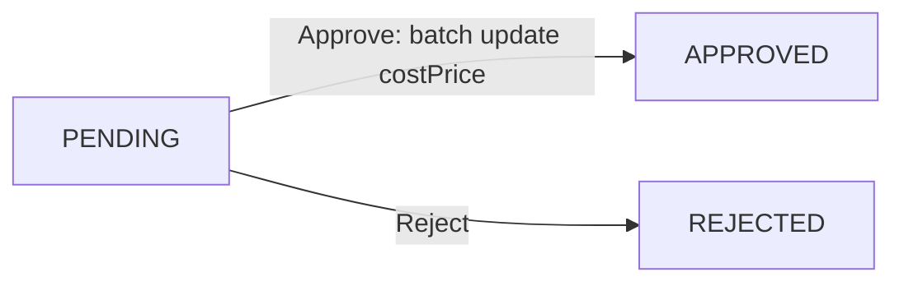
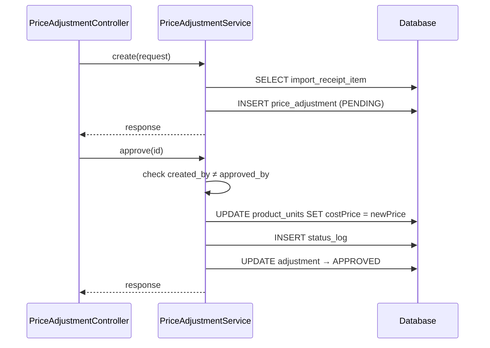
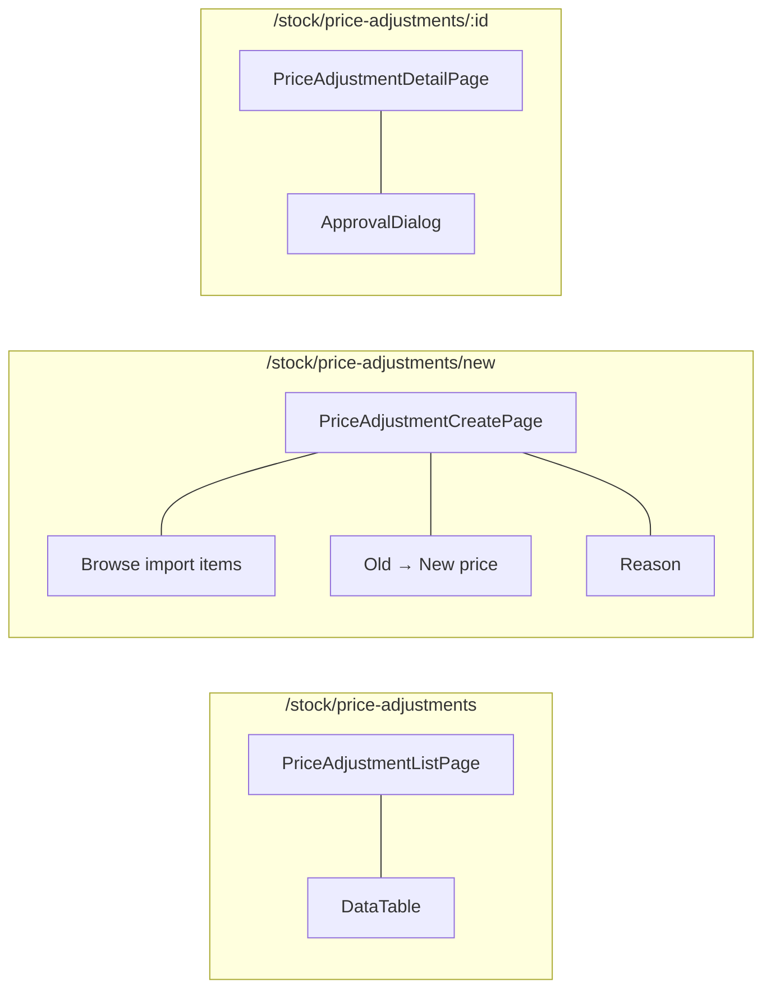

# 06 — Price Adjustment Flow

## BE

### Controller — `PriceAdjustmentController` (`/api/v1/price-adjustment`)

| Method | Endpoint | Role Guard |
|--------|----------|------------|
| `GET` | `/price-adjustment/my` | `CAN_OPERATE_STOCK` |
| `GET` | `/price-adjustment` | `CAN_VIEW_INVENTORY` |
| `GET` | `/price-adjustment/{id}` | `CAN_VIEW_INVENTORY` |
| `POST` | `/price-adjustment` | `CAN_OPERATE` |
| `PUT` | `/price-adjustment/{id}/approve` | `CAN_APPROVE` |
| `PUT` | `/price-adjustment/{id}/reject` | `CAN_APPROVE` |

### Service — `PriceAdjustmentService`

| Method | Logic |
|--------|-------|
| `create` | Gen code `PADJ-YYYYMMDD-NNNN`, pick `importReceiptItemId`, save oldPrice→newPrice + reason |
| `approve` | Batch update `ProductUnit.costPrice` WHERE `importReceiptItemId = ? AND status = IN_STOCK`. Enforce 4-eyes |
| `reject` | Set `REJECTED` |

### State Machine

### Sequence

## FE

### Routes

| Path | Component | Guard |
|------|-----------|-------|
| `/stock/price-adjustments` | `PriceAdjustmentListPage` | `CAN_VIEW_INVENTORY` |
| `/stock/price-adjustments/new` | `PriceAdjustmentCreatePage` | `CAN_OPERATE` |
| `/stock/price-adjustments/:id` | `PriceAdjustmentDetailPage` | `CAN_VIEW_INVENTORY` |

### Pages

| Page | File | Chức năng |
|------|------|-----------|
| `PriceAdjustmentListPage` | `features/stock/pages/price-adjustment-list-page.tsx` | List, filter by status |
| `PriceAdjustmentCreatePage` | `features/stock/pages/price-adjustment-create-page.tsx` | Browse import items → enter new price → reason |
| `PriceAdjustmentDetailPage` | `features/stock/pages/price-adjustment-detail-page.tsx` | Detail + `ApprovalDialog` |

### Hooks

| Hook | Mutation |
|------|----------|
| `usePriceAdjustmentList` | — |
| `useMyPriceAdjustments` | — |
| `useCreatePriceAdjustment` | `POST /price-adjustment` |
| `useApprovePriceAdjustment` | `PUT /price-adjustment/{id}/approve` |
| `useRejectPriceAdjustment` | `PUT /price-adjustment/{id}/reject` |

### Service — `services/price-adjustment-service.ts`

| Function | API |
|----------|-----|
| `getAll(params)` | `GET /price-adjustment` |
| `getMy(params)` | `GET /price-adjustment/my` |
| `getById(id)` | `GET /price-adjustment/{id}` |
| `create(data)` | `POST /price-adjustment` |
| `approve(id)` | `PUT /price-adjustment/{id}/approve` |
| `reject(id)` | `PUT /price-adjustment/{id}/reject` |

### Component Tree

