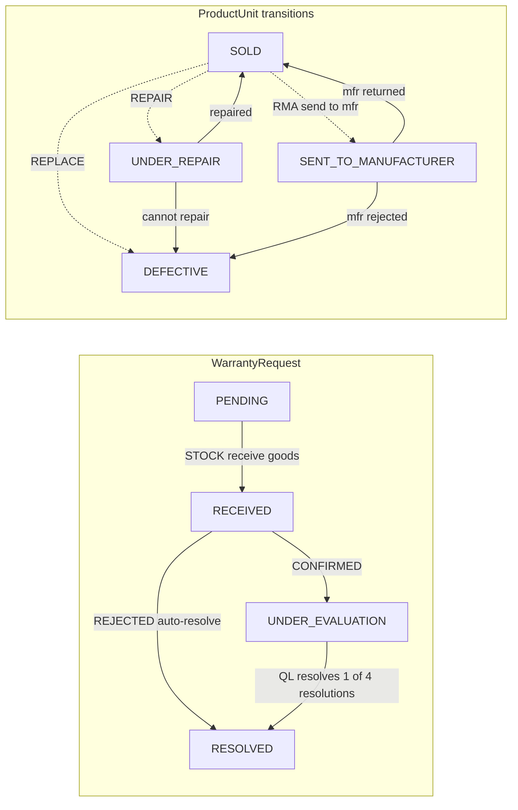
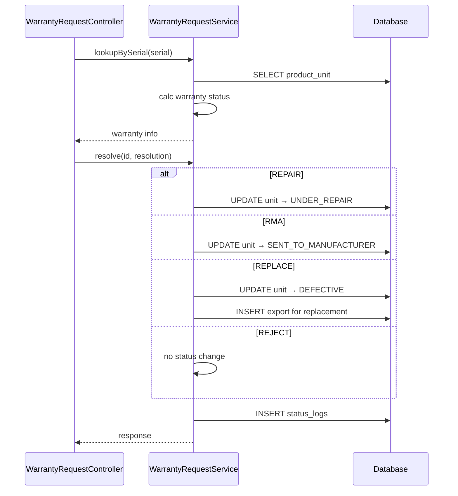
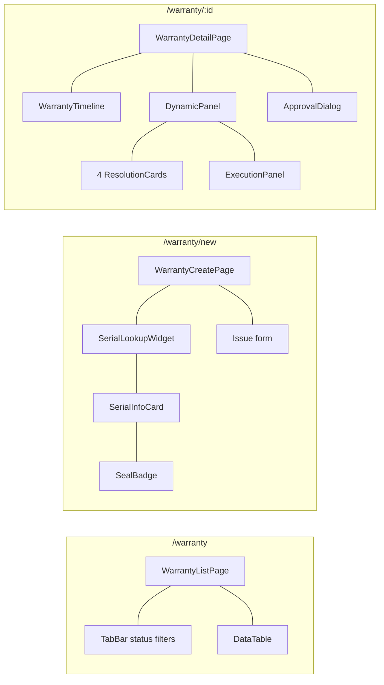

# 07 — Warranty Flow

## BE

### Controller — `WarrantyRequestController` (`/api/v1/warranty-request`)

| Method | Endpoint | Role Guard |
|--------|----------|------------|
| `GET` | `/warranty-request/lookup` | `CAN_OPERATE` |
| `GET` | `/warranty-request` | `CAN_VIEW_INVENTORY` |
| `GET` | `/warranty-request/my-handled` | `CAN_OPERATE` |
| `GET` | `/warranty-request/{id}` | `CAN_VIEW_INVENTORY` |
| `POST` | `/warranty-request` | `CAN_OPERATE` |
| `PUT` | `/warranty-request/{id}/resolve` | `CAN_APPROVE` |
| `PUT` | `/warranty-request/{id}/complete` | `CAN_OPERATE` |
| `PUT` | `/warranty-request/{id}/cancel` | `CAN_APPROVE` |

### Service — `WarrantyRequestService`

| Method | Logic |
|--------|-------|
| `lookupBySerial` | Query `ProductUnit` by serial, return warranty status (expiry, isActive) |
| `create` | Gen code `WR-YYYYMMDD-NNNN`, link to unit, set `PENDING` |
| `resolve` | `REPAIR`→`SOLD→UNDER_REPAIR`; `RMA`→`SOLD→SENT_TO_MANUFACTURER`; `REPLACE`→`SOLD→DEFECTIVE` + auto create export for replacement unit; `REJECT`→no status change |
| `complete` | Set `COMPLETED`, finalize unit transitions, `completedAt` |
| `cancel` | Set `CANCELLED` |

### State Machine

### Sequence

## FE

### Routes

| Path | Component | Guard |
|------|-----------|-------|
| `/warranty` | `WarrantyListPage` | `CAN_OPERATE` |
| `/warranty/new` | `WarrantyCreatePage` | `CAN_OPERATE` |
| `/warranty/:id` | `WarrantyDetailPage` | `CAN_OPERATE` |

### Pages

| Page | File | Chức năng |
|------|------|-----------|
| `WarrantyListPage` | `features/stock/pages/warranty-list-page.tsx` | Tabs (All/Pending/Received/Under eval/Resolved), search serial/phone, my-handled tab |
| `WarrantyCreatePage` | `features/stock/pages/warranty-create-page.tsx` | Stage A: serial lookup → `SerialInfoCard`; Stage B: issue description + images → submit |
| `WarrantyDetailPage` | `features/stock/pages/warranty-detail-page.tsx` | `WarrantyTimeline` (4 milestones). Panel động theo state+role: PENDING→receive, RECEIVED→check form, UNDER_EVALUATION→4 ResolutionCards, RESOLVED→execution panel |

### Hooks

| Hook | Mutation |
|------|----------|
| `useWarrantyList` | — |
| `useMyHandled` | — |
| `useWarrantyDetail` | — |
| `useLookupSerial` | `GET /warranty-request/lookup` |
| `useCreateWarranty` | `POST /warranty-request` |
| `useResolveWarranty` | `PUT /warranty-request/{id}/resolve` |
| `useCompleteWarranty` | `PUT /warranty-request/{id}/complete` |
| `useCancelWarranty` | `PUT /warranty-request/{id}/cancel` |

### Service — `services/warranty-service.ts`

| Function | API |
|----------|-----|
| `getAll(params)` | `GET /warranty-request` |
| `getMyHandled(params)` | `GET /warranty-request/my-handled` |
| `getById(id)` | `GET /warranty-request/{id}` |
| `lookupBySerial(serial)` | `GET /warranty-request/lookup?serial={serial}` |
| `create(data)` | `POST /warranty-request` |
| `resolve(id, data)` | `PUT /warranty-request/{id}/resolve` |
| `complete(id, data)` | `PUT /warranty-request/{id}/complete` |
| `cancel(id)` | `PUT /warranty-request/{id}/cancel` |

### Component Tree

