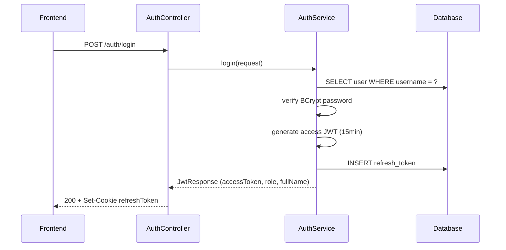
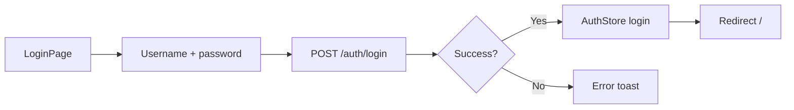
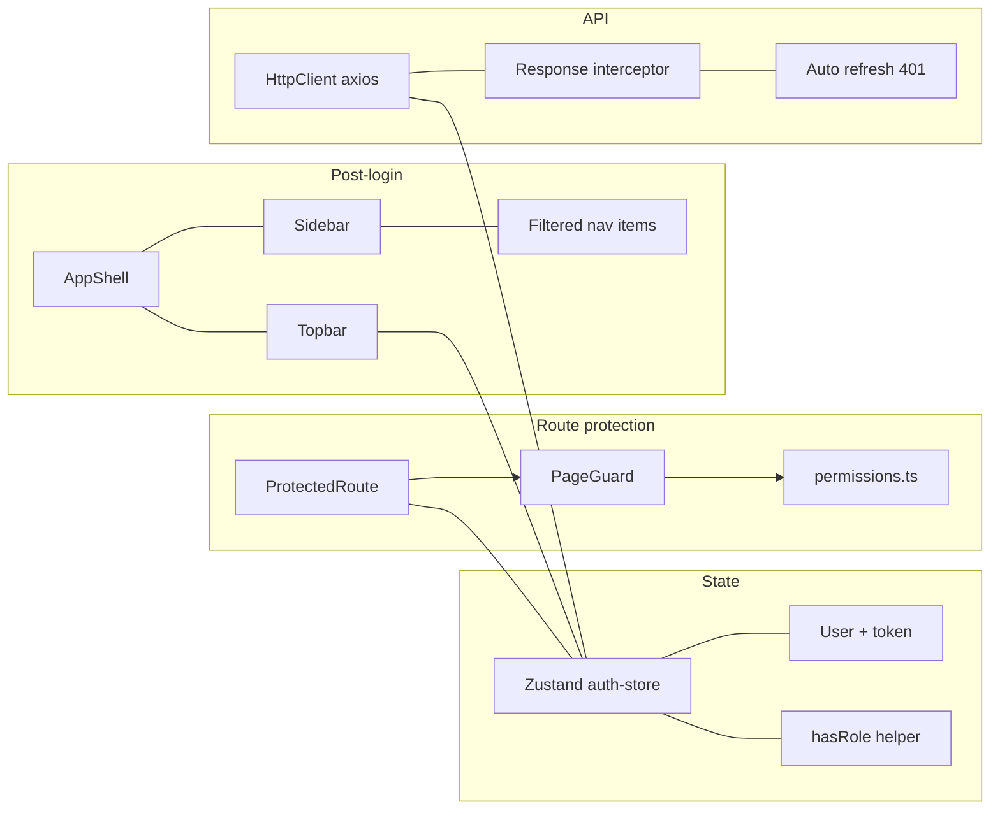

# 09 — Auth Flow

## BE

### Controllers

| Controller | Endpoints |
|------------|-----------|
| `AuthController` | `POST /auth/login`, `POST /auth/refresh-token`, `POST /auth/logout`, `PUT /auth/{id}/reset-password`, `POST /auth/forgot-password`, `POST /auth/reset-password`, `PUT /auth/change-password` |
| `UserController` | `GET /user`, `GET /user/{id}`, `POST /user`, `PUT /user/{id}/info`, `PUT /user/{id}/status`, `PUT /user/{id}/role` |

### Security Architecture

```mermaid
flowchart LR
    subgraph "Request flow"
        REQ[Request] --> ATF[AuthTokenFilter]
        ATF -->|Has Bearer token?| JWT[Decode JWT]
        JWT -->|Set SecurityContext| C[Controller]
        C -->|@PreAuthorize| PA{Permitted?}
        PA -->|Yes| SVC[Service]
        PA -->|No| ERR[403]
    end

    subgraph "Role hierarchy"
        AD[ADMIN level 1]
        MG[MANAGER level 2]
        SL[SALES level 3]
        SK[STOCK level 3]
    end
```

### Authorization Expressions

| Expression | Roles allowed |
|------------|---------------|
| `ROLE_ADMIN` | ADMIN |
| `ROLE_MANAGER` | MANAGER |
| `CAN_VIEW_REPORTS` | MANAGER, ADMIN |
| `CAN_APPROVE` | MANAGER, ADMIN |
| `CAN_OPERATE_STOCK` | MANAGER, STOCK |
| `CAN_VIEW_INVENTORY` | MANAGER, ADMIN, STOCK |
| `CAN_OPERATE` | SALES, STOCK, MANAGER |
| `CAN_MANAGE_CATALOG` | MANAGER |
| `CAN_MANAGE_SYSTEM` | ADMIN |

### Login Sequence



### Key Components

| Component | File | Role |
|-----------|------|------|
| `SecurityConfig` | `config/security/SecurityConfig.java` | Public endpoints, CORS, CSRF disable, `@EnableMethodSecurity` |
| `AuthTokenFilter` | `config/security/AuthTokenFilter.java` | Extract Bearer token, parse JWT, set SecurityContext |
| `JWTUtils` | `utils/JWTUtils.java` | Generate/validate JWT with claims (id, username, role) |
| `UserRoleSecurity` | `config/security/UserRoleSecurity.java` | `canUpdate(id, auth)` — prevent self/equal/higher update |

## FE

### Routes

| Path | Component | Guard |
|------|-----------|-------|
| `/login` | `LoginPage` | Public |
| `/403` | `ForbiddenPage` | Public |
| `/` | `RootRedirect` | `ProtectedRoute` |
| All others | Various | `ProtectedRoute` + `PageGuard` |

### Auth Store — `store/auth-store.ts`

| State | Description |
|-------|-------------|
| `user` | Current user (id, username, role, fullName) |
| `token` | JWT access token |
| `login(user, token)` | Set user + token |
| `logout()` | Clear + call `POST /auth/logout` |
| `hasRole(roles[])` | Role check helper |

### Login Flow



### HTTP Client — `utils/http-client.ts`

| Feature | Detail |
|---------|--------|
| `baseURL` | `VITE_BASE_API_URL` (default `/api/v1`) |
| Request interceptor | Attach `Authorization: Bearer {token}` |
| Response interceptor | 401 → auto-refresh via `POST /auth/refresh-token` → retry queued requests |
| Refresh failure | Logout + redirect `/login` |

### Root Redirect

| Role | Redirect to |
|------|-------------|
| STOCK | `/stock/units` |
| SALES | `/stock/exports` |
| MANAGER | Dashboard `/` |
| ADMIN | Dashboard `/` |

### Component Tree

