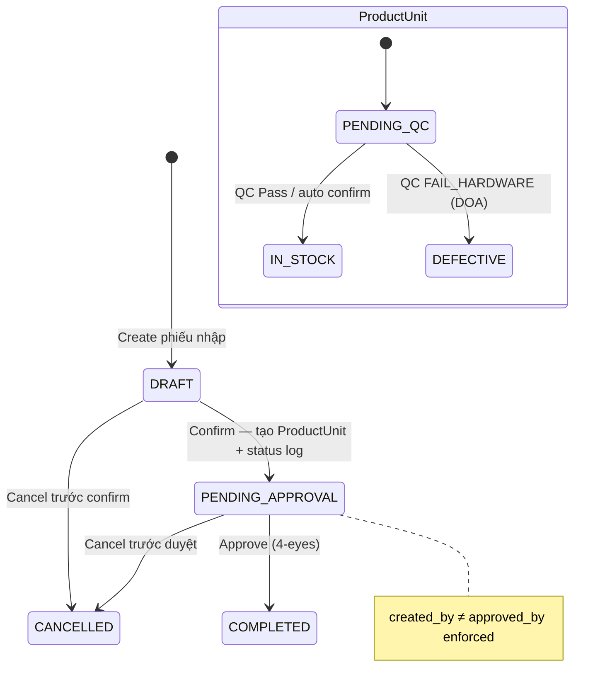
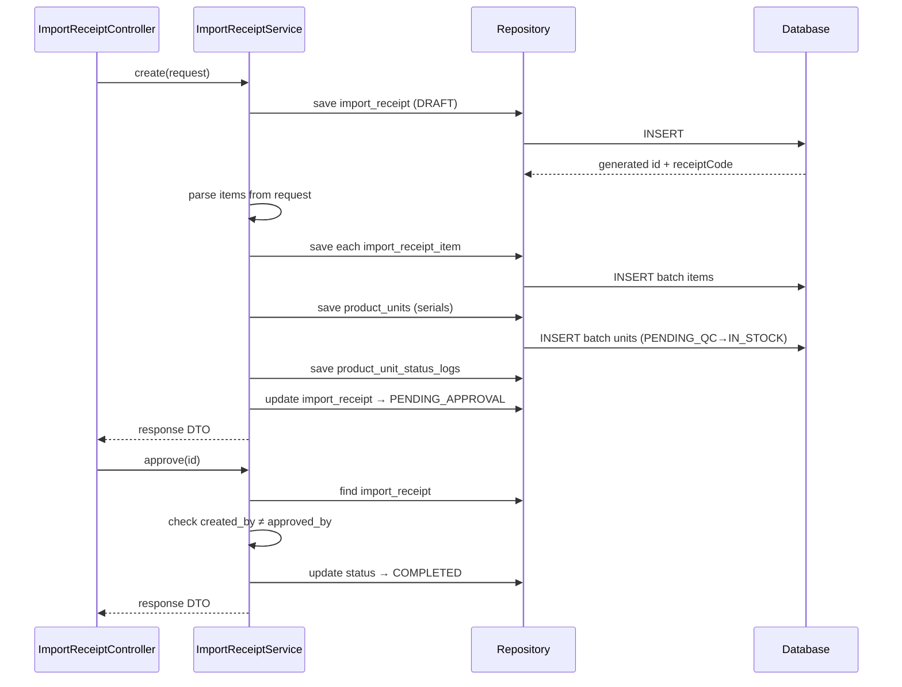

# Import Flow — Backend

## Controller

**Class:** `ImportReceiptController` (`/api/v1`)

| Method | Endpoint | Role | Description |
|--------|----------|------|-------------|
| `GET` | `/import-receipt` | `CAN_VIEW_INVENTORY` | List receipts, filter by status |
| `GET` | `/import-receipt/{id}` | `CAN_VIEW_INVENTORY` | Get receipt detail |
| `POST` | `/import-receipt` | `CAN_OPERATE_STOCK` | Create + auto-confirm |
| `PUT` | `/import-receipt/{id}/confirm` | `CAN_OPERATE_STOCK` | Confirm (add serials) |
| `PUT` | `/import-receipt/{id}/approve` | `CAN_APPROVE` | Approve (4-eyes) |
| `PUT` | `/import-receipt/{id}/cancel` | `CAN_APPROVE` | Cancel |
| `GET` | `/import-receipt/{id}/units` | `CAN_VIEW_INVENTORY` | Get product units of receipt |
| `GET` | `/product-unit` | `CAN_VIEW_INVENTORY` | List product units |
| `GET` | `/product-unit/{id}` | `CAN_VIEW_INVENTORY` | Get unit detail |
| `GET` | `/product-unit/status/{status}` | `CAN_VIEW_INVENTORY` | Filter units by status |

## Service

**Class:** `ImportReceiptService`

| Method | Logic |
|--------|-------|
| `create(request)` | Generate receipt code (`INIT-YYYYMMDD-NNNN`), create `ImportReceipt` + `ImportReceiptItem` rows, auto-confirm if no QC needed |
| `confirm(id, request)` | Create `ProductUnit` records (serialized: 1 per serial; bulk: 1 lot with `initialQuantity`), create `ProductUnitStatusLog` (`PENDING_QC→IN_STOCK`), update receipt status to `PENDING_APPROVAL` |
| `approve(id)` | Check `created_by ≠ approved_by`, update receipt to `COMPLETED`, audit log |
| `cancel(id)` | Check receipt not already completed, update to `CANCELLED`, revert units (set `removed`) |
| `getUnits(id)` | Query `ProductUnit` by `importReceiptItemId` |

## Entity & Table

| Table | Key fields |
|-------|------------|
| `import_receipts` | `receiptCode`, `supplierId`, `totalAmount`, `status` (`DRAFT/PENDING_APPROVAL/COMPLETED/CANCELLED`), `createdBy`, `approvedBy` |
| `import_receipt_items` | `receiptId`, `productId`, `quantity`, `unitPrice`, `warrantyMonths` |
| `product_units` | `serialNumber`, `trackingType`, `initialQuantity`, `remainingQuantity`, `costPrice`, `locationId`, `status` (`PENDING_QC→IN_STOCK`), `importReceiptItemId`, `warrantyMonths` |
| `product_unit_status_logs` | `productUnitId`, `fromStatus`, `toStatus`, `sourceType`, `sourceId`, `changedBy` |

## State Machine

## Audit

| Action | entity_type | Khi nào |
|--------|-------------|---------|
| `CREATE` + confirm | `IMPORT_RECEIPT` | `POST /import-receipt` (auto-confirm) |
| `APPROVE` | `IMPORT_RECEIPT` | `PUT /import-receipt/{id}/approve` |
| `CANCEL` | `IMPORT_RECEIPT` | `PUT /import-receipt/{id}/cancel` |
| `UPDATE` | `PRODUCT_UNIT` | Sửa serial sau nhập |

## Sequence

