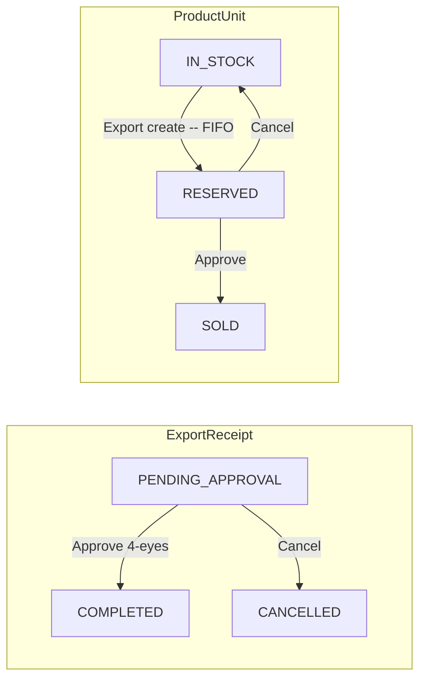
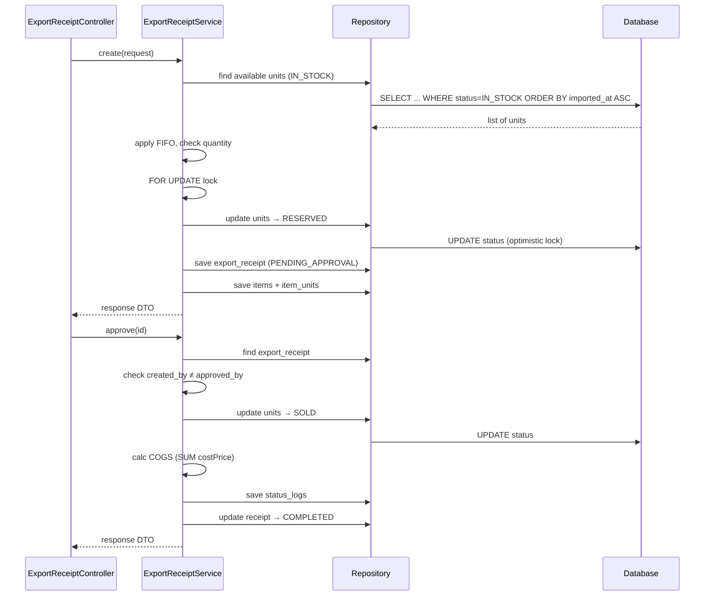

# Export Flow — Backend

## Controller

**Class:** `ExportReceiptController` (`/api/v1`)

| Method | Endpoint | Role | Description |
|--------|----------|------|-------------|
| `GET` | `/export-receipt` | `CAN_OPERATE` | List exports, filter by status |
| `GET` | `/export-receipt/{id}` | `CAN_OPERATE` | Get export detail |
| `POST` | `/export-receipt` | `CAN_OPERATE` | Create (reserve units) |
| `PUT` | `/export-receipt/{id}/approve` | `CAN_APPROVE` | Approve (4-eyes) |
| `PUT` | `/export-receipt/{id}/cancel` | `CAN_APPROVE` | Cancel |

## Service

**Class:** `ExportReceiptService`

| Method | Logic |
|--------|-------|
| `create(request)` | Generate receipt code (`EXP-YYYYMMDD-NNNN`), apply FIFO select (`ORDER BY imported_at ASC`), reserve units (`status=RESERVED`), create `ExportReceipt` + `ExportReceiptItem` + `ExportReceiptItemUnit` |
| `approve(id)` | Check `created_by ≠ approved_by`, update unit status `RESERVED→SOLD`, calculate COGS from unit cost prices, update receipt to `COMPLETED` |
| `cancel(id)` | Update receipt to `CANCELLED`, release units (`RESERVED→IN_STOCK`) |

## Entity & Table

| Table | Key fields |
|-------|------------|
| `export_receipts` | `receiptCode`, `reason` (`SALE/INTERNAL/RETURN_SUPPLIER/DISPOSE`), `customerId`, `totalAmount`, `totalCogs`, `status` (`PENDING_APPROVAL/COMPLETED/CANCELLED`), `createdBy`, `approvedBy` |
| `export_receipt_items` | `receiptId`, `productId`, `quantity`, `unitPrice`, `totalPrice` |
| `export_receipt_item_units` | `exportReceiptItemId`, `productUnitId`, `quantity`, `sellPrice` |
| `product_units` | status `IN_STOCK→RESERVED→SOLD`, `version` (optimistic lock), `costPrice` (for COGS) |

## State Machine

## Audit

| Action | entity_type | Khi nào |
|--------|-------------|---------|
| `CREATE` | `EXPORT_RECEIPT` | `POST /export-receipt` |
| `APPROVE` | `EXPORT_RECEIPT` | `PUT /export-receipt/{id}/approve` |
| `CANCEL` | `EXPORT_RECEIPT` | `PUT /export-receipt/{id}/cancel` |

## Sequence

