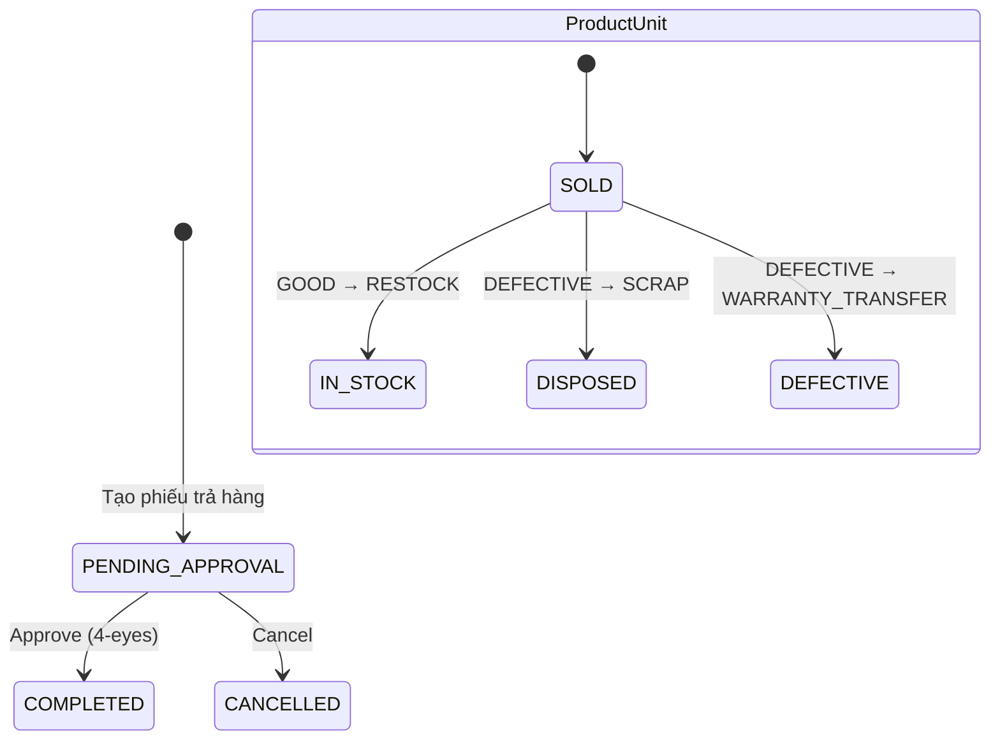
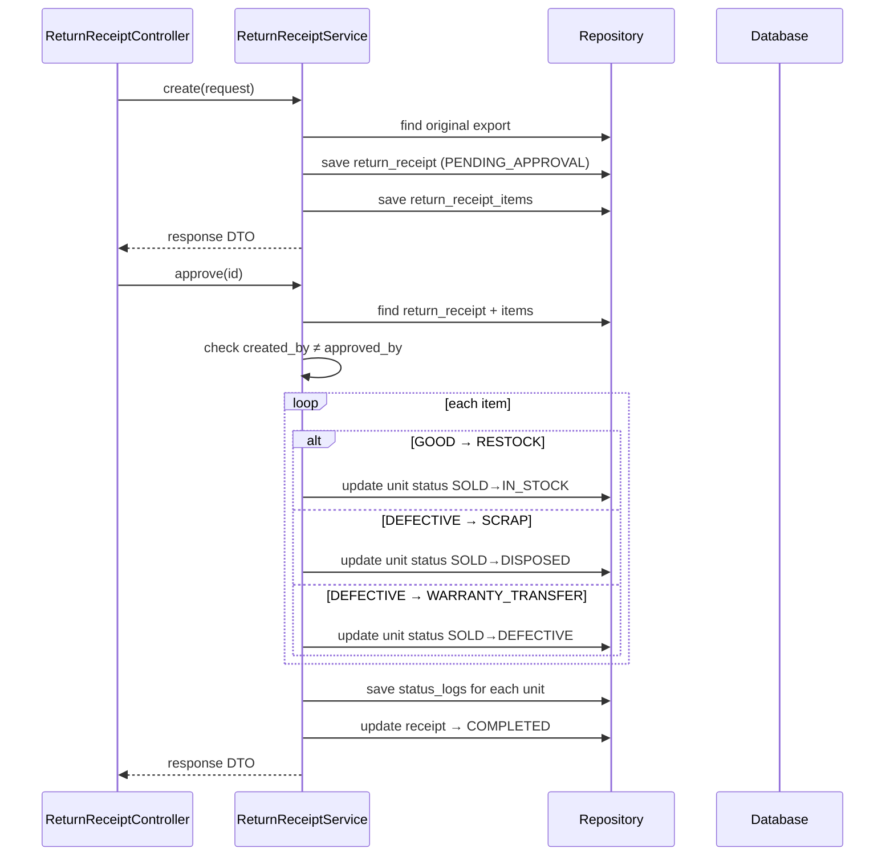

# Return Flow — Backend

## Controller

**Class:** `ReturnReceiptController` (`/api/v1/return-receipts`)

| Method | Endpoint | Role | Description |
|--------|----------|------|-------------|
| `GET` | `/return-receipts` | `CAN_OPERATE` | List returns |
| `GET` | `/return-receipts/{id}` | `CAN_OPERATE` | Get detail |
| `POST` | `/return-receipts` | `CAN_OPERATE` | Create return |
| `PUT` | `/return-receipts/{id}/approve` | `CAN_APPROVE` | Approve (4-eyes) |
| `PUT` | `/return-receipts/{id}/cancel` | `CAN_APPROVE` | Cancel |

## Service

**Class:** `ReturnReceiptService`

| Method | Logic |
|--------|-------|
| `create(request)` | Generate receipt code, link to original `export_receipt`, create `ReturnReceipt` + `ReturnReceiptItem` with condition + resulting action |
| `approve(id)` | For each item: `GOOD→RESTOCK` → unit `SOLD→IN_STOCK`; `DEFECTIVE→SCRAP` → unit `SOLD→DISPOSED`; `DEFECTIVE→WARRANTY_TRANSFER` → unit `SOLD→DEFECTIVE`. Enforce 4-eyes |
| `cancel(id)` | Update receipt to `CANCELLED` |

## Entity & Table

| Table | Key fields |
|-------|------------|
| `return_receipts` | `receiptCode`, `customerId`, `originalExportReceiptId`, `reason`, `status` (`PENDING_APPROVAL/COMPLETED/CANCELLED`), `createdBy`, `approvedBy` |
| `return_receipt_items` | `returnReceiptId`, `productUnitId`, `productId`, `quantity`, `condition` (`GOOD/DEFECTIVE`), `resultingAction` (`RESTOCK/SCRAP/WARRANTY_TRANSFER`) |
| `product_units` | status changes: `SOLD→IN_STOCK` (RESTOCK), `SOLD→DISPOSED` (SCRAP), `SOLD→DEFECTIVE` (WARRANTY_TRANSFER) |

## State Machine

## Audit

| Action | entity_type | Khi nào |
|--------|-------------|---------|
| `CREATE` | `RETURN_RECEIPT` | `POST /return-receipts` |
| `APPROVE` | `RETURN_RECEIPT` | `PUT /return-receipts/{id}/approve` |
| `CANCEL` | `RETURN_RECEIPT` | `PUT /return-receipts/{id}/cancel` |

## Sequence

