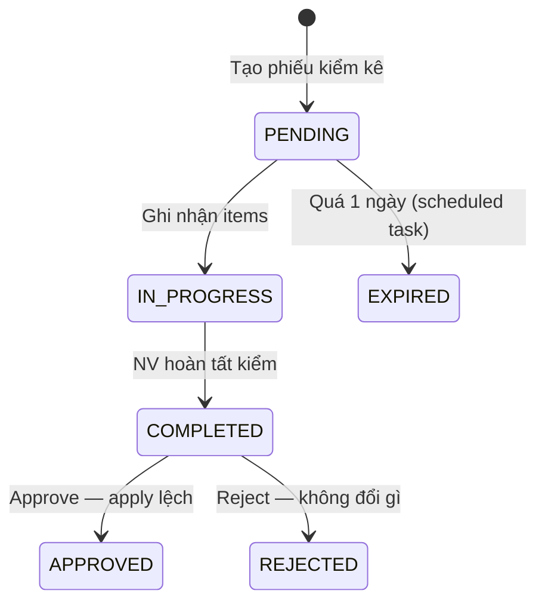
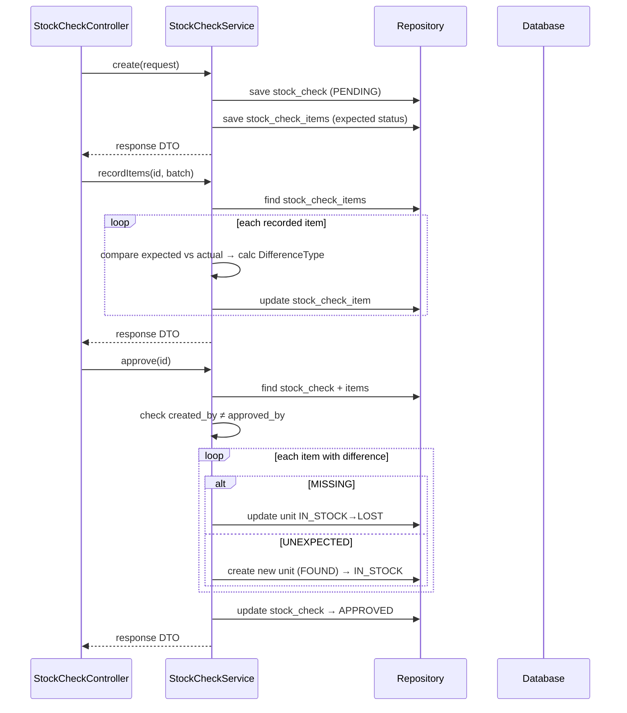

# Stock Check Flow — Backend

## Controller

**Class:** `StockCheckController` (`/api/v1`)

| Method | Endpoint | Role | Description |
|--------|----------|------|-------------|
| `GET` | `/stock-check/my` | `CAN_OPERATE_STOCK` | My stock checks |
| `GET` | `/stock-check` | `CAN_VIEW_INVENTORY` | List all checks |
| `GET` | `/stock-check/{id}` | `CAN_VIEW_INVENTORY` | Get detail |
| `POST` | `/stock-check` | `CAN_OPERATE_STOCK` | Create check |
| `PUT` | `/stock-check/{id}/items` | `CAN_OPERATE_STOCK` | Record items |
| `PUT` | `/stock-check/{id}/complete` | `CAN_OPERATE_STOCK` | Complete check |
| `PUT` | `/stock-check/{id}/approve` | `CAN_APPROVE` | Approve differences |
| `PUT` | `/stock-check/{id}/reject` | `CAN_APPROVE` | Reject check |

## Service

**Class:** `StockCheckService`

| Method | Logic |
|--------|-------|
| `create(request)` | Generate check code, create `StockCheck` with selected product units to verify |
| `recordItems(id, batch)` | For each item: record `actualStatus`, `countedQuantity`, auto-calc `difference` (`MATCH/MISSING/UNEXPECTED/PARTIAL_SHORTAGE`) |
| `complete(id)` | Mark `StockCheck` as `COMPLETED` |
| `approve(id, note)` | Apply differences: `MISSING` → create `StockAdjustment` (LOST) + unit `IN_STOCK→LOST`; `UNEXPECTED` → create `ProductUnit` (FOUND). Enforce 4-eyes |
| `reject(id, note)` | Mark as `REJECTED` — no changes applied |

## Entity & Table

| Table | Key fields |
|-------|------------|
| `stock_checks` | `checkCode`, `status` (`PENDING/IN_PROGRESS/COMPLETED/APPROVED/REJECTED/EXPIRED`), `createdBy`, `approvedBy` |
| `stock_check_items` | `stockCheckId`, `productUnitId`, `expectedStatus`, `actualStatus`, `countedQuantity`, `difference` (`MATCH/MISSING/UNEXPECTED/PARTIAL_SHORTAGE`), `note` |

## State Machine

## Audit

| Action | entity_type | Khi nào |
|--------|-------------|---------|
| `CREATE` | `STOCK_CHECK` | `POST /stock-check` |
| `APPROVE` | `STOCK_CHECK` | `PUT /stock-check/{id}/approve` |
| `REJECT` | `STOCK_CHECK` | `PUT /stock-check/{id}/reject` |
| `UPDATE` | `PRODUCT_UNIT` | Khi approve → `MISSING→LOST`, `UNEXPECTED→FOUND` |

## Sequence

