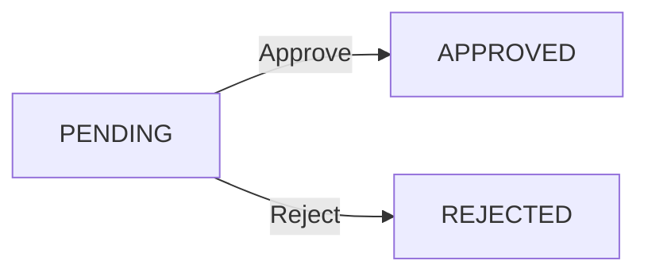
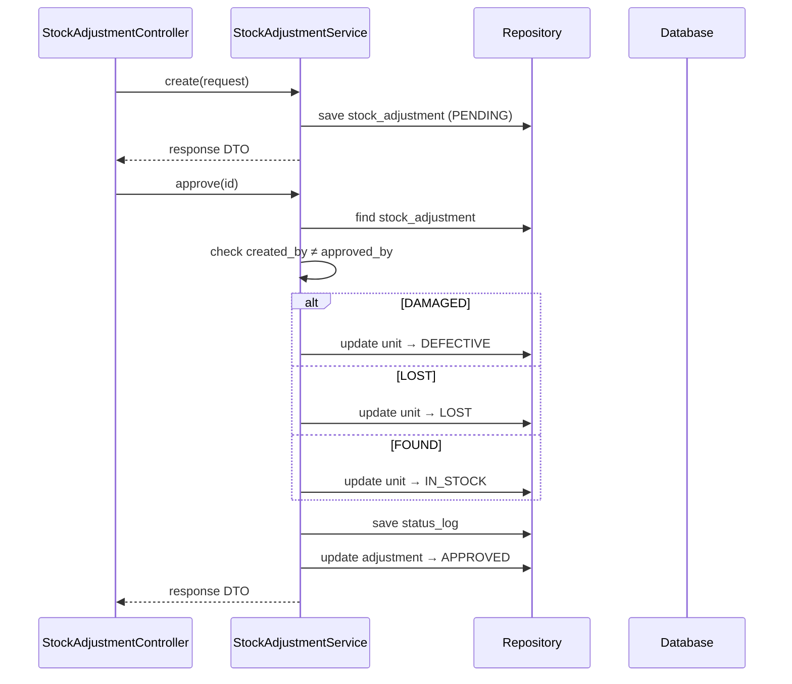

# Stock Adjustment Flow — Backend

## Controller

**Class:** `StockAdjustmentController` (`/api/v1/stock-adjustment`)

| Method | Endpoint | Role | Description |
|--------|----------|------|-------------|
| `GET` | `/stock-adjustment/my` | `CAN_OPERATE_STOCK` | My adjustments |
| `GET` | `/stock-adjustment` | `CAN_VIEW_INVENTORY` | List all |
| `GET` | `/stock-adjustment/{id}` | `CAN_VIEW_INVENTORY` | Get detail |
| `POST` | `/stock-adjustment` | `CAN_OPERATE_STOCK` | Create |
| `PUT` | `/stock-adjustment/{id}/approve` | `CAN_APPROVE` | Approve |
| `PUT` | `/stock-adjustment/{id}/reject` | `CAN_APPROVE` | Reject |

## Service

**Class:** `StockAdjustmentService`

| Method | Logic |
|--------|-------|
| `create(request)` | Generate adjust code (`ADJ-YYYYMMDD-NNNN`), create `StockAdjustment` with `type` (`DAMAGED/LOST/FOUND`), `reason`, optional `imageUrl` |
| `approve(id, note)` | Update `ProductUnit.status` — `DAMAGED→DEFECTIVE`, `LOST→LOST` (ghi nhận), `FOUND→IN_STOCK`. Enforce 4-eyes |
| `reject(id, note)` | Set status to `REJECTED` — no changes |

## Entity & Table

| Table | Key fields |
|-------|------------|
| `stock_adjustments` | `adjustCode`, `type` (`DAMAGED/LOST/FOUND`), `productUnitId`, `productId` (fallback), `quantity`, `reason`, `status` (`PENDING/APPROVED/REJECTED`), `createdBy`, `approvedBy` |

## State Machine

## Audit

| Action | entity_type | Khi nào |
|--------|-------------|---------|
| `CREATE` | `STOCK_ADJUSTMENT` | `POST /stock-adjustment` |
| `APPROVE` | `STOCK_ADJUSTMENT` | `PUT /stock-adjustment/{id}/approve` |
| `REJECT` | `STOCK_ADJUSTMENT` | `PUT /stock-adjustment/{id}/reject` |

## Sequence

