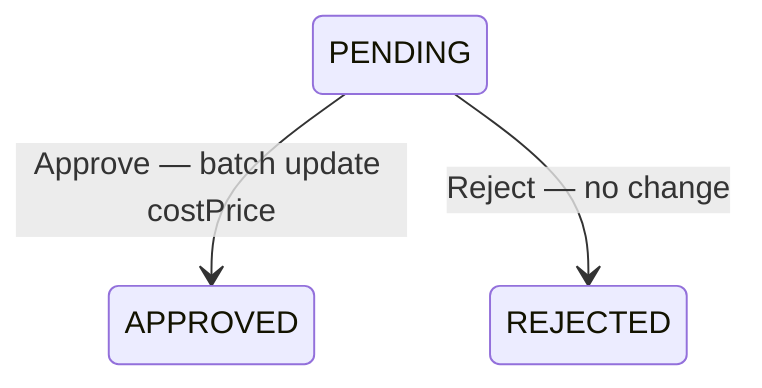
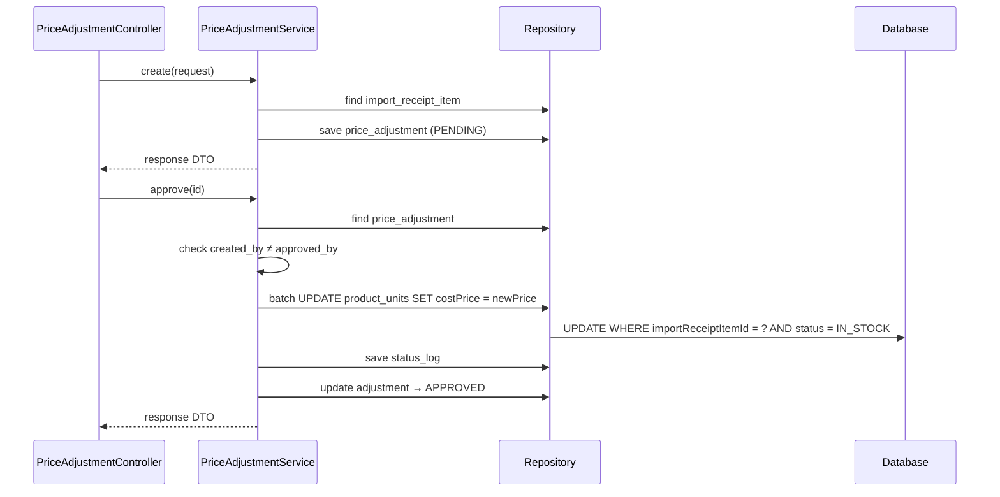

# Price Adjustment Flow — Backend

## Controller

**Class:** `PriceAdjustmentController` (`/api/v1/price-adjustment`)

| Method | Endpoint | Role | Description |
|--------|----------|------|-------------|
| `GET` | `/price-adjustment/my` | `CAN_OPERATE_STOCK` | My adjustments |
| `GET` | `/price-adjustment` | `CAN_VIEW_INVENTORY` | List all |
| `GET` | `/price-adjustment/{id}` | `CAN_VIEW_INVENTORY` | Get detail |
| `POST` | `/price-adjustment` | `CAN_OPERATE` | Create |
| `PUT` | `/price-adjustment/{id}/approve` | `CAN_APPROVE` | Approve |
| `PUT` | `/price-adjustment/{id}/reject` | `CAN_APPROVE` | Reject |

## Service

**Class:** `PriceAdjustmentService`

| Method | Logic |
|--------|-------|
| `create(request)` | Generate adjust code (`PADJ-YYYYMMDD-NNNN`), create `PriceAdjustment` with `importReceiptItemId`, `oldPrice`, `newPrice`, `reason` |
| `approve(id)` | Batch update `ProductUnit.costPrice` for all units of that `importReceiptItemId` where `status=IN_STOCK`. Enforce 4-eyes |
| `reject(id)` | Set status to `REJECTED` |

## Entity & Table

| Table | Key fields |
|-------|------------|
| `price_adjustments` | `adjustCode`, `importReceiptItemId`, `oldPrice`, `newPrice`, `reason`, `status` (`PENDING/APPROVED/REJECTED`), `createdBy`, `approvedBy` |
| `product_units` | `costPrice` updated by batch `UPDATE ... WHERE importReceiptItemId = ? AND status = IN_STOCK` |

## State Machine

## Audit

| Action | entity_type | Khi nào |
|--------|-------------|---------|
| `CREATE` | `PRICE_ADJUSTMENT` | `POST /price-adjustment` |
| `APPROVE` | `PRICE_ADJUSTMENT` | `PUT /price-adjustment/{id}/approve` |
| `REJECT` | `PRICE_ADJUSTMENT` | `PUT /price-adjustment/{id}/reject` |

## Sequence

