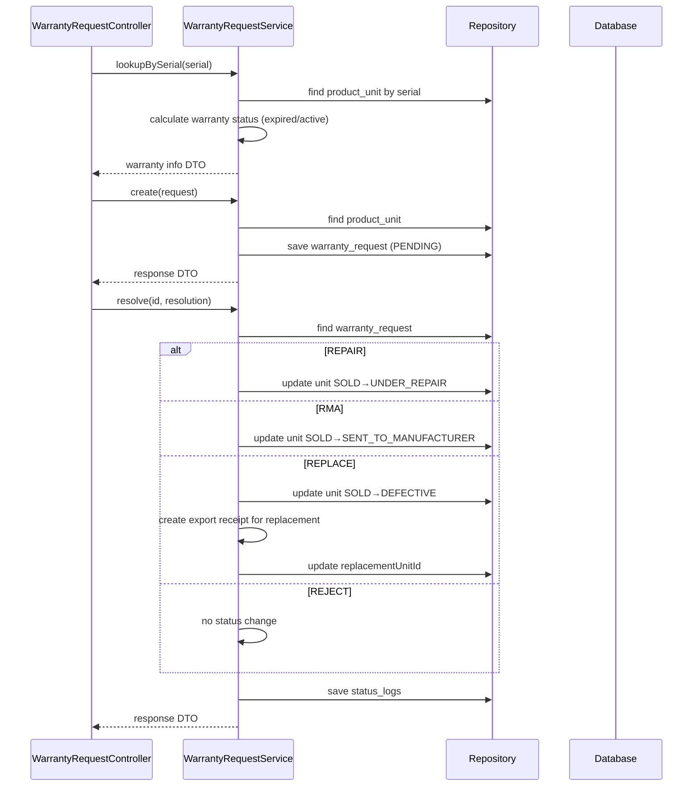

# Warranty Flow — Backend

## Controller

**Class:** `WarrantyRequestController` (`/api/v1/warranty-request`)

| Method | Endpoint | Role | Description |
|--------|----------|------|-------------|
| `GET` | `/warranty-request/lookup` | `CAN_OPERATE` | Lookup by serial (check warranty status) |
| `GET` | `/warranty-request` | `CAN_VIEW_INVENTORY` | List all |
| `GET` | `/warranty-request/my-handled` | `CAN_OPERATE` | My handled requests |
| `GET` | `/warranty-request/{id}` | `CAN_VIEW_INVENTORY` | Get detail |
| `POST` | `/warranty-request` | `CAN_OPERATE` | Create |
| `PUT` | `/warranty-request/{id}/resolve` | `CAN_APPROVE` | Resolve with resolution |
| `PUT` | `/warranty-request/{id}/complete` | `CAN_OPERATE` | Complete execution |
| `PUT` | `/warranty-request/{id}/cancel` | `CAN_APPROVE` | Cancel |

## Service

**Class:** `WarrantyRequestService`

| Method | Logic |
|--------|-------|
| `lookupBySerial(serial)` | Query `ProductUnit` by serial, return warranty info (warrantyExpiresAt, isWarrantyActive, warrantyStartDate) |
| `create(request)` | Generate request code (`WR-YYYYMMDD-NNNN`), create `WarrantyRequest` linked to `ProductUnit`, set `PENDING` |
| `resolve(id, resolution)` | Set `resolutionType` (`REPAIR/RMA/REPLACE/REJECT/RETURN_SUPPLIER`). REPAIR → `SOLD→UNDER_REPAIR`; RMA → `SOLD→SENT_TO_MANUFACTURER`; REPLACE → `SOLD→DEFECTIVE` + create replacement export; REJECT → no status change |
| `complete(id, request)` | Mark as `COMPLETED`, update `completedAt`, finalize unit transitions |
| `cancel(id, request)` | Set to `CANCELLED` |

## Entity & Table

| Table | Key fields |
|-------|------------|
| `warranty_requests` | `requestCode`, `productUnitId`, `customerId`, `issueDescription`, `resolutionType` (`REPAIR/RMA/REPLACE/REJECT/RETURN_SUPPLIER`), `replacementUnitId`, `rmaNumber`, `sentToPartnerAt`, `status` (`PENDING/COMPLETED/CANCELLED`), `handledBy` |
| `product_units` | status changes: `SOLD→UNDER_REPAIR` / `SOLD→SENT_TO_MANUFACTURER` / `SOLD→DEFECTIVE` |
| `export_receipts` | Tự động tạo export `reason=INTERNAL` khi REPLACE (replacement unit) |

## State Machine

```mermaid
stateDiagram-v2
    PENDING --> COMPLETED : Complete execution
    PENDING --> CANCELLED : Cancel

    state "ProductUnit" as PU {
        SOLD --> UNDER_REPAIR : resolve → REPAIR
        SOLD --> SENT_TO_MANUFACTURER : resolve → RMA
        SOLD --> DEFECTIVE : resolve → REPLACE
        UNDER_REPAIR --> SOLD : complete → repaired
        UNDER_REPAIR --> DEFECTIVE : complete → cannot repair
        SENT_TO_MANUFACTURER --> SOLD : complete → returned from mfr
        SENT_TO_MANUFACTURER --> DEFECTIVE : complete → mfr rejected
    }

    note right of PU : REPLACE: auto-create export receipt<br/>for replacement unit (reason=INTERNAL)
```

## Audit

| Action | entity_type | Khi nào |
|--------|-------------|---------|
| `CREATE` | `WARRANTY_REQUEST` | `POST /warranty-request` |
| `RESOLVE` | `WARRANTY_REQUEST` | `PUT /warranty-request/{id}/resolve` |
| `COMPLETE` | `WARRANTY_REQUEST` | `PUT /warranty-request/{id}/complete` |
| `CANCEL` | `WARRANTY_REQUEST` | `PUT /warranty-request/{id}/cancel` |

## Sequence

