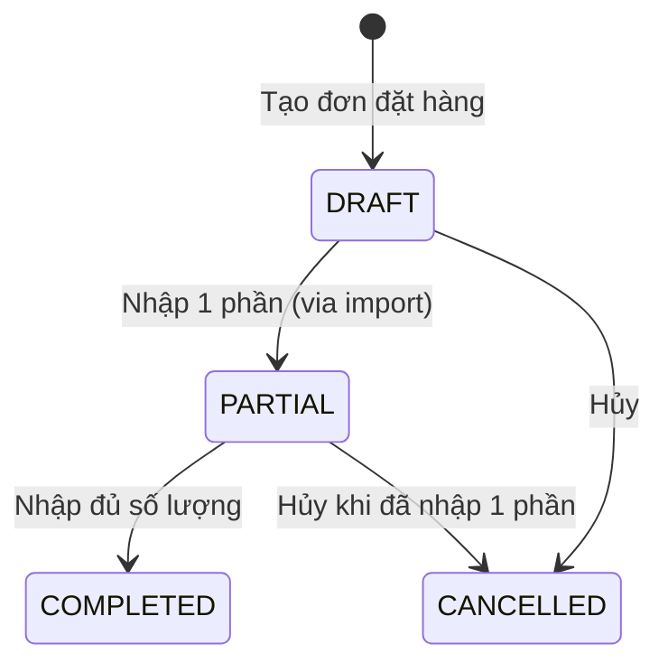
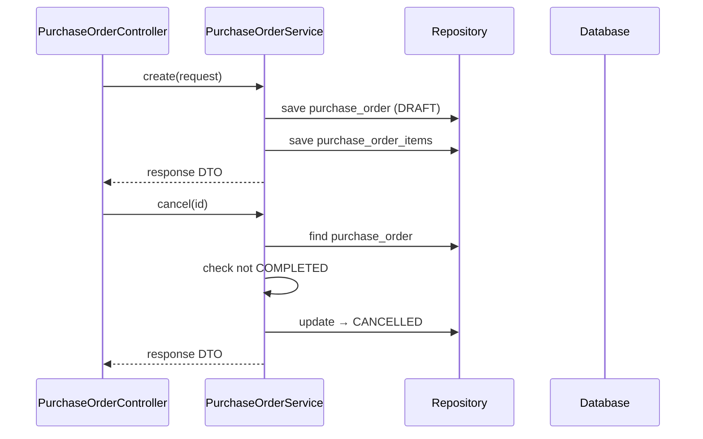

# Purchase Order Flow — Backend

## Controller

**Class:** `PurchaseOrderController` (`/api/v1/purchase-order`)

| Method | Endpoint | Role | Description |
|--------|----------|------|-------------|
| `GET` | `/purchase-order` | `CAN_VIEW_INVENTORY` | List POs, filter by status |
| `GET` | `/purchase-order/{id}` | `CAN_VIEW_INVENTORY` | Get PO detail |
| `POST` | `/purchase-order` | `CAN_MANAGE_CATALOG` | Create PO |
| `PUT` | `/purchase-order/{id}/cancel` | `CAN_MANAGE_CATALOG` | Cancel PO |

## Service

**Class:** `PurchaseOrderService`

| Method | Logic |
|--------|-------|
| `create(request)` | Generate PO code (`PO-YYYYMMDD-NNNN`), create `PurchaseOrder` + `PurchaseOrderItem`. No approval step — direct `DRAFT` |
| `cancel(id)` | Check PO is not `COMPLETED`, update to `CANCELLED` |
| `findAll(pageable, status)` | Query with optional status filter |
| `findOne(id)` | Get PO with items |

## Entity & Table

| Table | Key fields |
|-------|------------|
| `purchase_orders` | `poCode`, `supplierId`, `totalAmount`, `status` (`DRAFT/PARTIAL/COMPLETED/CANCELLED`), `expectedDate`, `note`, `createdBy` |
| `purchase_order_items` | `poId`, `productId`, `quantity`, `unitPrice`, `receivedQuantity` |

## State Machine

## Audit

| Action | entity_type | Khi nào |
|--------|-------------|---------|
| `CREATE` | `PURCHASE_ORDER` | `POST /purchase-order` |
| `CANCEL` | `PURCHASE_ORDER` | `PUT /purchase-order/{id}/cancel` |

## Sequence

