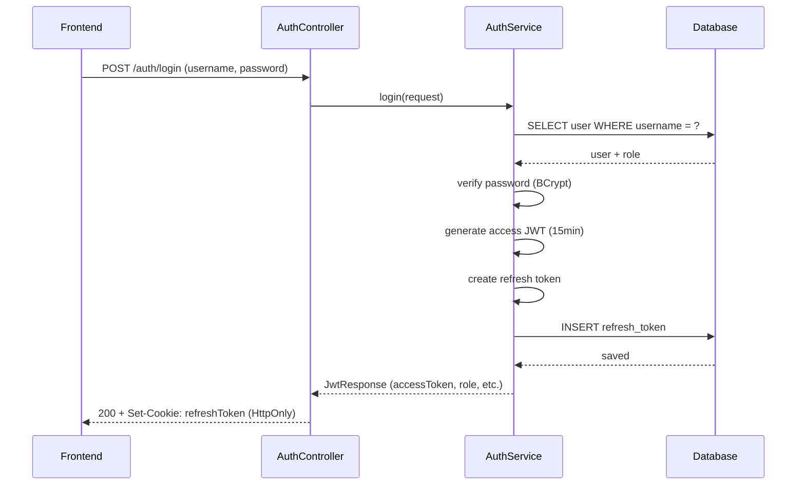
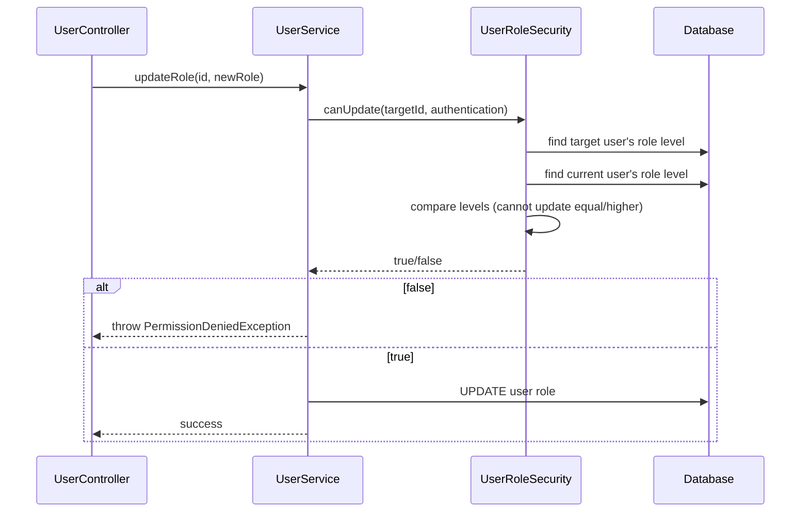

# Auth Flow — Backend

## Controllers

### AuthController (`/api/v1/auth`)

| Method | Endpoint | Role | Description |
|--------|----------|------|-------------|
| `POST` | `/auth/login` | Public | Login → JWT access + refresh cookie |
| `POST` | `/auth/refresh-token` | Public | Refresh expired access token |
| `POST` | `/auth/logout` | Public | Clear refresh cookie |
| `PUT` | `/auth/{id}/reset-password` | `CAN_MANAGE_SYSTEM` | Admin force-reset password |
| `POST` | `/auth/forgot-password` | Public | Send reset email |
| `POST` | `/auth/reset-password` | Public | Reset by token |
| `PUT` | `/auth/change-password` | Authenticated | User self-change password |

### UserController (`/api/v1/user`)

| Method | Endpoint | Role | Description |
|--------|----------|------|-------------|
| `GET` | `/user` | `CAN_MANAGE_SYSTEM` | List users |
| `GET` | `/user/{id}` | `CAN_MANAGE_SYSTEM` | Get user detail |
| `POST` | `/user` | `CAN_MANAGE_SYSTEM` | Create user |
| `PUT` | `/user/{id}/info` | `CAN_MANAGE_SYSTEM` | Update user info |
| `PUT` | `/user/{id}/status` | `CAN_MANAGE_SYSTEM` | Toggle active |
| `PUT` | `/user/{id}/role` | `CAN_MANAGE_SYSTEM` | Change role |

## Services

| Service | Key methods |
|---------|-------------|
| `AuthService` | `login` → validate credentials → generate JWT + refresh; `refreshToken` → verify refresh → rotate; `logout` → clear cookie |
| `UserService` | `create` → validate unique username/email → hash password → save; `updateRole` → enforce hierarchy via `UserRoleSecurity.canUpdate()` |
| `UserDetailService` | `loadUserByUsername` — Spring Security UserDetails |

## Security Architecture

```mermaid
graph TD
    A[Request] --> B[AuthTokenFilter]
    B --> C{Has Bearer token?}
    C -->|No| D[Pass through]
    C -->|Yes| E[Decode JWT]
    E --> F[Set SecurityContext]
    F --> G[Controller]
    G --> H{@PreAuthorize check}
    H -->|Pass| I[Service method]
    H -->|Fail| J[403 Forbidden]
    I --> K[AuditLogAspect]
    K --> L[AOP log before/after]

    subgraph "Role Hierarchy (URole)"
        M[ADMIN level=1]
        N[MANAGER level=2]
        O[SALES level=3]
        P[STOCK level=3]
    end
```

### Key components

| Component | File | Role |
|-----------|------|------|
| `SecurityConfig` | `config/security/SecurityConfig.java` | Public endpoints, CORS, CSRF disable, stateful session disable, `@EnableMethodSecurity` |
| `AuthTokenFilter` | `config/security/AuthTokenFilter.java` | OncePerRequest: extract Bearer → parse JWT → set `UsernamePasswordAuthenticationToken` |
| `JWTUtils` | `utils/JWTUtils.java` | Generate/validate JWT with claims: `id`, `username`, `email`, `role`, `fullName` |
| `AuthEntryPointJwt` | `config/security/AuthEntryPointJwt.java` | 401 handler — unauthorized JSON response |
| `RoleAccessHandler` | `config/security/RoleAccessHandler.java` | 403 handler — forbidden JSON response |
| `UserRoleSecurity` | `config/security/UserRoleSecurity.java` | Bean method `canUpdate(id, auth)` — prevents self/equal/higher-level update |
| `AuthorizationExpressions` | `constant/security/AuthorizationExpressions.java` | Reusable SpEL constants: `CAN_APPROVE`, `CAN_OPERATE`, etc. |

### Authorization expressions

| Expression | Roles allowed |
|------------|---------------|
| `ROLE_ADMIN` | ADMIN |
| `ROLE_MANAGER` | MANAGER |
| `CAN_VIEW_REPORTS` | MANAGER, ADMIN |
| `CAN_APPROVE` | MANAGER, ADMIN |
| `CAN_OPERATE_STOCK` | MANAGER, STOCK |
| `CAN_VIEW_INVENTORY` | MANAGER, ADMIN, STOCK |
| `CAN_OPERATE` | SALES, STOCK, MANAGER |
| `CAN_MANAGE_CATALOG` | MANAGER |
| `CAN_MANAGE_SYSTEM` | ADMIN |

## Audit

Login/logout không audit qua `@AuditLog` (auth events handled separately). User CRUD và role change được audit:

| Action | entity_type | Khi nào |
|--------|-------------|---------|
| `CREATE` | `USER` | `POST /user` |
| `UPDATE` | `USER` | `PUT /user/{id}/info` |
| `TOGGLE_ACTIVE` | `USER` | `PUT /user/{id}/status` |
| `UPDATE_ROLE` | `USER` | `PUT /user/{id}/role` |

## Sequence — Login



## Sequence — Role hierarchy check (user update)

