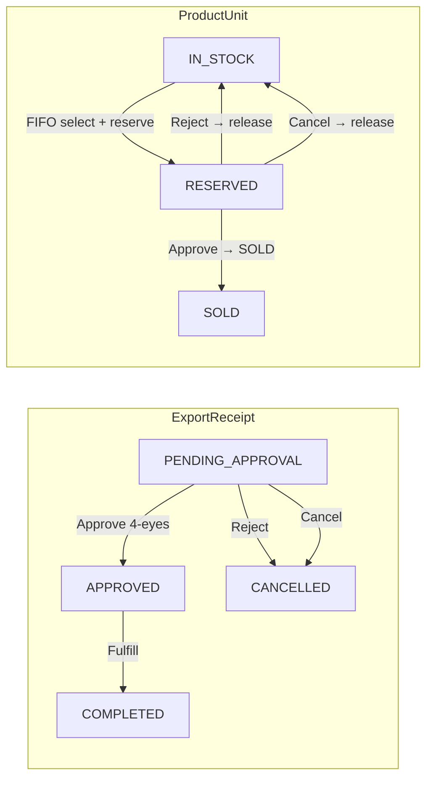
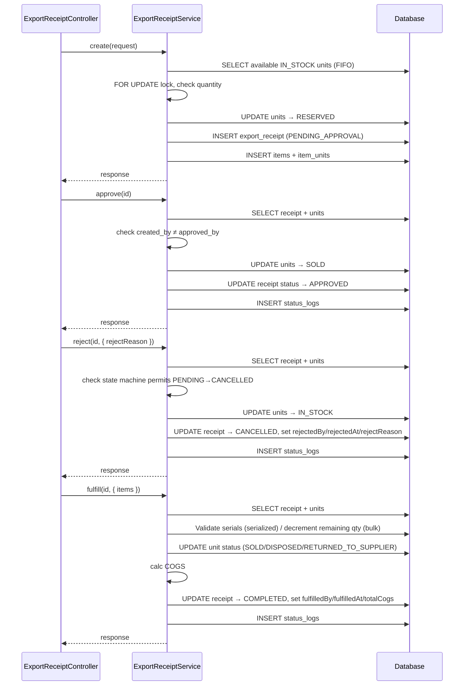
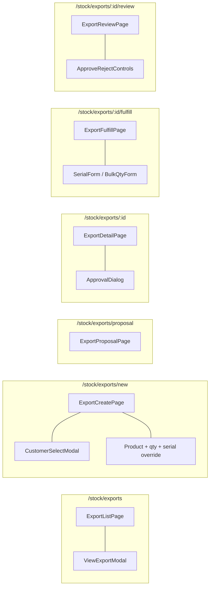

# 02 — Export Flow

## BE

### Controller — `ExportReceiptController`

| Method | Endpoint | Role Guard |
|--------|----------|------------|
| `GET` | `/export-receipt` | `CAN_OPERATE` |
| `GET` | `/export-receipt/{id}` | `CAN_OPERATE` |
| `POST` | `/export-receipt` | `CAN_OPERATE` |
| `PUT` | `/export-receipt/{id}/approve` | `CAN_APPROVE` |
| `PUT` | `/export-receipt/{id}/reject` | `CAN_APPROVE` |
| `PUT` | `/export-receipt/{id}/fulfill` | `CAN_OPERATE` |
| `PUT` | `/export-receipt/{id}/cancel` | `CAN_APPROVE` |
| `GET` | `/export-receipt/{id}/units` | `CAN_OPERATE` |

### Service — `ExportReceiptService`

| Method | Logic |
|--------|-------|
| `create` | Gen code `EXP-YYYYMMDD-NNNN`, FIFO select (`ORDER BY imported_at ASC`), reserve units (`IN_STOCK→RESERVED`), save receipt + items + item_units |
| `approve` | Check `created_by ≠ approved_by`, units `RESERVED→SOLD`, calc COGS from unit cost prices, set `COMPLETED`, set `approvedBy` |
| `reject` | Set `CANCELLED`, populate `rejectedBy`/`rejectedAt`/`rejectReason`, units `RESERVED→IN_STOCK` |
| `fulfill` | Process units (bulk: decrement remaining qty; serialized: validate serials, set unit status to `SOLD`/`DISPOSED`/`RETURNED_TO_SUPPLIER`, set warranty dates for SALE), calc COGS, set `fulfilledBy`/`fulfilledAt`/`totalCogs` |
| `cancel` | Units `RESERVED→IN_STOCK`, set `CANCELLED` |
| `getUnitsByReceipt` | Return exported units for receipt, optional filter by `productId` |

### State Machine

### Sequence

## FE

### Routes

| Path | Component | Guard |
|------|-----------|-------|
| `/stock/exports` | `ExportListPage` | `CAN_OPERATE` |
| `/stock/exports/new` | `ExportCreatePage` | `CAN_OPERATE` |
| `/stock/exports/proposal` | `ExportProposalPage` | `CAN_OPERATE` |
| `/stock/exports/:id` | `ExportDetailPage` | `CAN_OPERATE` |
| `/stock/exports/:id/fulfill` | `ExportFulfillPage` | `CAN_OPERATE` |
| `/stock/exports/:id/review` | `ExportReviewPage` | `CAN_OPERATE` |

### Pages

| Page | File | Chức năng |
|------|------|-----------|
| `ExportListPage` | `features/stock/pages/export-list-page.tsx` | Dùng `ReceiptListPage`, columns: customer, reason, externalReference, totalAmount, status |
| `ExportCreatePage` | `features/stock/pages/export-create-page.tsx` | Chọn customer, thêm SP + qty, auto FIFO pick serial, có override serial |
| `ExportProposalPage` | `features/stock/pages/export-proposal-page.tsx` | Tạo phiếu xuất dạng đề xuất |
| `ExportDetailPage` | `features/stock/pages/export-detail-page.tsx` | Chi tiết + actions (approve/reject) |
| `ExportFulfillPage` | `features/stock/pages/export-fulfill-page.tsx` | Xử lý xuất kho thực tế (chọn serial cho serialized, nhập số lượng cho bulk) |
| `ExportReviewPage` | `features/stock/pages/export-review-page.tsx` | Duyệt (approve/reject) phiếu xuất đã fulfilled |

### Hooks

| Hook | Mutation |
|------|----------|
| `useExportReceipts` | `GET /export-receipt` (React Query listing) |
| (pages call service directly) | `POST /export-receipt` |
| (pages call service directly) | `PUT /export-receipt/{id}/approve` |
| (pages call service directly) | `PUT /export-receipt/{id}/reject` |
| (pages call service directly) | `PUT /export-receipt/{id}/fulfill` |
| (pages call service directly) | `PUT /export-receipt/{id}/cancel` |

### Service — `services/export-service.ts`

| Function | API |
|----------|-----|
| `getExportReceipts(params)` | `GET /export-receipt` |
| `getExportReceiptById(id)` | `GET /export-receipt/{id}` |
| `createExportReceipt(data)` | `POST /export-receipt` |
| `approveExportReceipt(id)` | `PUT /export-receipt/{id}/approve` |
| `rejectExportReceipt(id, { rejectReason })` | `PUT /export-receipt/{id}/reject` |
| `fulfillExportReceipt(id, { items })` | `PUT /export-receipt/{id}/fulfill` |
| `cancelExportReceipt(id)` | `PUT /export-receipt/{id}/cancel` |
| `getExportUnits(id, productId?)` | `GET /export-receipt/{id}/units` |

### Component Tree

