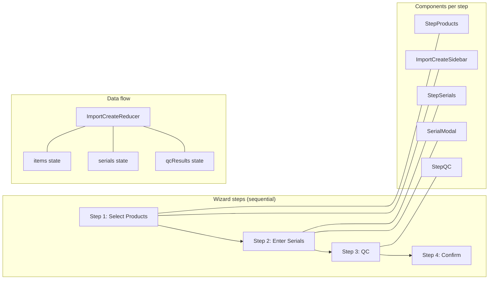
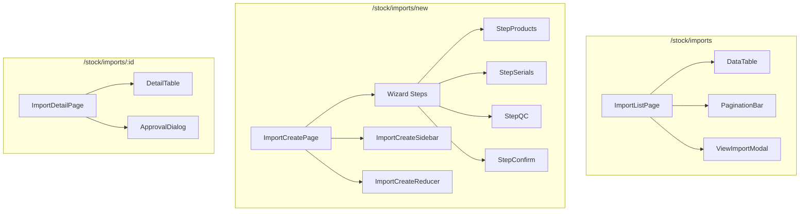

# Import Flow — Frontend

## Route

| Path | Component | PageGuard | Description |
|------|-----------|-----------|-------------|
| `/stock/imports` | `ImportListPage` | `CAN_VIEW_INVENTORY` | List all import receipts |
| `/stock/imports/new` | `ImportCreatePage` | `CAN_OPERATE_STOCK` | Wizard create (4 steps) |
| `/stock/imports/:id` | `ImportDetailPage` | `CAN_VIEW_INVENTORY` | Detail + approve/cancel |

## Page — ImportListPage

**File:** `features/stock/pages/import-list-page.tsx`

Uses shared `ReceiptListPage<R>` template with pre-configured columns.

| Prop | Value |
|------|-------|
| `useHook` | `useImportList` |
| `columns` | receiptCode, supplier, totalAmount, status, createdAt |
| `cancelService` | `importService.cancel` |
| `approveService` | `importService.approve` |
| `ViewModal` | `ViewImportModal` |
| `createRoute` | `/stock/imports/new` |

## Page — ImportCreatePage (Wizard)

**File:** `features/stock/pages/import-create-page.tsx`

4-step wizard managed by `importCreateReducer`:

| Step | Component | Logic |
|------|-----------|-------|
| 1. Products | `StepProducts` | Select product + qty from catalog, show sidebar summary |
| 2. Serials | `StepSerials` | Input serials (one per line, paste multi), assign location via `LocationPicker` |
| 3. QC | `StepQC` | Toggle Pass/Fail per serial, progress bar |
| 4. Confirm | (inline) | Summary + submit → `POST /import-receipt` |

## Page — ImportDetailPage

**File:** `features/stock/pages/import-detail-page.tsx`

| Section | Content |
|---------|---------|
| Header | receiptCode, status badge, supplier |
| Items table | product, qty, unitPrice, warrantyMonths |
| Units table | serial, location, status |
| Actions | `ApprovalDialog` for approve/cancel (role-based) |

## Hooks

| Hook | File | Query key | Mutation |
|------|------|-----------|----------|
| `useImportList` | `hooks/use-import-list.ts` | `['imports', params]` | — |
| `useImportDetail` | (inline or shared) | `['import', id]` | — |
| `useImportCreate` | (inline) | — | `POST /import-receipt` |
| `useImportApprove` | (inline) | — | `PUT /import-receipt/{id}/approve` |
| `useImportCancel` | (inline) | — | `PUT /import-receipt/{id}/cancel` |

## Service

**File:** `services/import-service.ts`

| Function | API | Description |
|----------|-----|-------------|
| `getAll(params)` | `GET /import-receipt` | Paginated list |
| `getById(id)` | `GET /import-receipt/{id}` | Detail |
| `create(data)` | `POST /import-receipt` | Create + auto-confirm |
| `approve(id)` | `PUT /import-receipt/{id}/approve` | Approve |
| `cancel(id)` | `PUT /import-receipt/{id}/cancel` | Cancel |

## Component Tree

