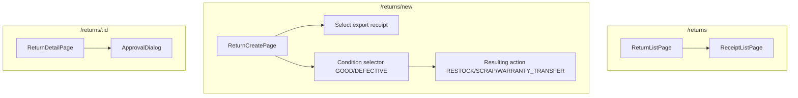

# Return Flow — Frontend

## Route

| Path | Component | PageGuard | Description |
|------|-----------|-----------|-------------|
| `/returns` | `ReturnListPage` | `CAN_OPERATE` | List returns |
| `/returns/new` | `ReturnCreatePage` | `CAN_OPERATE` | Create return |
| `/returns/:id` | `ReturnDetailPage` | `CAN_OPERATE` | Detail + approve/cancel |

## Page — ReturnListPage

**File:** `features/stock/pages/return-list-page.tsx`

Uses shared `ReceiptListPage<R>` template.

| Prop | Value |
|------|-------|
| `useHook` | `useReturnList` |
| `columns` | receiptCode, customer, exportReceipt, reason, status |
| `cancelService` | `returnService.cancel` |
| `approveService` | `returnService.approve` |
| `createRoute` | `/returns/new` |

## Page — ReturnCreatePage

**File:** `features/stock/pages/return-create-page.tsx`

| Section | Logic |
|---------|-------|
| Select export | Autocomplete by export code or serial — find original sale |
| Select reason | `CHANGE_MIND` / `DEFECTIVE` / `WRONG_ITEM`; CHANGE_MIND shows remaining 7-day window |
| Pick serials | Select which units are being returned |
| Define condition | For each unit: `GOOD` or `DEFECTIVE` |
| Resulting action | `GOOD→RESTOCK` (auto); `DEFECTIVE→SCRAP` or `WARRANTY_TRANSFER` |

## Page — ReturnDetailPage

**File:** `features/stock/pages/return-detail-page.tsx`

| Section | Content |
|---------|---------|
| Header | receiptCode, status, customer, export ref |
| Items | product, serial, condition, resulting action |
| Actions | `ApprovalDialog` |

## Hooks

| Hook | Query key | Mutation |
|------|-----------|----------|
| `useReturnList` | `['returns', params]` | — |
| `useReturnCreate` | — | `POST /return-receipts` |
| `useReturnApprove` | — | `PUT /return-receipts/{id}/approve` |
| `useReturnCancel` | — | `PUT /return-receipts/{id}/cancel` |

## Service

**File:** `services/return-service.ts`

| Function | API | Description |
|----------|-----|-------------|
| `getAll(params)` | `GET /return-receipts` | Paginated list |
| `getById(id)` | `GET /return-receipts/{id}` | Detail |
| `create(data)` | `POST /return-receipts` | Create |
| `approve(id)` | `PUT /return-receipts/{id}/approve` | Approve (apply actions) |
| `cancel(id)` | `PUT /return-receipts/{id}/cancel` | Cancel |

## Component Tree

