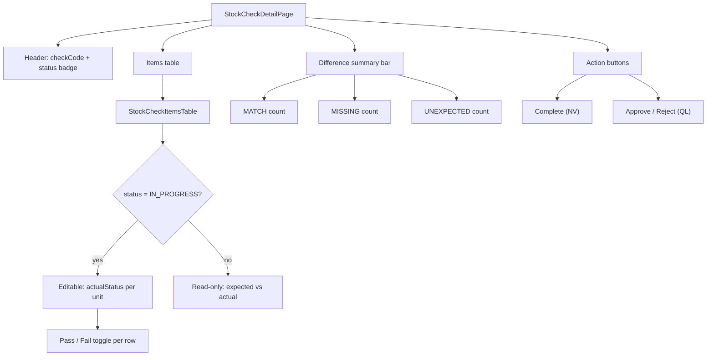
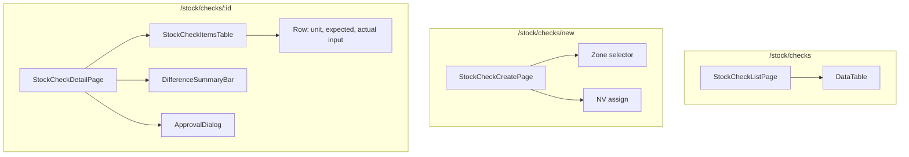

# Stock Check Flow — Frontend

## Route

| Path | Component | PageGuard | Description |
|------|-----------|-----------|-------------|
| `/stock/checks` | `StockCheckListPage` | `CAN_VIEW_INVENTORY` | List stock checks |
| `/stock/checks/new` | `StockCheckCreatePage` | `CAN_OPERATE_STOCK` | Create check |
| `/stock/checks/:id` | `StockCheckDetailPage` | `CAN_VIEW_INVENTORY` | Detail + record + approve |

## Page — StockCheckListPage

**File:** `features/stock/pages/stock-check-list-page.tsx`

| Feature | Detail |
|---------|--------|
| Table columns | checkCode, zone, status, createdBy, createdAt |
| Filters | status, date range |
| My checks tab | `/stock-check/my` filtered by current user |

## Page — StockCheckCreatePage

**File:** `features/stock/pages/stock-check-create-page.tsx`

| Section | Logic |
|---------|-------|
| Select zone | Choose warehouse zone to check |
| NV assigned | Pick which NV will record items |
| Auto-select units | System lists all `IN_STOCK` units in selected zone |
| Submit | `POST /stock-check` → status `PENDING` |

## Page — StockCheckDetailPage

**File:** `features/stock/pages/stock-check-detail-page.tsx`

This is the most complex page in the check flow:

| State | NV actions | QL actions |
|-------|------------|------------|
| `PENDING` | — | — (waiting for items) |
| `IN_PROGRESS` | Record `actualStatus` + `countedQuantity` per unit | — |
| `COMPLETED` | Read-only | Approve or Reject |

## Hooks

| Hook | Query key | Mutation |
|------|-----------|----------|
| `useStockCheckList` | `['stock-checks', params]` | — |
| `useStockCheckCreate` | — | `POST /stock-check` |
| `useRecordItems` | — | `PUT /stock-check/{id}/items` |
| `useCompleteCheck` | — | `PUT /stock-check/{id}/complete` |
| `useApproveCheck` | — | `PUT /stock-check/{id}/approve` |
| `useRejectCheck` | — | `PUT /stock-check/{id}/reject` |

## Service

**File:** `services/stock-check-service.ts`

| Function | API | Description |
|----------|-----|-------------|
| `getAll(params)` | `GET /stock-check` | Paginated list |
| `getMy(params)` | `GET /stock-check/my` | My checks |
| `getById(id)` | `GET /stock-check/{id}` | Detail with items |
| `create(data)` | `POST /stock-check` | Create |
| `recordItems(id, items)` | `PUT /stock-check/{id}/items` | Batch record actual status |
| `complete(id)` | `PUT /stock-check/{id}/complete` | Complete |
| `approve(id, note)` | `PUT /stock-check/{id}/approve` | Approve differences |
| `reject(id, note)` | `PUT /stock-check/{id}/reject` | Reject |

## Component Tree

