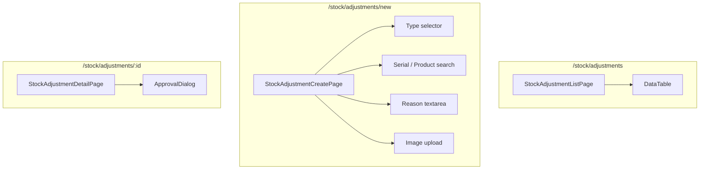

# Stock Adjustment Flow — Frontend

## Route

| Path | Component | PageGuard | Description |
|------|-----------|-----------|-------------|
| `/stock/adjustments` | `StockAdjustmentListPage` | `CAN_VIEW_INVENTORY` | List all adjustments |
| `/stock/adjustments/new` | `StockAdjustmentCreatePage` | `CAN_OPERATE_STOCK` | Create adjustment |
| `/stock/adjustments/:id` | `StockAdjustmentDetailPage` | `CAN_VIEW_INVENTORY` | Detail + approve/reject |

## Page — StockAdjustmentListPage

**File:** `features/stock/pages/stock-adjustment-list-page.tsx`

| Feature | Detail |
|---------|--------|
| Columns | adjustCode, type (DAMAGED/LOST/FOUND), product, reason, status, createdBy |
| Filters | type, status |
| Tabs | My adjustments (`/stock-adjustment/my`) vs All |

## Page — StockAdjustmentCreatePage

**File:** `features/stock/pages/stock-adjustment-create-page.tsx`

| Section | Logic |
|---------|-------|
| Type selector | DAMAGED / LOST / FOUND — changes UI context |
| Product unit | Search by serial or product; for FOUND without serial → fallback to productId + quantity |
| Reason | Required textarea, reason for adjustment |
| Image | Optional upload (damaged proof) via `FileUploadController` |
| Submit | `POST /stock-adjustment` → status `PENDING` |

## Page — StockAdjustmentDetailPage

**File:** `features/stock/pages/stock-adjustment-detail-page.tsx`

| Section | Content |
|---------|---------|
| Header | adjustCode, type badge, status |
| Detail | product, serial, reason, image |
| Actions | `ApprovalDialog` — approve or reject |

## Hooks

| Hook | Query key | Mutation |
|------|-----------|----------|
| `useStockAdjustmentList` | `['adjustments', params]` | — |
| `useMyAdjustments` | `['my-adjustments', params]` | — |
| `useCreateAdjustment` | — | `POST /stock-adjustment` |
| `useApproveAdjustment` | — | `PUT /stock-adjustment/{id}/approve` |
| `useRejectAdjustment` | — | `PUT /stock-adjustment/{id}/reject` |

## Service

**File:** `services/stock-adjustment-service.ts`

| Function | API | Description |
|----------|-----|-------------|
| `getAll(params)` | `GET /stock-adjustment` | Paginated list |
| `getMy(params)` | `GET /stock-adjustment/my` | My adjustments |
| `getById(id)` | `GET /stock-adjustment/{id}` | Detail |
| `create(data)` | `POST /stock-adjustment` | Create |
| `approve(id, note)` | `PUT /stock-adjustment/{id}/approve` | Approve |
| `reject(id, note)` | `PUT /stock-adjustment/{id}/reject` | Reject |

## Component Tree

