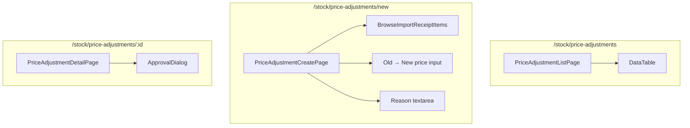

# Price Adjustment Flow — Frontend

## Route

| Path | Component | PageGuard | Description |
|------|-----------|-----------|-------------|
| `/stock/price-adjustments` | `PriceAdjustmentListPage` | `CAN_VIEW_INVENTORY` | List all price adjustments |
| `/stock/price-adjustments/new` | `PriceAdjustmentCreatePage` | `CAN_OPERATE` | Create adjustment |
| `/stock/price-adjustments/:id` | `PriceAdjustmentDetailPage` | `CAN_VIEW_INVENTORY` | Detail + approve/reject |

## Page — PriceAdjustmentListPage

**File:** `features/stock/pages/price-adjustment-list-page.tsx`

| Feature | Detail |
|---------|--------|
| Columns | adjustCode, importReceiptItem, product, oldPrice→newPrice, status, createdBy |
| Filters | status |
| Tabs | My adjustments vs All |

## Page — PriceAdjustmentCreatePage

**File:** `features/stock/pages/price-adjustment-create-page.tsx`

| Section | Logic |
|---------|-------|
| Select import receipt item | Browse import receipts → pick item (product + old price shown) |
| Enter new price | Input new cost price; shows old → new side-by-side |
| Reason | Required textarea |
| Submit | `POST /price-adjustment` → status `PENDING` |

## Page — PriceAdjustmentDetailPage

**File:** `features/stock/pages/price-adjustment-detail-page.tsx`

| Section | Content |
|---------|---------|
| Header | adjustCode, status |
| Detail | product, importReceiptItemId, oldPrice → newPrice, reason |
| Actions | `ApprovalDialog` — approve or reject |

## Hooks

| Hook | Query key | Mutation |
|------|-----------|----------|
| `usePriceAdjustmentList` | `['price-adjustments', params]` | — |
| `useMyPriceAdjustments` | `['my-price-adjustments', params]` | — |
| `useCreatePriceAdjustment` | — | `POST /price-adjustment` |
| `useApprovePriceAdjustment` | — | `PUT /price-adjustment/{id}/approve` |
| `useRejectPriceAdjustment` | — | `PUT /price-adjustment/{id}/reject` |

## Service

**File:** `services/price-adjustment-service.ts`

| Function | API | Description |
|----------|-----|-------------|
| `getAll(params)` | `GET /price-adjustment` | Paginated list |
| `getMy(params)` | `GET /price-adjustment/my` | My adjustments |
| `getById(id)` | `GET /price-adjustment/{id}` | Detail |
| `create(data)` | `POST /price-adjustment` | Create |
| `approve(id)` | `PUT /price-adjustment/{id}/approve` | Approve (batch update cost) |
| `reject(id)` | `PUT /price-adjustment/{id}/reject` | Reject |

## Component Tree

