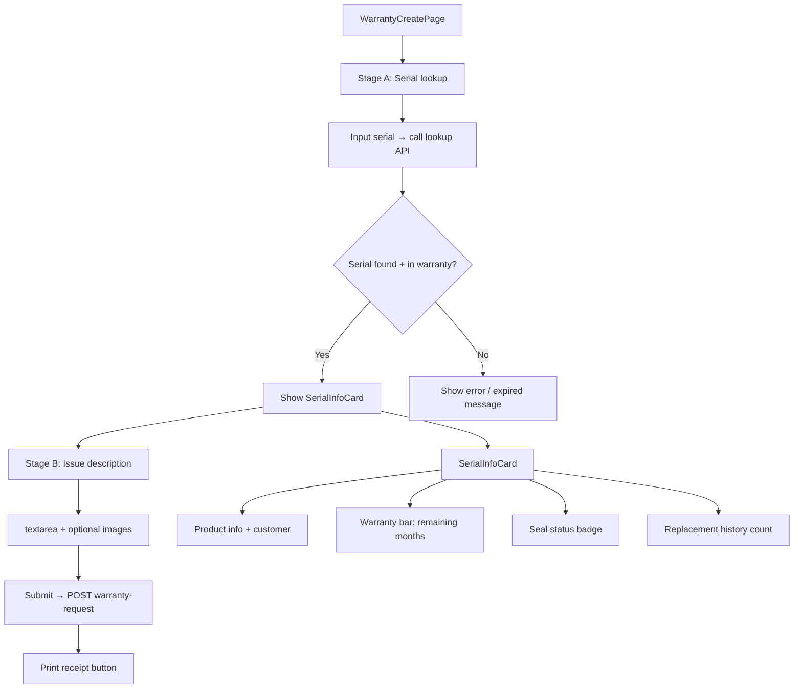
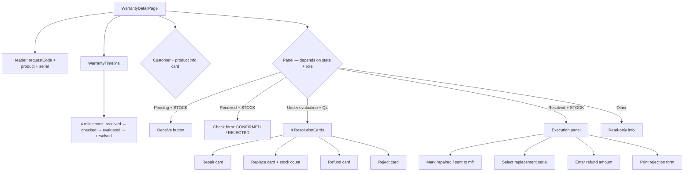
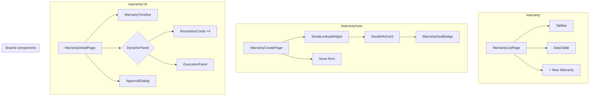

# Warranty Flow — Frontend

## Route

| Path | Component | PageGuard | Description |
|------|-----------|-----------|-------------|
| `/warranty` | `WarrantyListPage` | `CAN_OPERATE` | List warranty requests |
| `/warranty/new` | `WarrantyCreatePage` | `CAN_OPERATE` | Create request (lookup first) |
| `/warranty/:id` | `WarrantyDetailPage` | `CAN_OPERATE` | Detail + resolve + complete |

## Page — WarrantyListPage

**File:** `features/stock/pages/warranty-list-page.tsx`

| Feature | Detail |
|---------|--------|
| Tabs | All / Pending / Received / Under evaluation / Resolved |
| Columns | requestCode, serial, product, customer, status, resolution, createdAt |
| Search | By serial, phone, or request code |
| My handled tab | `/warranty-request/my-handled` |
| Create button | SALES/STOCK/QL → `/warranty/new` |

## Page — WarrantyCreatePage

**File:** `features/stock/pages/warranty-create-page.tsx`

Two-stage design:

| Component | File | Purpose |
|-----------|------|---------|
| `SerialLookupWidget` | (within page) | Input + scan + card result |
| `WarrantySealBadge` | (shared) | 3 states: verified / missing / not-applicable |

## Page — WarrantyDetailPage

**File:** `features/stock/pages/warranty-detail-page.tsx`

Most complex page — dynamic panel per state + role:

| State | STOCK sees | QL sees | SALES sees |
|-------|------------|---------|------------|
| `PENDING` | Receive button | Read-only | Read-only |
| `RECEIVED` | Check form (CONFIRMED/REJECTED) | Read-only | Read-only |
| `UNDER_EVALUATION` | "Waiting for QL" | 4 ResolutionCards | "Waiting for QL" |
| `RESOLVED` | Execution panel | Read-only | Read-only + print |

## Hooks

| Hook | Query key | Mutation |
|------|-----------|----------|
| `useWarrantyList` | `['warranties', params]` | — |
| `useMyHandled` | `['my-warranties', params]` | — |
| `useWarrantyDetail` | `['warranty', id]` | — |
| `useLookupSerial` | `['warranty-lookup', serial]` | — |
| `useCreateWarranty` | — | `POST /warranty-request` |
| `useResolveWarranty` | — | `PUT /warranty-request/{id}/resolve` |
| `useCompleteWarranty` | — | `PUT /warranty-request/{id}/complete` |
| `useCancelWarranty` | — | `PUT /warranty-request/{id}/cancel` |

## Service

**File:** `services/warranty-service.ts`

| Function | API | Description |
|----------|-----|-------------|
| `getAll(params)` | `GET /warranty-request` | Paginated list |
| `getMyHandled(params)` | `GET /warranty-request/my-handled` | My handled |
| `getById(id)` | `GET /warranty-request/{id}` | Detail |
| `lookupBySerial(serial)` | `GET /warranty-request/lookup?serial={serial}` | Warranty status lookup |
| `create(data)` | `POST /warranty-request` | Create |
| `resolve(id, data)` | `PUT /warranty-request/{id}/resolve` | Set resolution |
| `complete(id, data)` | `PUT /warranty-request/{id}/complete` | Complete |
| `cancel(id)` | `PUT /warranty-request/{id}/cancel` | Cancel |

## Component Tree

