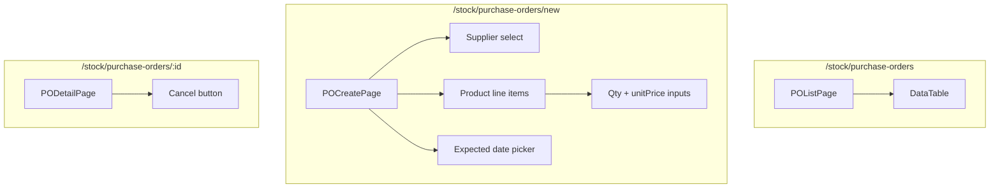

# Purchase Order Flow — Frontend

## Route

| Path | Component | PageGuard | Description |
|------|-----------|-----------|-------------|
| `/stock/purchase-orders` | `POListPage` | `MANAGER` | List POs |
| `/stock/purchase-orders/new` | `POCreatePage` | `MANAGER` | Create PO |
| `/stock/purchase-orders/:id` | `PODetailPage` | `MANAGER` | Detail + cancel |

## Page — POListPage

**File:** `features/stock/pages/po-list-page.tsx`

| Feature | Detail |
|---------|--------|
| Columns | poCode, supplier, totalAmount, status, expectedDate, createdBy |
| Filters | status |
| Create | MANAGER → `/stock/purchase-orders/new` |

## Page — POCreatePage

**File:** `features/stock/pages/po-create-page.tsx`

| Section | Logic |
|---------|-------|
| Supplier select | Browse suppliers |
| Add items | Select product + qty + unitPrice per line |
| Expected date | Date picker for delivery ETA |
| Note | Optional |
| Submit | `POST /purchase-order` → status `DRAFT` |

## Page — PODetailPage

**File:** `features/stock/pages/po-detail-page.tsx`

| Section | Content |
|---------|---------|
| Header | poCode, supplier, status, expected date |
| Items table | product, qty, unitPrice, receivedQty, total |
| Actions | Cancel button (if not COMPLETED) |

## Hooks

| Hook | Query key | Mutation |
|------|-----------|----------|
| `usePOList` | `['purchase-orders', params]` | — |
| `usePOCreate` | — | `POST /purchase-order` |
| `usePOCancel` | — | `PUT /purchase-order/{id}/cancel` |

## Service

**File:** `services/purchase-order-service.ts`

| Function | API | Description |
|----------|-----|-------------|
| `getAll(params)` | `GET /purchase-order` | Paginated list |
| `getById(id)` | `GET /purchase-order/{id}` | Detail |
| `create(data)` | `POST /purchase-order` | Create |
| `cancel(id)` | `PUT /purchase-order/{id}/cancel` | Cancel |

## Component Tree

