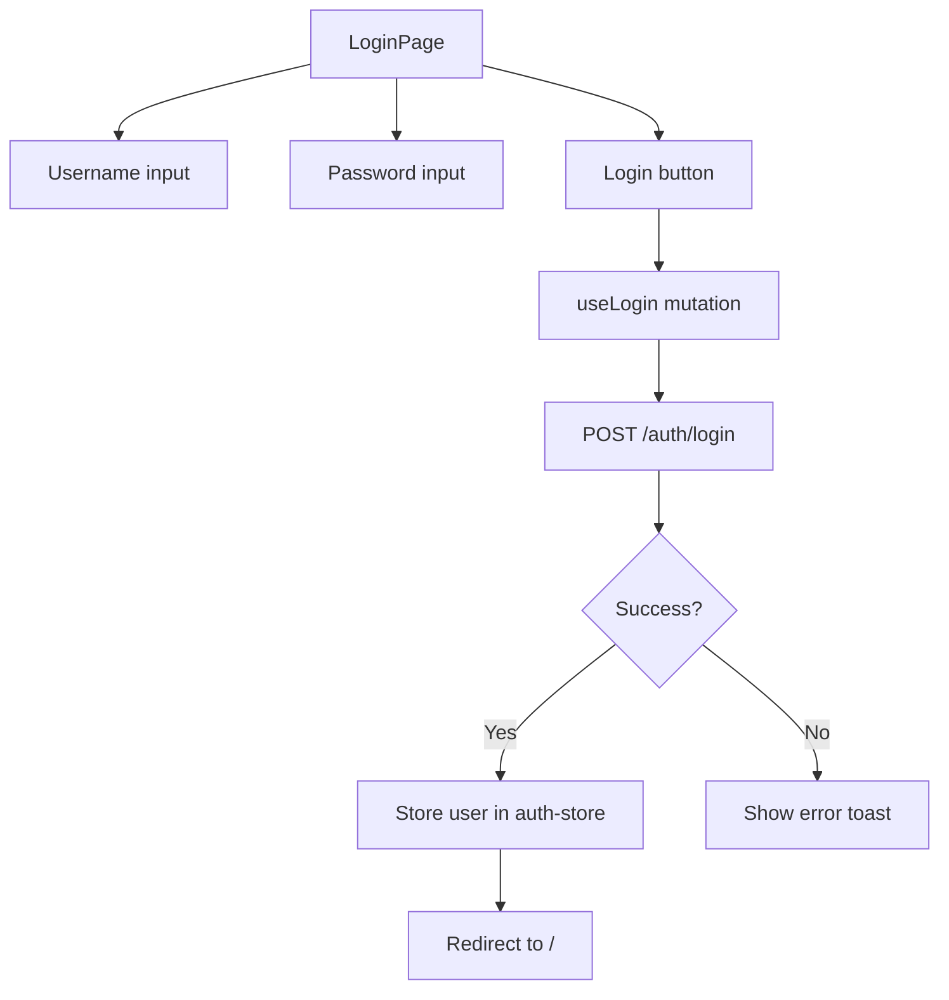
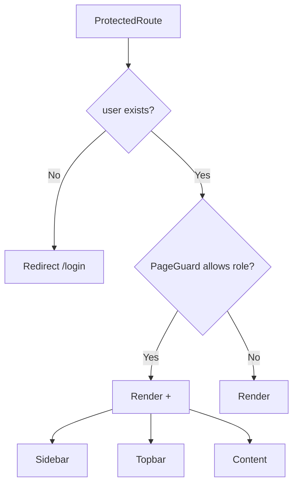
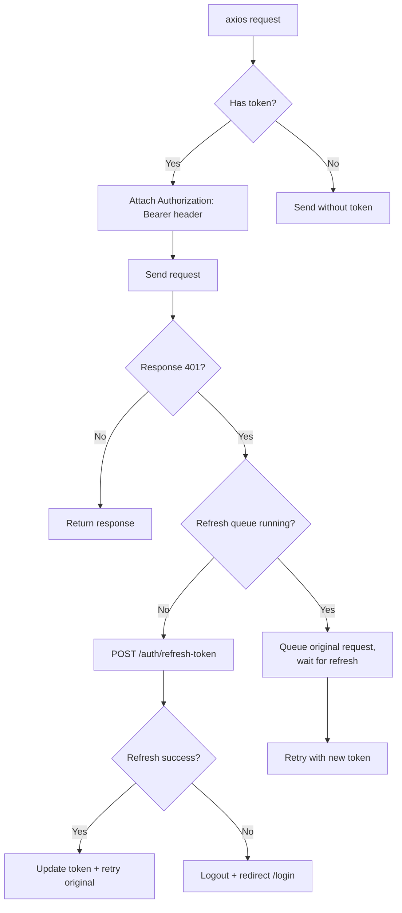
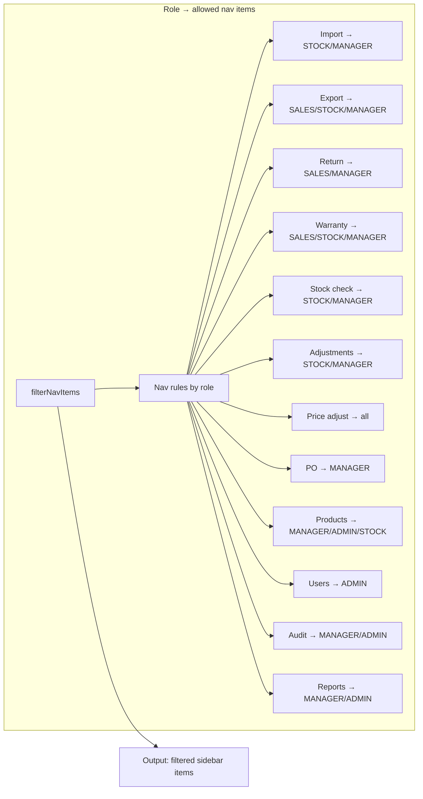
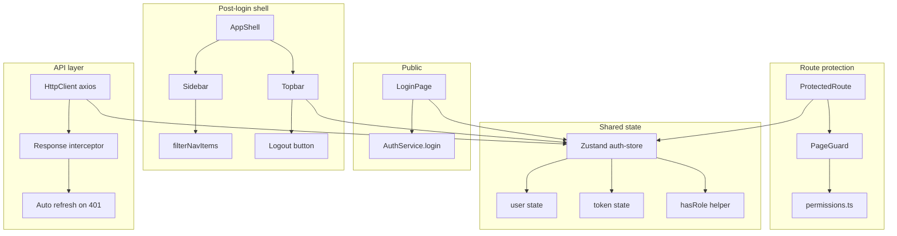

# Auth Flow — Frontend

## Route

| Path | Component | PageGuard | Description |
|------|-----------|-----------|-------------|
| `/login` | `LoginPage` | Public (redirect if logged in) | Login form |
| `/403` | `ForbiddenPage` | Public | Access denied |
| `/` | `RootRedirect` | `ProtectedRoute` | Redirect based on role |
| All others | Various | `ProtectedRoute` + `PageGuard` | Role-based access |

## Page — LoginPage

**File:** `features/auth/pages/login-page.tsx`



## Auth Store

**File:** `store/auth-store.ts` (Zustand)

| State | Description |
|-------|-------------|
| `user` | Current user object (id, username, role, fullName) |
| `token` | JWT access token (stored in memory + localStorage) |
| `login(user, token)` | Set user + token |
| `logout()` | Clear user + token, call `POST /auth/logout` |
| `hasRole(roles[])` | Check if user's role is in the allowed list |

## Protected Route

**File:** `layouts/protected-route.tsx`



## Root Redirect

**File:** (in `routes/index.tsx` — `RootRedirect`)

| User role | Redirect to |
|-----------|-------------|
| STOCK | `/stock/units` |
| SALES | `/stock/exports` |
| MANAGER | `/` → Dashboard |
| ADMIN | `/` → Dashboard |

## HTTP Client — Auth Interceptor

**File:** `utils/http-client.ts`



## Service

**File:** `services/auth-service.ts`

| Function | API | Description |
|----------|-----|-------------|
| `login(data)` | `POST /auth/login` | Returns JWT + user info |
| `logout()` | `POST /auth/logout` | Clear server-side refresh cookie |
| `refreshToken()` | `POST /auth/refresh-token` | Refresh access token (reads cookie) |

**File:** `services/user-service.ts`

| Function | API | Description |
|----------|-----|-------------|
| `getAll(params)` | `GET /user` | List users (ADMIN only) |
| `getById(id)` | `GET /user/{id}` | User detail |
| `create(data)` | `POST /user` | Create user |
| `updateInfo(id, data)` | `PUT /user/{id}/info` | Update profile |
| `updateStatus(id, status)` | `PUT /user/{id}/status` | Toggle active |
| `updateRole(id, role)` | `PUT /user/{id}/role` | Change role |
| `resetPassword(id)` | `PUT /auth/{id}/reset-password` | Force reset |

## Permission Constants

**File:** `utils/permissions.ts`

```typescript
ROLES = {
  ADMIN:                ["ADMIN"],
  MANAGER:              ["MANAGER"],
  CAN_VIEW_REPORTS:     ["MANAGER", "ADMIN"],
  CAN_APPROVE:          ["MANAGER", "ADMIN"],
  CAN_MANAGE_CATALOG:   ["MANAGER"],
  CAN_MANAGE_SYSTEM:    ["ADMIN"],
  CAN_OPERATE_STOCK:    ["MANAGER", "STOCK"],
  CAN_VIEW_INVENTORY:   ["MANAGER", "ADMIN", "STOCK"],
  CAN_OPERATE:          ["SALES", "STOCK", "MANAGER", "ADMIN"],
}
```

## Sidebar — Role-based nav filtering

**File:** `layouts/sidebar.tsx` + `utils/navigation.ts`



## Component Tree — Auth System

