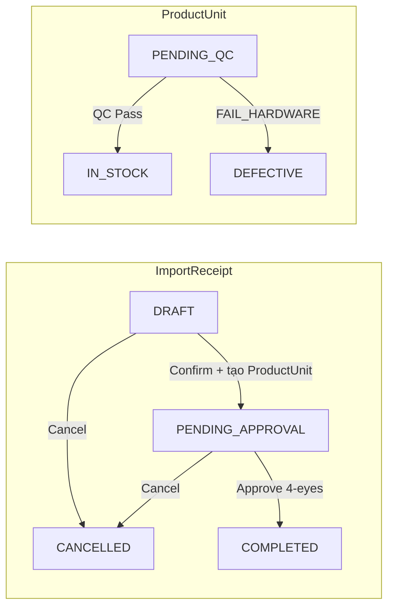
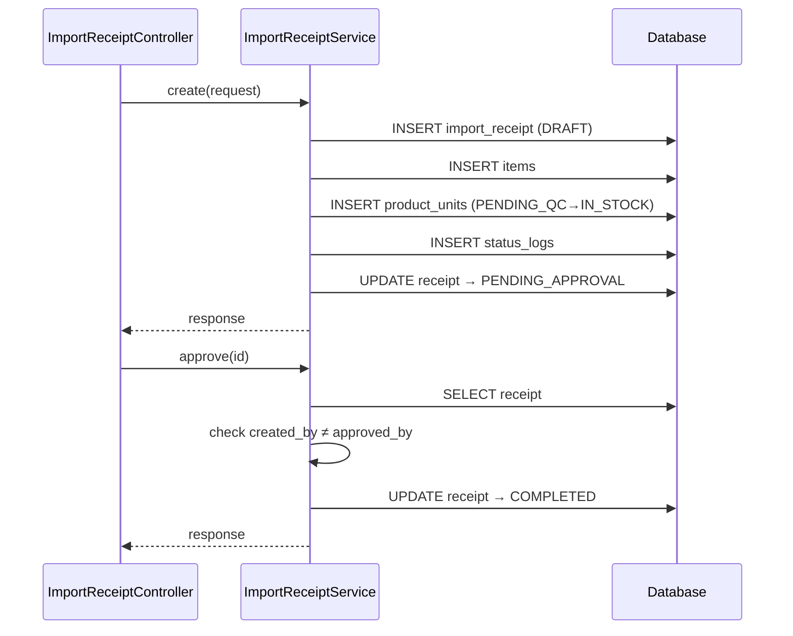
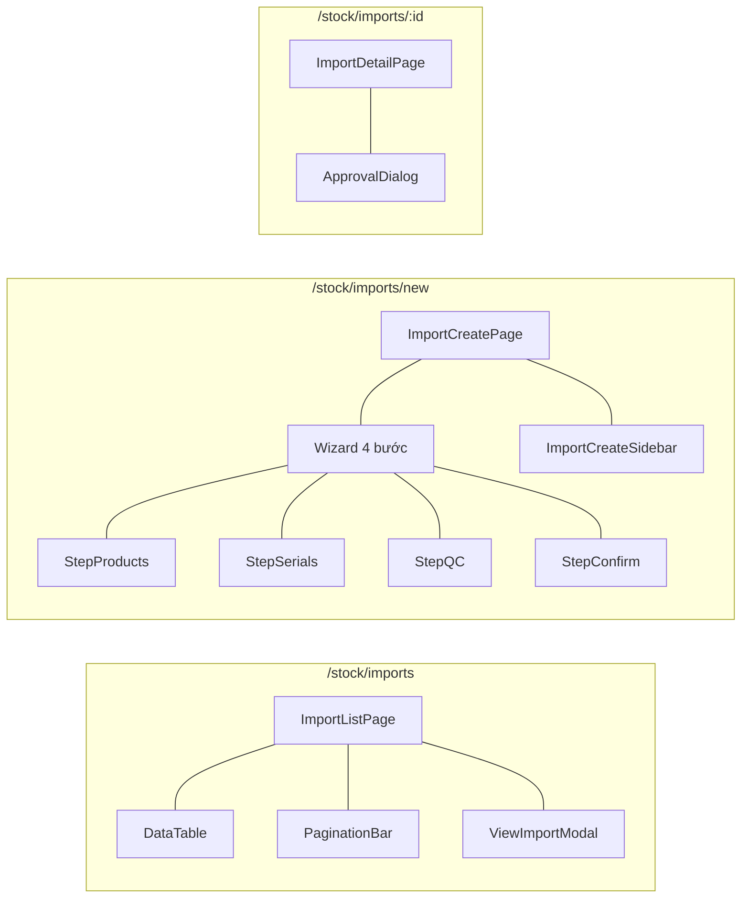

# 01 — Import Flow

## BE

### Controller — `ImportReceiptController`

| Method | Endpoint | Role Guard |
|--------|----------|------------|
| `GET` | `/import-receipt` | `CAN_VIEW_INVENTORY` |
| `GET` | `/import-receipt/{id}` | `CAN_VIEW_INVENTORY` |
| `POST` | `/import-receipt` | `CAN_OPERATE_STOCK` |
| `PUT` | `/import-receipt/{id}/confirm` | `CAN_OPERATE_STOCK` |
| `PUT` | `/import-receipt/{id}/approve` | `CAN_APPROVE` |
| `PUT` | `/import-receipt/{id}/cancel` | `CAN_APPROVE` |

### Service — `ImportReceiptService`

| Method | Logic |
|--------|-------|
| `create` | Gen code `INIT-YYYYMMDD-NNNN`, save receipt `DRAFT`, parse items, save `ProductUnit` (serials/bulk), create status log, auto-set `PENDING_APPROVAL` |
| `approve` | Check `created_by ≠ approved_by`, set `COMPLETED`, audit log |
| `cancel` | Check not already completed, set `CANCELLED`, revert units → `REMOVED` |

### State Machine

### Sequence

## FE

### Routes

| Path | Component | Guard |
|------|-----------|-------|
| `/stock/imports` | `ImportListPage` | `CAN_VIEW_INVENTORY` |
| `/stock/imports/new` | `ImportCreatePage` | `CAN_OPERATE_STOCK` |
| `/stock/imports/:id` | `ImportDetailPage` | `CAN_VIEW_INVENTORY` |

### Pages

| Page | File | Chức năng |
|------|------|-----------|
| `ImportListPage` | `features/stock/pages/import-list-page.tsx` | Dùng `ReceiptListPage` template — list, filter by status, view detail modal |
| `ImportCreatePage` | `features/stock/pages/import-create-page.tsx` | Wizard 4 bước: (1) chọn SP (2) nhập serial (3) QC (4) confirm. `ImportCreateReducer` quản lý state |
| `ImportDetailPage` | `features/stock/pages/import-detail-page.tsx` | Chi tiết + `ApprovalDialog` duyệt/từ chối |

### Hooks

| Hook | Mutation |
|------|----------|
| `useImportList` | — |
| `useImportCreate` | `POST /import-receipt` |
| `useImportApprove` | `PUT /import-receipt/{id}/approve` |
| `useImportCancel` | `PUT /import-receipt/{id}/cancel` |

### Service — `services/import-service.ts`

| Function | API |
|----------|-----|
| `getAll(params)` | `GET /import-receipt` |
| `getById(id)` | `GET /import-receipt/{id}` |
| `create(data)` | `POST /import-receipt` |
| `approve(id)` | `PUT /import-receipt/{id}/approve` |
| `cancel(id)` | `PUT /import-receipt/{id}/cancel` |

### Component Tree

