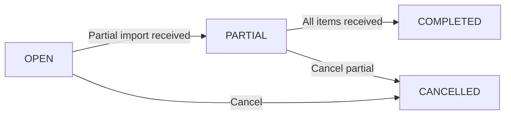
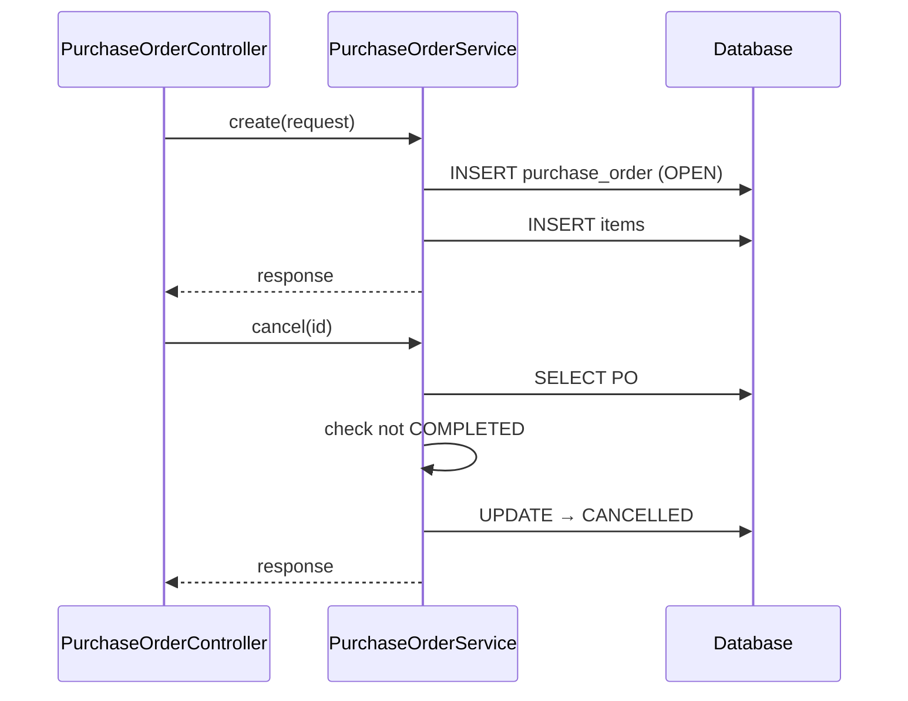
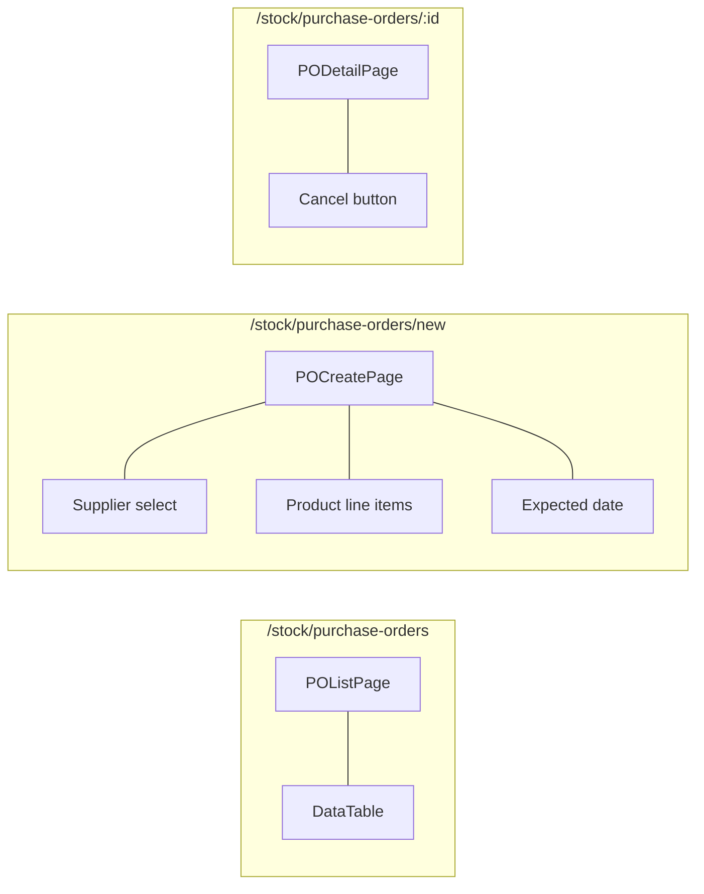

# 08 — Purchase Order Flow

## BE

### Controller — `PurchaseOrderController` (`/api/v1/purchase-order`)

| Method | Endpoint | Role Guard |
|--------|----------|------------|
| `GET` | `/purchase-order` | `CAN_VIEW_INVENTORY` |
| `GET` | `/purchase-order/{id}` | `CAN_VIEW_INVENTORY` |
| `POST` | `/purchase-order` | `CAN_MANAGE_CATALOG` |
| `PUT` | `/purchase-order/{id}/cancel` | `CAN_MANAGE_CATALOG` |

### Service — `PurchaseOrderService`

| Method | Logic |
|--------|-------|
| `create` | Gen code `PO-YYYYMMDD-NNNN`, save PO + items. No approval step. Guard: nếu SP có NCC thì phải chứa `supplierId` của PO |
| `cancel` | Check not `COMPLETED`, set `CANCELLED` |

### State Machine

### Sequence

## FE

### Routes

| Path | Component | Guard |
|------|-----------|-------|
| `/stock/purchase-orders` | `POListPage` | `MANAGER` |
| `/stock/purchase-orders/new` | `POCreatePage` | `MANAGER` |
| `/stock/purchase-orders/:id` | `PODetailPage` | `MANAGER` |

### Pages

| Page | File | Chức năng |
|------|------|-----------|
| `POListPage` | `features/stock/pages/po-list-page.tsx` | List POs, filter by status |
| `POCreatePage` | `features/stock/pages/po-create-page.tsx` | Chọn supplier trước → picker SP chỉ hiện SP được gán cho NCC đó; thêm items (product + qty + unitPrice), expected date |
| `PODetailPage` | `features/stock/pages/po-detail-page.tsx` | Detail + cancel button |

### Hooks

| Hook | Mutation |
|------|----------|
| `usePOList` | — |
| `usePOCreate` | `POST /purchase-order` |
| `usePOCancel` | `PUT /purchase-order/{id}/cancel` |

### Service — `services/purchase-order-service.ts`

| Function | API |
|----------|-----|
| `getAll(params)` | `GET /purchase-order` |
| `getById(id)` | `GET /purchase-order/{id}` |
| `create(data)` | `POST /purchase-order` |
| `cancel(id)` | `PUT /purchase-order/{id}/cancel` |

### Component Tree

