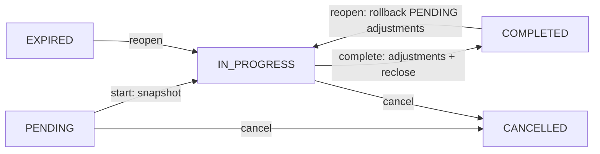
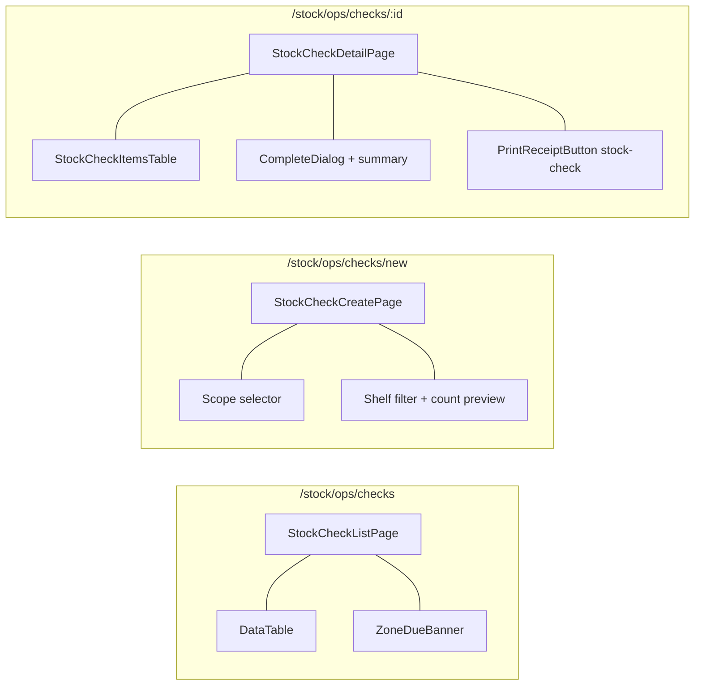

# 04 — Stock Check Flow

Kiểm kê theo phạm vi (ZONE + shelf filter / CATEGORY / BOX). Kỳ vọng được chốt **tại lúc bắt đầu** (PENDING → IN_PROGRESS). Hoàn tất tự tạo adjustment cho lệch/thừa; dòng chưa ghi → `UNVERIFIED` (không adjustment).

## BE

### Controller — `StockCheckController` (`/api/v1`)

| Method | Endpoint | Role Guard |
|--------|----------|------------|
| `GET` | `/stock-check/my` | `CAN_OPERATE_STOCK` |
| `GET` | `/stock-check` | `CAN_VIEW_INVENTORY` |
| `GET` | `/stock-check/{id}` | `CAN_VIEW_INVENTORY` |
| `GET` | `/stock-check/{id}/print?lang=` | `CAN_VIEW_INVENTORY` |
| `GET` | `/stock-check/count` | `CAN_VIEW_INVENTORY` |
| `GET` | `/stock-check/zone-status` | `CAN_VIEW_INVENTORY` |
| `GET` | `/stock-check/scope-unit-count?scopeType=&scopeId=&shelfCodes=` | `CAN_VIEW_INVENTORY` |
| `POST` | `/stock-check` | `CAN_OPERATE_STOCK` |
| `PUT` | `/stock-check/{id}/start` | `CAN_OPERATE_STOCK` |
| `PUT` | `/stock-check/{id}/items` | `CAN_OPERATE_STOCK` |
| `PUT` | `/stock-check/{id}/complete` | `CAN_OPERATE_STOCK` |
| `PUT` | `/stock-check/{id}/reopen` | `CAN_OPERATE_STOCK` |
| `PUT` | `/stock-check/{id}/cancel` | `CAN_OPERATE_STOCK` |
| `POST` | `/stock-check/{id}/extra-items` | `CAN_OPERATE_STOCK` |
| `GET/POST/PUT/DELETE` | `/stock-check/schedules` | `CAN_MANAGE_CATALOG` |

### Service — `StockCheckService`

| Method | Logic |
|--------|-------|
| `create` | Chặn unit đang nằm trong phiếu khác (`STOCK_CHECK_UNIT_IN_ANOTHER_CHECK`); tạo `PENDING`, **không** snapshot kỳ vọng |
| `start` | `PENDING` → `IN_PROGRESS`, snapshot kỳ vọng từ trạng thái hiện tại (unit trong phạm vi → item; unit đã trong phiếu khác → bỏ qua) |
| `recordItems` | Cập nhật `actualStatus/countedQuantity/note/photo/suspectSeal/damagedPackaging/touchedAt`; qty âm → chặn (`STOCK_CHECK_NEGATIVE_QTY`); BULK thiếu số lượng → chặn; tự tính `difference` (MATCH/MISSING/UNEXPECTED/PARTIAL_SHORTAGE) |
| `complete` | BULK chưa đếm → chặn (`STOCK_CHECK_BULK_MISSING_QTY`); tạo adjustment cho từng item đã ghi: LOST/SURPLUS-expected → `LOST`, UNEXPECTED → `FOUND`, PARTIAL_SHORTAGE → `LOST` (số chênh), SERIALIZED khớp → không adjustment; dòng chưa ghi (`touchedAt` null) → `UNVERIFIED` (không adjustment); đóng lại hộp từng SEALED lúc snapshot (đang UNSEALED) qua `boxService.reclose`; cập nhật `last_checked_at`; `COMPLETED` |
| `addExtraItem` | Thêm hàng phát sinh (surplus) ngoài danh sách: SKU bắt buộc → `STOCK_CHECK_EXTRA_SKU_REQUIRED`; SKU không tồn tại → `STOCK_CHECK_EXTRA_SKU_NOT_FOUND`; SERIALIZED: serial bắt buộc → `STOCK_CHECK_EXTRA_SERIAL_REQUIRED`, serial thuộc unit ngoài phạm vi → `STOCK_CHECK_EXTRA_OUT_OF_SCOPE`, serial mới → tạo ProductUnit (IN_STOCK); BULK: qty > 0 bắt buộc → `STOCK_CHECK_EXTRA_QTY_REQUIRED`, tạo ProductUnit BULK (initial=remaining=qty); location = vị trí đại diện scope (location đầu tiên trong phạm vi); trùng SKU+serial/sản phẩm → `STOCK_CHECK_EXTRA_ALREADY_ADDED`; tạo item `difference=SURPLUS`, `actualStatus=IN_STOCK`, `touchedAt=now` |
| `reopen` | `COMPLETED/EXPIRED` → `IN_PROGRESS`; xóa adjustments PENDING của phiếu + khôi phục unit thừa (FOUND) về trạng thái trước; nếu items rỗng (còn sót unit chưa snapshot) → snapshot lại |
| `cancel` | `PENDING/IN_PROGRESS` → `CANCELLED`, không tạo thay đổi |
| `generateDueStockChecks` | Chạy 02:30 hằng ngày (cron `0 30 2 * * ?`): khu vực `last_checked_at` quá hạn (hoặc chưa kiểm) và chưa có phiếu PENDING/IN_PROGRESS cùng phạm vi → tạo `PENDING` |

### Mapping G1/G2 (adjustment khi complete)

| Item difference | Adjustment | Quantity | Location |
|-----------------|------------|----------|----------|
| `MISSING` | `LOST` | `expectedQuantity` | null (unit giữ location cũ) |
| `PARTIAL_SHORTAGE` | `LOST` | chênh lệch (expected − counted) | null |
| `UNEXPECTED` | `FOUND` | `countedQuantity` | location của unit |
| `SURPLUS` | `FOUND` | BULK = countedQuantity, SERIALIZED = 1 | location của unit (đã gán lúc `addExtraItem`) |
| `MATCH` / `UNVERIFIED` | — | — | — |

### State Machine

Ghi chú: item kết quả dùng `actual_status` + `difference`; cờ `suspect_seal`/`damaged_packaging` là ghi nhận, không sinh adjustment riêng. Dòng SURPLUS là item thật (có `product_unit_id`), không còn dòng "hàng dư" cục bộ ở FE.

## FE

### Routes

| Path | Component | Guard |
|------|-----------|-------|
| `/stock/ops/checks` | `StockCheckListPage` | `CAN_VIEW_INVENTORY` |
| `/stock/ops/checks/new` | `StockCheckCreatePage` | `CAN_OPERATE_STOCK` |
| `/stock/ops/checks/:id` | `StockCheckDetailPage` | `CAN_VIEW_INVENTORY` |

### Pages

| Page | File | Chức năng |
|------|------|-----------|
| `StockCheckListPage` | `features/stock/pages/stock-check-list-page.tsx` | Banner cảnh báo khu đến hạn (zone-status), nút Bắt đầu kiểm cho phiếu PENDING |
| `StockCheckCreatePage` | `features/stock/pages/stock-check-create-page.tsx` | Chọn scope (ZONE/CATEGORY/BOX) + kệ theo lịch, preview số lượng (scope-unit-count), tạo PENDING |
| `StockCheckDetailPage` | `features/stock/pages/stock-check-detail-page.tsx` | Status strip gộp (banner PENDING / progress IN_PROGRESS); 1 nút chính theo trạng thái (Bắt đầu / Hoàn tất / Mở lại) + menu ··· (In phiếu, Hủy); tab Kết quả: bảng items + hộp đếm (xanh khi đủ), dialog hoàn tất (cảnh báo UNVERIFIED + TĂNG tồn kho, summary 6 ô) |
| `StockCheckItemsTable` | `features/stock/components/stock-check-items-table.tsx` | Toolbar Tabs đếm (tất cả/lệch/chưa ghi) + search + Thao tác nhanh (Thêm lệch, Tất cả còn hàng, Tất cả thất lạc); cột ⚠/serial/sản phẩm+note/kết quả/chênh lệch; WarningCell popover (seal/vỏ/ảnh), UNVERIFIED badge, DiffBadge màu; dialog Thêm lệch (SKU, serial, qty, note) → `POST extra-items` |

### Hooks

| Hook | Mutation |
|------|----------|
| `useStockChecks` / `useMyStockChecks` | `GET /stock-check` / `GET /stock-check/my` |
| `useStockCheck(id)` | `GET /stock-check/{id}` |
| `useStockCheckZoneStatus` | `GET /stock-check/zone-status` |
| `useStartStockCheck` | `PUT /stock-check/{id}/start` |

### Service — `services/stock-check-service.ts`

| Function | API |
|----------|-----|
| `getStockChecks` / `getMyStockChecks` | `GET /stock-check` / `/my` |
| `getStockCheckById` | `GET /stock-check/{id}` |
| `createStockCheck(data)` | `POST /stock-check` |
| `startStockCheck(id)` | `PUT /stock-check/{id}/start` |
| `recordStockCheckItems(id, items)` | `PUT /stock-check/{id}/items` |
| `completeStockCheck(id)` | `PUT /stock-check/{id}/complete` |
| `addExtraStockCheckItem(id, {sku, serialNumber?, countedQuantity?, note?, photo?})` | `POST /stock-check/{id}/extra-items` |
| `reopenStockCheck` / `cancelStockCheck` | `PUT /stock-check/{id}/reopen` / `/cancel` |
| `getStockCheckZoneStatus` | `GET /stock-check/zone-status` |
| `countUnitsInScope(scopeType, scopeId, shelfCodes?)` | `GET /stock-check/scope-unit-count` |
| `getStockCheckPrintHtml(id, lang)` | `GET /stock-check/{id}/print` |

### Component Tree

