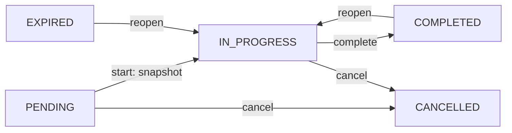
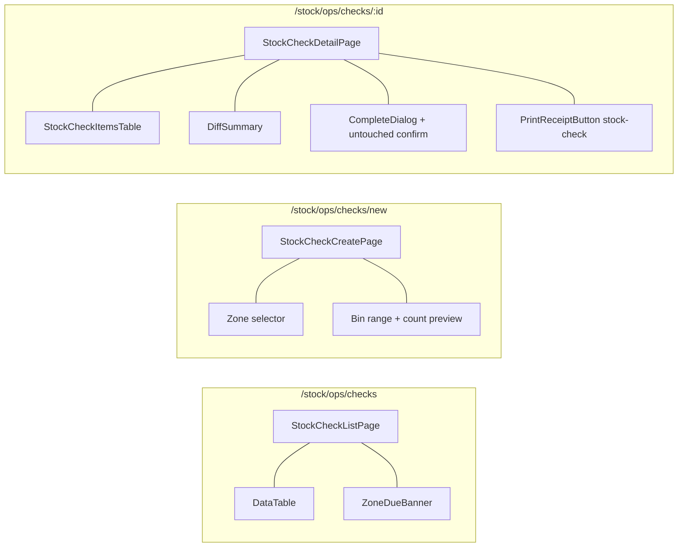

# 04 — Stock Check Flow

Kiểm kê theo phạm vi (ZONE + bin range). Kỳ vọng được chốt **tại lúc bắt đầu** (IN_PROGRESS), kết quả nhập tay từng dòng, hoàn tất chặn dòng chưa ghi trừ khi xác nhận. Không tạo adjustment tự động.

## BE

### Controller — `StockCheckController` (`/api/v1`)

| Method | Endpoint | Role Guard |
|--------|----------|------------|
| `GET` | `/stock-check/my` | `CAN_OPERATE_STOCK` |
| `GET` | `/stock-check` | `CAN_VIEW_INVENTORY` |
| `GET` | `/stock-check/{id}` | `CAN_VIEW_INVENTORY` |
| `POST` | `/stock-check` | `CAN_OPERATE_STOCK` |
| `PUT` | `/stock-check/{id}/start` | `CAN_OPERATE_STOCK` |
| `PUT` | `/stock-check/{id}/items` | `CAN_OPERATE_STOCK` |
| `PUT` | `/stock-check/{id}/complete?confirmUntouched=` | `CAN_OPERATE_STOCK` |
| `PUT` | `/stock-check/{id}/reopen` | `CAN_OPERATE_STOCK` |
| `PUT` | `/stock-check/{id}/cancel` | `CAN_OPERATE_STOCK` |
| `GET` | `/stock-check/zone-status` | `CAN_VIEW_INVENTORY` |
| `GET` | `/stock-check/scope-unit-count` | `CAN_OPERATE_STOCK` |
| `GET` | `/stock-check/{id}/count` | `CAN_OPERATE_STOCK` |
| `GET` | `/stock-check/count-pending` | `CAN_OPERATE_STOCK` |
| `GET/POST/PUT/DELETE` | `/stock-check/schedules` | `CAN_MANAGE_CATALOG` |

### Service — `StockCheckService`

| Method | Logic |
|--------|-------|
| `create` | Chỉ `ZONE`; nếu binFrom/binTo nhập → chỉ unit trong dải bin; tạo thẳng `IN_PROGRESS` + snapshot `box_status_snapshot` (JSON: boxId → {sealed, unitIds}) |
| `start` | `PENDING` → `IN_PROGRESS`, chốt snapshot kỳ vọng từ trạng thái hiện tại |
| `recordItems` | Cập nhật `actualStatus/countedQuantity/note/photo/suspectSeal/damagedPackaging/touchedAt`; BULK thiếu số lượng → chặn; tự tính `difference` (MATCH/MISSING/UNEXPECTED/PARTIAL_SHORTAGE) |
| `complete` | Nếu còn dòng chưa ghi (`touchedAt` null) và `confirmUntouched=false` → chặn; còn lại: BULK chưa đếm → MISSING, serial chưa kiểm → MATCH; đóng lại hộp từng SEALED lúc snapshot (đang UNSEALED) qua `boxService.reclose`; cập nhật `last_checked_at` cho location khu vực |
| `reopen` | `COMPLETED/EXPIRED` → `IN_PROGRESS`; nếu items rỗng (còn sót unit chưa snapshot) → snapshot lại |
| `cancel` | `PENDING/IN_PROGRESS` → `CANCELLED`, không tạo thay đổi |
| `generateDueStockChecks` | Chạy 02:30 hằng ngày (cron `0 30 2 * * ?`): khu vực `last_checked_at` quá hạn (hoặc chưa kiểm) và chưa có phiếu PENDING/IN_PROGRESS cùng phạm vi → tạo `PENDING` |

### State Machine

Ghi chú: item kết quả dùng `actual_status` + `difference`; cờ `suspect_seal`/`damaged_packaging` là ghi nhận, không sinh adjustment. Dòng "Dư" (hàng thừa) là cục bộ ở FE, không persist.

## FE

### Routes

| Path | Component | Guard |
|------|-----------|-------|
| `/stock/ops/checks` | `StockCheckListPage` | `CAN_VIEW_INVENTORY` |
| `/stock/ops/checks/new` | `StockCheckCreatePage` | `CAN_OPERATE_STOCK` |
| `/stock/ops/checks/:id` | `StockCheckDetailPage` | `CAN_VIEW_INVENTORY` |

### Pages

| Page | File | Chức năng |
|------|------|-----------|
| `StockCheckListPage` | `features/stock/pages/stock-check-list-page.tsx` | Banner cảnh báo khu đến hạn (zone-status), nút Bắt đầu kiểm cho phiếu PENDING, cột phạm vi + bin |
| `StockCheckCreatePage` | `features/stock/pages/stock-check-create-page.tsx` | Chọn ZONE + bin range, preview số lượng (scope-unit-count), tạo thẳng IN_PROGRESS |
| `StockCheckDetailPage` | `features/stock/pages/stock-check-detail-page.tsx` | Banner PENDING + start; bảng nhập kết quả (màu: Thiếu=đỏ, Dư=xanh, Khớp=xám, Chưa kiểm=vàng); cờ Nghi seal/Hư bao bì; thêm "Hàng dư" cục bộ; dialog hoàn tất có checkbox xác nhận dòng chưa ghi |

### Hooks

| Hook | Mutation |
|------|----------|
| `useStockChecks` / `useMyStockChecks` | `GET /stock-check` / `GET /stock-check/my` |
| `useStockCheck(id)` | `GET /stock-check/{id}` |
| `useStockCheckZoneStatus` | `GET /stock-check/zone-status` |
| `useStartStockCheck` | `PUT /stock-check/{id}/start` |

### Service — `services/stock-check-service.ts`

| Function | API |
|----------|-----|
| `getStockChecks` / `getMyStockChecks` | `GET /stock-check` / `/my` |
| `getStockCheckById` | `GET /stock-check/{id}` |
| `createStockCheck(data)` | `POST /stock-check` |
| `startStockCheck(id)` | `PUT /stock-check/{id}/start` |
| `recordStockCheckItems(id, items)` | `PUT /stock-check/{id}/items` |
| `completeStockCheck(id, confirmUntouched)` | `PUT /stock-check/{id}/complete` |
| `reopenStockCheck` / `cancelStockCheck` | `PUT /stock-check/{id}/reopen` / `/cancel` |
| `getStockCheckZoneStatus` | `GET /stock-check/zone-status` |
| `countUnitsInScope(zoneId, binFrom, binTo)` | `GET /stock-check/scope-unit-count` |
| `getStockCheckPrintHtml(id, lang)` | `GET /stock-check/{id}/print` |

### Component Tree

