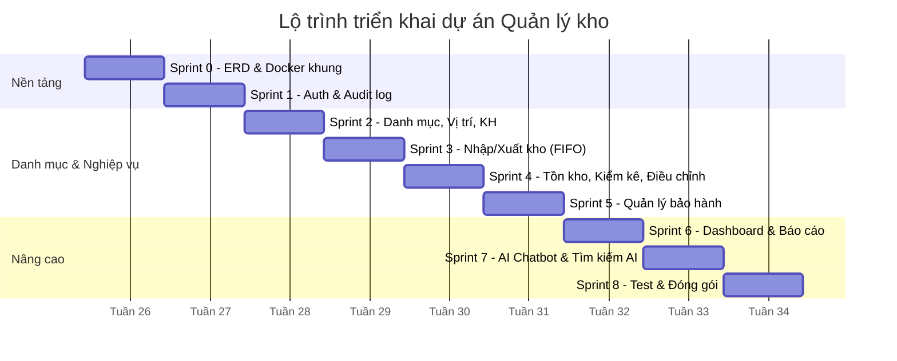

# PLAN DỰ ÁN: HỆ THỐNG QUẢN LÝ KHO CHO CỬA HÀNG LINH KIỆN MÁY TÍNH

## 1. Tổng quan dự án

### 1.1. Mục tiêu
Xây dựng hệ thống quản lý kho cho cửa hàng bán linh kiện máy tính, hỗ trợ nhập/xuất kho theo lô, theo dõi tồn kho real-time, kiểm kê định kỳ, truy vết lịch sử thao tác, báo cáo, và trợ lý AI tra cứu thông tin kho bằng ngôn ngữ tự nhiên.

### 1.2. Tech stack

**Frontend**
- React
- Zustand (quản lý state: auth, UI state)
- TanStack Query (gọi API, cache, đồng bộ dữ liệu server)
- Shadcn UI + Tailwind CSS

**Backend**
- Spring Boot
- Spring Data JPA
- Spring Security (JWT + refresh token)
- Cloudinary (lưu trữ ảnh sản phẩm)
- Langchain (AI chatbot tra cứu kho)
- Spring Mail (gửi mail quên mật khẩu, xác thực tài khoản)

**Database**
- MySQL

**Triển khai**
- Docker Compose (MySQL + Backend + Frontend)

### 1.3. Danh sách chức năng
- Admin tạo tài khoản nhân viên (tự động gửi mật khẩu tạm qua email)
- Đăng nhập, đổi mật khẩu lần đầu, quên mật khẩu
- Refresh token
- Quản lý người dùng (khóa/mở khóa, đổi role)
- Nhập kho (1 sản phẩm / nhiều sản phẩm, gán vị trí, sinh serial, import file)
- Xuất kho (1 sản phẩm / nhiều sản phẩm, FIFO tự động, hỗ trợ partial)
- Quản lý danh mục (sản phẩm, danh mục, nhà cung cấp)
- Quản lý vị trí kho (kệ/ngăn, sơ đồ kho)
- Quản lý khách hàng
- Quản lý tồn kho & cảnh báo tồn tối thiểu
- Kiểm kê và kiểm kê lệch
- Điều chỉnh tồn kho thủ công (hỏng, mất, thừa)
- Quản lý bảo hành (tra cứu serial, đổi 1:1, gửi hãng RMA, sửa chữa, từ chối)
- Log hệ thống & lịch sử truy vết
- Dashboard tổng quan
- Báo cáo tồn kho
- Upload ảnh sản phẩm (Cloudinary)
- AI Chatbot Text-to-SQL tra cứu thông tin kho (Langchain)
- Tìm kiếm dữ liệu bằng AI (natural language search trên sản phẩm, phiếu nhập-xuất, lịch sử)

---

## 2. Kiến trúc dữ liệu (Database) — Chi tiết

### 2.1. Quan hệ tổng thể

```
roles (1) ──< users (N)
users  (1) ──< refresh_tokens (N)
users  (1) ──< password_reset_tokens (N)
users  (1) ──< import_receipts (N)          -- created_by
users  (1) ──< export_receipts (N)          -- created_by

brands (1) ──< products (N)
categories (1) ──< products (N)
suppliers (1) ──< import_receipts (N)

products (1) ──< product_images (N)
products (1) ──< product_units (N)
products (1) ──< import_receipt_items (N)
products (1) ──< export_receipt_items (N)

locations (1) ──< product_units (N)

import_receipts (1) ──< import_receipt_items (N)
import_receipt_items (1) ──< product_units (N)

export_receipts (1) ──< export_receipt_items (N)
export_receipt_items (1) ──< export_receipt_item_units (N)
product_units (1) ──< export_receipt_item_units (N)

product_units (1) ──< warranty_requests (N)
customers (1) ──< export_receipts (N)
customers (1) ──< warranty_requests (N)

stock_checks (1) ──< stock_check_items (N)
product_units (1) ──< stock_check_items (N)
```

### 2.2. Nhóm bảng Auth

#### roles
| Column | Type | Constraint |
|--------|------|-----------|
| id | BIGINT | PK AUTO_INCREMENT |
| name | VARCHAR(50) | NOT NULL, UNIQUE — `ADMIN`, `MANAGER`, `SALES`, `STOCK` |
| level | INT | NOT NULL — 1=ADMIN, 2=MANAGER, 3=SALES/STOCK |
| description | VARCHAR(255) | |
| created_at | TIMESTAMP | |
| updated_at | TIMESTAMP | |

#### users
| Column | Type | Constraint |
|--------|------|-----------|
| id | BIGINT | PK AUTO_INCREMENT |
| username | VARCHAR(100) | NOT NULL, UNIQUE |
| full_name | VARCHAR(255) | |
| email | VARCHAR(255) | UNIQUE |
| password | VARCHAR(255) | NOT NULL — bcrypt hash |
| role_id | BIGINT | FK → roles |
| status | VARCHAR(20) | DEFAULT 'NEW' — NEW/ACTIVE/INACTIVE |
| last_login | TIMESTAMP | |
| gender | INT | |
| date_of_birth | TIMESTAMP | |
| phone_number | VARCHAR(20) | UNIQUE |
| is_password_reset | BOOLEAN | NOT NULL DEFAULT true |
| is_deleted | BOOLEAN | NOT NULL DEFAULT false |
| created_at | TIMESTAMP | |
| updated_at | TIMESTAMP | |

#### refresh_tokens
| Column | Type | Constraint |
|--------|------|-----------|
| id | BIGINT | PK AUTO_INCREMENT |
| user_id | BIGINT | FK → users |
| token | VARCHAR(255) | NOT NULL, UNIQUE |
| expiry_date | TIMESTAMP | NOT NULL |
| created_at | TIMESTAMP | |

#### password_reset_tokens
| Column | Type | Constraint |
|--------|------|-----------|
| id | BIGINT | PK AUTO_INCREMENT |
| user_id | BIGINT | FK → users |
| token | VARCHAR(255) | NOT NULL, UNIQUE |
| expiry_date | TIMESTAMP | NOT NULL |
| used | BOOLEAN | DEFAULT false |
| created_at | TIMESTAMP | |

### 2.3. Nhóm bảng Danh mục

#### brands
| Column | Type | Constraint |
|--------|------|-----------|
| id | BIGINT | PK AUTO_INCREMENT |
| name | VARCHAR(100) | NOT NULL, UNIQUE — ASUS, Gigabyte, Samsung... |
| description | TEXT | |
| created_at | TIMESTAMP | |
| updated_at | TIMESTAMP | |

#### categories
| Column | Type | Constraint |
|--------|------|-----------|
| id | BIGINT | PK AUTO_INCREMENT |
| name | VARCHAR(100) | NOT NULL — CPU, RAM, GPU, Mainboard, PSU, Case, Storage, Cooling... |
| description | TEXT | |
| created_at | TIMESTAMP | |
| updated_at | TIMESTAMP | |

#### suppliers
| Column | Type | Constraint |
|--------|------|-----------|
| id | BIGINT | PK AUTO_INCREMENT |
| name | VARCHAR(200) | NOT NULL |
| contact_person | VARCHAR(100) | |
| phone | VARCHAR(20) | |
| email | VARCHAR(255) | |
| address | TEXT | |
| tax_code | VARCHAR(50) | |
| note | TEXT | |
| created_at | TIMESTAMP | |
| updated_at | TIMESTAMP | |

#### products
| Column | Type | Constraint |
|--------|------|-----------|
| id | BIGINT | PK AUTO_INCREMENT |
| name | VARCHAR(255) | NOT NULL — "RTX 3060 ASUS Dual OC 12GB" |
| sku | VARCHAR(100) | NOT NULL, UNIQUE — "RTX3060-ASUS-DUAL-12G" |
| barcode | VARCHAR(100) | — mã vạch (nếu có) |
| brand_id | BIGINT | FK → brands |
| category_id | BIGINT | FK → categories |
| description | TEXT | |
| unit | VARCHAR(20) | NOT NULL DEFAULT 'piece' — piece/meter/box/set/kg |
| sell_price | DECIMAL(15,2) | — giá bán niêm yết |
| min_stock | INT | DEFAULT 0 — ngưỡng cảnh báo tồn tối thiểu |
| is_active | BOOLEAN | DEFAULT true |
| created_at | TIMESTAMP | |
| updated_at | TIMESTAMP | |

#### product_images
| Column | Type | Constraint |
|--------|------|-----------|
| id | BIGINT | PK AUTO_INCREMENT |
| product_id | BIGINT | FK → products |
| url | VARCHAR(500) | NOT NULL — Cloudinary URL |
| is_primary | BOOLEAN | DEFAULT false — ảnh đại diện |
| sort_order | INT | DEFAULT 0 |
| created_at | TIMESTAMP | |

#### locations
| Column | Type | Constraint |
|--------|------|-----------|
| id | BIGINT | PK AUTO_INCREMENT |
| zone_code | VARCHAR(10) | — VD: "A", "B", "C" |
| shelf_code | VARCHAR(10) | — VD: "01", "02" |
| bin_code | VARCHAR(10) | — VD: "01A" |
| full_code | VARCHAR(50) | NOT NULL, UNIQUE — VD: "A-01-01A" |
| description | VARCHAR(255) | |
| is_active | BOOLEAN | DEFAULT true |
| created_at | TIMESTAMP | |

*Gợi ý format location: `<ZONE>-<SHELF>-<BIN>` → A-01-01A, A-01-01B, B-02-03A...*

#### customers
| Column | Type | Constraint |
|--------|------|-----------|
| id | BIGINT | PK AUTO_INCREMENT |
| name | VARCHAR(200) | NOT NULL |
| phone | VARCHAR(20) | |
| email | VARCHAR(255) | |
| address | TEXT | |
| note | TEXT | |
| created_at | TIMESTAMP | |
| updated_at | TIMESTAMP | |

### 2.4. Nhóm bảng Nghiệp vụ kho

#### import_receipts
| Column | Type | Constraint |
|--------|------|-----------|
| id | BIGINT | PK AUTO_INCREMENT |
| receipt_code | VARCHAR(50) | NOT NULL, UNIQUE — "IMP-20260706-001" |
| supplier_id | BIGINT | FK → suppliers |
| total_amount | DECIMAL(15,2) | |
| status | VARCHAR(20) | NOT NULL DEFAULT 'pending' — pending/completed/cancelled |
| note | TEXT | |
| created_by | BIGINT | FK → users |
| created_at | TIMESTAMP | |
| updated_at | TIMESTAMP | |

#### import_receipt_items
| Column | Type | Constraint |
|--------|------|-----------|
| id | BIGINT | PK AUTO_INCREMENT |
| receipt_id | BIGINT | FK → import_receipts |
| product_id | BIGINT | FK → products |
| quantity | INT | NOT NULL — số lượng nhập |
| unit_price | DECIMAL(15,2) | — đơn giá nhập |
| warranty_months | INT | DEFAULT 0 — số tháng bảo hành cho lô này |
| created_at | TIMESTAMP | |

#### export_receipts
| Column | Type | Constraint |
|--------|------|-----------|
| id | BIGINT | PK AUTO_INCREMENT |
| receipt_code | VARCHAR(50) | NOT NULL, UNIQUE — "EXP-20260706-001" |
| customer_id | BIGINT | FK → customers |
| total_amount | DECIMAL(15,2) | |
| status | VARCHAR(20) | NOT NULL DEFAULT 'pending' — pending/completed/cancelled |
| reason | VARCHAR(50) | — sale/internal/return_supplier/dispose |
| note | TEXT | |
| created_by | BIGINT | FK → users |
| created_at | TIMESTAMP | |
| updated_at | TIMESTAMP | |

#### export_receipt_items
| Column | Type | Constraint |
|--------|------|-----------|
| id | BIGINT | PK AUTO_INCREMENT |
| receipt_id | BIGINT | FK → export_receipts |
| product_id | BIGINT | FK → products |
| quantity | INT | NOT NULL — số lượng xuất |
| unit_price | DECIMAL(15,2) | — đơn giá bán thực tế |
| created_at | TIMESTAMP | |

#### export_receipt_item_units
| Column | Type | Constraint |
|--------|------|-----------|
| id | BIGINT | PK AUTO_INCREMENT |
| export_receipt_item_id | BIGINT | FK → export_receipt_items |
| product_unit_id | BIGINT | FK → product_units |
| sell_price | DECIMAL(15,2) | — giá bán của serial này |

#### product_units (bảng trung tâm)
| Column | Type | Constraint |
|--------|------|-----------|
| id | BIGINT | PK AUTO_INCREMENT |
| serial_number | VARCHAR(100) | NOT NULL, UNIQUE |
| product_id | BIGINT | FK → products |
| import_receipt_item_id | BIGINT | FK → import_receipt_items |
| location_id | BIGINT | FK → locations |
| status | VARCHAR(30) | NOT NULL DEFAULT 'in_stock' — xem state machine mục 2.7 |
| imported_at | TIMESTAMP | NOT NULL — mốc tính FIFO |
| warranty_months | INT | DEFAULT 0 |
| warranty_start_date | TIMESTAMP | — kích hoạt khi xuất bán |
| warranty_expires_at | TIMESTAMP | — = warranty_start_date + warranty_months |
| export_receipt_item_id | BIGINT | FK → export_receipt_items (nullable, set khi xuất) |
| created_at | TIMESTAMP | |

#### stock_checks
| Column | Type | Constraint |
|--------|------|-----------|
| id | BIGINT | PK AUTO_INCREMENT |
| check_code | VARCHAR(50) | NOT NULL, UNIQUE — "SC-20260706-001" |
| status | VARCHAR(20) | DEFAULT 'pending' — pending/in_progress/completed/approved/rejected |
| note | TEXT | |
| created_by | BIGINT | FK → users |
| approved_by | BIGINT | FK → users (nullable) |
| approval_note | TEXT | |
| created_at | TIMESTAMP | |
| updated_at | TIMESTAMP | |

#### stock_check_items
| Column | Type | Constraint |
|--------|------|-----------|
| id | BIGINT | PK AUTO_INCREMENT |
| stock_check_id | BIGINT | FK → stock_checks |
| product_unit_id | BIGINT | FK → product_units |
| expected_status | VARCHAR(30) | — trạng thái hệ thống đang ghi nhận |
| actual_status | VARCHAR(30) | — trạng thái thực tế kiểm kê được |
| difference | VARCHAR(50) | — match/missing/unexpected |
| note | TEXT | |

#### stock_adjustments
| Column | Type | Constraint |
|--------|------|-----------|
| id | BIGINT | PK AUTO_INCREMENT |
| adjust_code | VARCHAR(50) | NOT NULL, UNIQUE — "ADJ-20260706-001" |
| type | VARCHAR(30) | NOT NULL — damaged/lost/found |
| product_unit_id | BIGINT | FK → product_units |
| reason | TEXT | NOT NULL |
| status | VARCHAR(20) | DEFAULT 'pending' — pending/approved/rejected |
| created_by | BIGINT | FK → users |
| approved_by | BIGINT | FK → users (nullable) |
| approval_note | TEXT | |
| created_at | TIMESTAMP | |
| updated_at | TIMESTAMP | |

### 2.5. Nhóm bảng Hệ thống

#### audit_logs
*(đã có ở V2 migration)*

### 2.6. Nhóm bảng Bảo hành

#### warranty_requests
| Column | Type | Constraint |
|--------|------|-----------|
| id | BIGINT | PK AUTO_INCREMENT |
| request_code | VARCHAR(50) | NOT NULL, UNIQUE — "WR-20260706-001" |
| product_unit_id | BIGINT | FK → product_units |
| customer_id | BIGINT | FK → customers |
| issue_description | TEXT | — mô tả lỗi |
| resolution_type | VARCHAR(30) | — replace/rma/repair/reject/return_supplier |
| replacement_unit_id | BIGINT | FK → product_units (serial thay thế, nếu có) |
| rma_number | VARCHAR(100) | — mã RMA gửi hãng |
| sent_to_partner_at | TIMESTAMP | |
| expected_return_at | TIMESTAMP | |
| partner_note | TEXT | |
| status | VARCHAR(20) | DEFAULT 'pending' — pending/completed/cancelled |
| handled_by | BIGINT | FK → users |
| completed_at | TIMESTAMP | |
| note | TEXT | |
| created_at | TIMESTAMP | |
| updated_at | TIMESTAMP | |

### 2.7. State Machine — Trạng thái `product_units`

```
                    ┌──────────────────────────────┐
                    │         in_stock              │
                    └──────┬───────────┬────────────┘
                           │           │
              ┌────────────┼────────────┼───────────────────┐
              │            │            │                   │
              ▼            ▼            ▼                   ▼
           sold      defective    damaged_in_storage      lost
              │            │            │
              │            ├──────────────────┐
              │            ▼                  ▼
              │     returned_to_      sent_to_manufacturer
              │     supplier               │
              │                         ┌──┴──┐
              ▼                         ▼     ▼
          returned                 sold   defective
              │                    (sửa   (không
              └──► in_stock        xong)  sửa được)
              (nếu trả lại kho,
              giữ nguyên
              imported_at gốc)
```

**Quy tắc chuyển trạng thái:**
| Từ | Sang | Điều kiện/Kích hoạt |
|---|---|---|
| `in_stock` | `sold` | Xuất kho (bán hàng / nội bộ) |
| `in_stock` | `defective` | Phát hiện lỗi khi nhập hoặc trong kho |
| `in_stock` | `damaged_in_storage` | Hỏng trong quá trình lưu kho (điều chỉnh) |
| `in_stock` | `lost` | Mất hàng (điều chỉnh tồn, có duyệt) |
| `sold` | `returned` | Khách trả hàng |
| `sold` | `under_repair` | Nhận bảo hành — sửa chữa |
| `sold` | `sent_to_manufacturer` | Gửi hãng bảo hành (RMA) |
| `under_repair` | `sold` | Sửa xong, trả lại khách |
| `under_repair` | `defective` | Không sửa được |
| `sent_to_manufacturer` | `sold` | Hãng trả hàng đã sửa xong |
| `sent_to_manufacturer` | `defective` | Hãng từ chối BH |
| `defective` | `returned_to_supplier` | Trả nhà cung cấp |
| `returned` | `in_stock` | Hàng trả đủ điều kiện nhập lại kho |
| `returned` | `defective` | Hàng trả bị lỗi |

> Tồn kho hiện tại của 1 sản phẩm = COUNT `product_units` WHERE `product_id = ?` AND `status = 'in_stock'`. Nếu query chậm (hàng nghìn serial), thêm cột denormalized `stock_count` trên `products` và cập nhật trigger khi nhập/xuất.

---

## 3. Danh sách module theo độ ưu tiên

### Nhóm nền tảng (làm trước)
1. **Auth**: đăng ký, đăng nhập, quên mật khẩu (gửi mail), refresh token, phân quyền
2. **Audit log & lịch sử truy vết**: ghi lại mọi hành động quan trọng
3. **Quản lý danh mục**: sản phẩm, danh mục, nhà cung cấp, vị trí kho
4. **Quản lý khách hàng**: hồ sơ khách hàng phục vụ tra cứu bảo hành và lịch sử mua

### Nhóm nghiệp vụ kho (lõi hệ thống)
5. **Nhập kho**: tạo phiếu nhập 1 hoặc nhiều sản phẩm, gán vị trí, upload ảnh
6. **Xuất kho**: tạo phiếu xuất, FIFO tự động, chọn serial theo vị trí
7. **Quản lý tồn kho**: xem tồn theo sản phẩm/vị trí/serial, cảnh báo tồn dưới ngưỡng tối thiểu (`min_stock`)
8. **Kiểm kê & kiểm kê lệch**: tạo phiếu kiểm kê, so sánh hệ thống vs thực tế, luồng duyệt điều chỉnh
9. **Điều chỉnh tồn kho thủ công**: xử lý hàng hỏng/mất/thừa ngoài luồng kiểm kê (có duyệt)
10. **Quản lý bảo hành**: tra cứu serial, xử lý yêu cầu bảo hành (đổi/sửa/từ chối/trả nhà cung cấp)

### Nhóm hỗ trợ & nâng cao
11. **Dashboard**: tổng quan tồn kho, nhập/xuất gần đây, cảnh báo, biểu đồ
12. **Báo cáo tồn kho**: xuất báo cáo theo thời gian, sản phẩm/danh mục
13. **AI Chatbot**: tra cứu tồn kho bằng ngôn ngữ tự nhiên (Text-to-SQL + RAG)
14. **Tìm kiếm dữ liệu bằng AI**: thanh search thông minh, tìm sản phẩm/phiếu theo mô tả gần đúng

---

## 4. Lộ trình triển khai theo Sprint

| Sprint | Nội dung |
|---|---|
| Sprint 0 | Thiết kế DB schema chi tiết (ERD), setup Docker Compose khung (MySQL + BE + FE chạy "hello world") |
| Sprint 1 | Auth đầy đủ (đăng ký/đăng nhập/quên mật khẩu/refresh token) + phân quyền + audit log middleware |
| Sprint 2 | Quản lý danh mục (sản phẩm, danh mục, nhà cung cấp, vị trí kho) + quản lý khách hàng + upload ảnh |
| Sprint 3 | Nhập kho + Xuất kho + gán vị trí khi nhập + chọn vị trí khi xuất |
| Sprint 4 | Quản lý tồn kho (min stock alert, xem theo vị trí) + Kiểm kê & điều chỉnh tồn + điều chỉnh thủ công |
| Sprint 5 | Quản lý bảo hành (tra cứu, xử lý yêu cầu, đổi/sửa/từ chối/trả NCC) |
| Sprint 6 | Dashboard + Báo cáo tồn kho |
| Sprint 7 | AI Chatbot (Langchain) — Text-to-SQL trước, RAG sau nếu cần |
| Sprint 8 | Hoàn thiện, test end-to-end, đóng gói Docker Compose production, viết tài liệu |

---

## 5. Quyết định kiến trúc cần chốt trước khi code

| Vấn đề | Quyết định |
|---|---|
| Quản lý tồn kho | ✅ **Theo serial number** — mỗi sản phẩm vật lý có mã riêng (bảng `product_units`), phục vụ truy vết & bảo hành chi tiết |
| Xuất kho | ✅ **FIFO tự động** — hệ thống tự chọn các `product_units` có `imported_at` sớm nhất để xuất, không cần nhân viên chọn thủ công |
| Phạm vi kho | ✅ **Chỉ 1 kho duy nhất** — không cần bảng/khái niệm `warehouse_id` |
| Token | JWT access token (sống ngắn ~15 phút) + refresh token (lưu DB, revoke được, sống dài ~7 ngày) |
| Tạo tài khoản | ✅ **Option A** — Admin tạo tài khoản + hệ thống tự sinh mật khẩu tạm + gửi qua email. Nhân viên bắt buộc đổi mật khẩu lần đầu. Không có đăng ký công khai |
| Quản lý vị trí kho | ✅ **Location-based** — mỗi `product_unit` gán 1 vị trí (`location_id`). Khi nhập: chọn vị trí. Khi xuất: FIFO trong cùng vị trí hoặc lấy gần nhau nhất |
| Kiểm kê lệch | ✅ Chỉ Quản lý kho/Admin mới duyệt được, **bắt buộc nhập lý do** |
| Điều chỉnh tồn thủ công | ✅ Hỗ trợ 3 loại: `damaged`, `lost`, `found` — tất cả đều cần duyệt + lý do + audit log |
| Ảnh sản phẩm | ✅ **Nhiều ảnh / sản phẩm (gallery)** — tối đa 5 ảnh, đánh dấu 1 ảnh `is_primary` làm ảnh đại diện hiển thị danh sách/tìm kiếm |
| Đơn vị tính (UOM) | ✅ Hỗ trợ: `piece`, `meter`, `box`, `set`, `kg` — mặc định `piece` |
| Tồn âm | ✅ **Không cho phép** — mặc định chặn, có thể bật trong cài đặt hệ thống nếu cần |
| AI Chatbot | ✅ **Text-to-SQL trước** (truy vấn database bằng ngôn ngữ tự nhiên). **RAG** (tra cứu datasheet/thông số) là mở rộng sau này, không thuộc core |
| Tìm kiếm dữ liệu bằng AI | ✅ **Tận dụng Text-to-SQL có sẵn** — không xây thêm vector DB, dùng chung pipeline với Chatbot |

> **Lưu ý kỹ thuật về FIFO + serial**: vì xuất kho tự động chọn theo `imported_at` sớm nhất, cần đảm bảo:
> - Cột `imported_at` trên `product_units` được set chính xác tại thời điểm tạo phiếu nhập (không phải lúc tạo record).
> - Khi tạo phiếu xuất, query `product_units` theo `product_id`, trạng thái `in_stock`, `ORDER BY imported_at ASC LIMIT n`, sau đó cập nhật trạng thái sang `sold` trong cùng transaction để tránh race condition khi nhiều phiếu xuất tạo đồng thời (nên dùng `SELECT ... FOR UPDATE` hoặc optimistic locking).
> - Vì nhập 1 sản phẩm có thể tạo ra nhiều `product_units` cùng lúc (vd nhập 50 RAM), cần sinh 50 serial — serial có thể do nhà sản xuất cung cấp (nhập tay/import file) hoặc hệ thống tự sinh mã nội bộ nếu sản phẩm không có serial gốc (linh kiện rời, phụ kiện...).

---

## 6. Định nghĩa "hoàn thành" cho mỗi module

Một module được coi là hoàn thành khi có đầy đủ:
- Entity + migration database
- API CRUD/nghiệp vụ tương ứng
- Validate input đầu vào
- Ghi audit log (nếu là thao tác thay đổi dữ liệu)
- Test cơ bản (unit/integration)
- UI tương ứng ở Frontend

---

## 7. Cấu trúc thư mục đề xuất

### Backend (Spring Boot) — tổ chức theo module
```
src/main/java/com/warehouse/
├── auth/          (đăng nhập, đăng ký, JWT, phân quyền)
├── customer/      (quản lý khách hàng)
├── product/       (sản phẩm, danh mục, nhà cung cấp, vị trí kho)
├── inventory/     (nhập kho, xuất kho, tồn kho, FIFO)
├── stockcheck/    (kiểm kê, điều chỉnh tồn thủ công)
├── warranty/      (bảo hành, RMA, sửa chữa)
├── report/        (báo cáo, dashboard)
├── audit/         (audit log)
├── chatbot/       (AI Text-to-SQL)
├── upload/        (Cloudinary)
└── config/        (Security, JWT, CORS, Swagger)
```

### Frontend (React) — tổ chức theo feature
```
src/
├── features/
│   ├── auth/
│   ├── customer/
│   ├── product/
│   ├── inventory/
│   ├── stockcheck/
│   ├── warranty/
│   ├── report/
│   ├── dashboard/
│   └── chatbot/
├── components/      (Shadcn UI components dùng chung)
├── stores/          (Zustand stores)
├── lib/             (TanStack Query client, axios instance...)
└── routes/
```

### Docker Compose — service
- `mysql`: database, volume lưu data
- `backend`: Spring Boot app
- `frontend`: React app
- Biến môi trường: Cloudinary key, JWT secret, mail config, DB credentials

---

## 8. Business Requirements (Yêu cầu nghiệp vụ)

### 8.1. Đối tượng sử dụng
| Vai trò | Nhu cầu chính |
|---|---|
| Admin | Toàn quyền hệ thống, quản lý người dùng/phân quyền, xem mọi báo cáo & audit log |
| Quản lý kho | Duyệt phiếu nhập/xuất, duyệt điều chỉnh kiểm kê lệch, xem báo cáo tồn kho |
| Nhân viên kho | Tạo phiếu nhập/xuất, thực hiện kiểm kê, tra cứu tồn kho qua chatbot |

### 8.2. Yêu cầu chức năng (Functional Requirements)
| Mã | Yêu cầu | Mô tả |
|---|---|---|
| BR-01 | Tạo tài khoản nhân viên | Admin tạo tài khoản (email, họ tên, role); hệ thống tự sinh mật khẩu tạm và tự động gửi qua email; không có trang đăng ký công khai |
| BR-02 | Đổi mật khẩu lần đầu | Nhân viên đăng nhập bằng mật khẩu tạm bị bắt buộc đổi mật khẩu mới trước khi vào hệ thống |
| BR-03 | Quên mật khẩu | Gửi link/OTP reset mật khẩu qua email, token có thời hạn |
| BR-04 | Phiên đăng nhập | Access token ngắn hạn + refresh token, tự động làm mới phiên không cần đăng nhập lại |
| BR-05 | Nhập kho | Tạo phiếu nhập 1 hoặc nhiều sản phẩm, mỗi sản phẩm sinh ra các serial number tương ứng; khai báo số tháng bảo hành theo từng dòng nhập |
| BR-06 | Xuất kho | Tạo phiếu xuất, hệ thống tự động chọn serial theo nguyên tắc FIFO (nhập trước xuất trước); nếu xuất bán, kích hoạt mốc thời gian bảo hành cho serial |
| BR-07 | Quản lý tồn kho | Xem tồn kho real-time theo sản phẩm, tra cứu theo serial number |
| BR-08 | Kiểm kê | Tạo phiếu kiểm kê định kỳ, đối chiếu số liệu hệ thống với thực tế, ghi nhận và xử lý chênh lệch |
| BR-09 | Báo cáo | Xuất báo cáo tồn kho theo khoảng thời gian/danh mục, dạng xem trên web (và Excel/PDF nếu mở rộng) |
| BR-10 | Audit log | Ghi lại toàn bộ thao tác nhập/xuất/sửa/xóa/duyệt — ai, lúc nào, dữ liệu trước/sau |
| BR-11 | Dashboard | Tổng quan tồn kho, hoạt động nhập/xuất gần đây, cảnh báo tồn thấp |
| BR-12 | Upload ảnh | Upload và quản lý ảnh sản phẩm qua Cloudinary |
| BR-13 | AI Chatbot | Trả lời câu hỏi tra cứu thông tin kho bằng ngôn ngữ tự nhiên |
| BR-14 | Tìm kiếm dữ liệu bằng AI | Tìm kiếm sản phẩm/phiếu nhập/phiếu xuất/lịch sử bằng ngôn ngữ tự nhiên hoặc mô tả gần đúng, không cần nhớ chính xác tên/mã sản phẩm |
| BR-15 | Tra cứu bảo hành | Tra cứu nhanh theo serial: còn bảo hành hay không, mua ngày nào, từ phiếu xuất nào |
| BR-16 | Xử lý yêu cầu bảo hành | Tạo và xử lý phiếu bảo hành: đổi mới, gửi hãng (RMA), sửa chữa (cửa hàng/bên thứ 3), từ chối, hoặc trả nhà cung cấp; ghi nhận serial thay thế, RMA number |
| BR-17 | Quản lý người dùng | Admin xem danh sách, khóa/mở khóa tài khoản, đổi role, gửi lại email mật khẩu tạm nếu gửi thất bại |
| BR-18 | Quản lý vị trí kho | Quản lý sơ đồ kệ/ngăn trong kho; gán vị trí cho từng `product_unit` khi nhập; xem tồn kho theo vị trí; chuyển/chuyển đổi vị trí khi cần |
| BR-19 | Quản lý khách hàng | CRUD thông tin khách hàng (tên, SĐT, email, địa chỉ); xem lịch sử mua hàng; tra cứu khi tiếp nhận bảo hành |
| BR-20 | Điều chỉnh tồn thủ công | Ghi nhận và duyệt điều chỉnh tồn kho ngoài luồng kiểm kê: hàng hỏng trong kho, mất, phát hiện thừa — bắt buộc lý do + người duyệt |
| BR-21 | Cảnh báo tồn tối thiểu | Cấu hình `min_stock` trên từng sản phẩm; tự động đánh dấu sản phẩm sắp hết hàng; hiển thị cảnh báo trên toàn hệ thống |
| BR-22 | Nhập/sửa serial sau xác nhận | Cho phép sửa serial của `product_unit` sau khi đã nhập kho (nếu nhập sai); ghi audit log; không cho sửa nếu đã xuất hoặc đang trong bảo hành |
| BR-23 | Xuất kho không đủ hàng (partial) | Nếu số lượng yêu cầu > tồn khả dụng: hệ thống báo số lượng tối đa có thể xuất, nhân viên chọn xuất đủ phần còn lại hoặc điều chỉnh số lượng |

### 8.3. Yêu cầu phi chức năng (Non-Functional Requirements)
- **Bảo mật**: mật khẩu hash (bcrypt), JWT ký bằng secret an toàn, phân quyền theo role ở cả API và UI. Rate limiting cho API login/register để chống brute-force
- **Hiệu năng**: API danh sách tồn kho phản hồi dưới 1s với dữ liệu vài nghìn sản phẩm. Denormalized cột `stock_count` trên `products` nếu query chậm
- **Khả dụng**: hệ thống chạy ổn định qua Docker Compose, có thể restart container mà không mất dữ liệu (volume MySQL)
- **Khả mở rộng**: schema thiết kế cho phép bổ sung multi-warehouse sau này nếu cần
- **Toàn vẹn dữ liệu**: thao tác xuất kho FIFO phải đảm bảo transaction, tránh xuất trùng serial khi có nhiều request đồng thời
- **Input validation**: tất cả API đầu vào phải được validate (định dạng, độ dài, khoảng giá trị). Trả về lỗi rõ ràng kèm mã lỗi chuẩn
- **Error handling**: API trả về response chuẩn `BaseResponse` với `code`, `message`, `data`. Không leak stack trace ra ngoài
- **Audit log retention**: audit_logs giữ tối thiểu 1 năm, có cơ chế archive hoặc xóa dữ liệu cũ
- **Backup**: MySQL volume được backup định kỳ (cron job hoặc tool backup Docker volume)
- **Session timeout**: JWT access token hết hạn sau 15 phút. Refresh token hết hạn sau 7 ngày. Tự động logout UI khi access token hết hạn

---

## 9. WBS (Work Breakdown Structure)

```
1. Quản lý kho linh kiện máy tính
├── 1.1 Khởi tạo dự án
│   ├── 1.1.1 Thiết kế ERD database
│   ├── 1.1.2 Setup repo (BE, FE)
│   ├── 1.1.3 Setup Docker Compose khung (MySQL + BE + FE)
│   └── 1.1.4 Cấu hình môi trường (.env, secrets)
│
├── 1.2 Module Auth, Phân quyền & Quản lý người dùng
│   ├── 1.2.1 Entity & migration (users, roles, refresh_tokens, password_reset_tokens)
│   ├── 1.2.2 API Admin tạo tài khoản nhân viên (sinh mật khẩu tạm, hash bcrypt)
│   ├── 1.2.3 Tích hợp Spring Mail gửi email mật khẩu tạm tự động
│   ├── 1.2.4 Xử lý lỗi gửi mail (email_sent=false, nút gửi lại)
│   ├── 1.2.5 API đăng nhập + bắt buộc đổi mật khẩu lần đầu
│   ├── 1.2.6 API quên mật khẩu + gửi mail reset
│   ├── 1.2.7 JWT access token + refresh token flow
│   ├── 1.2.8 Spring Security phân quyền theo role
│   ├── 1.2.9 API quản lý người dùng (khóa/mở khóa, đổi role, gửi lại email)
│   └── 1.2.10 UI: đăng nhập/đổi MK lần đầu/quên MK/quản lý người dùng (FE)
│
├── 1.3 Module Audit Log
│   ├── 1.3.1 Entity & migration (audit_logs)
│   ├── 1.3.2 Middleware/Aspect tự động ghi log
│   └── 1.3.3 UI xem lịch sử truy vết (FE)
│
├── 1.4 Module Quản lý danh mục & Vị trí kho
│   ├── 1.4.1 Entity & migration (products, categories, suppliers, product_images, locations)
│   ├── 1.4.2 API CRUD sản phẩm/danh mục/nhà cung cấp/vị trí kho
│   ├── 1.4.3 Tích hợp Cloudinary upload ảnh
│   ├── 1.4.4 UI quản lý danh mục + sơ đồ vị trí kho (FE)
│   └── 1.4.5 API gán/di chuyển vị trí cho product_units
│
├── 1.5 Module Quản lý khách hàng
│   ├── 1.5.1 Entity & migration (customers)
│   ├── 1.5.2 API CRUD khách hàng
│   ├── 1.5.3 API xem lịch sử mua hàng theo khách hàng
│   └── 1.5.4 UI quản lý khách hàng + tra cứu khi tạo phiếu xuất (FE)
│
├── 1.6 Module Nhập kho
│   ├── 1.6.1 Entity & migration (product_units, import_receipts, import_receipt_items)
│   ├── 1.6.2 API tạo phiếu nhập (1 sản phẩm / nhiều sản phẩm) + sinh serial
│   ├── 1.6.3 Nhập/import serial hàng loạt (tay hoặc file Excel/CSV) + validate trùng serial
│   ├── 1.6.4 Khai báo số tháng bảo hành theo từng dòng nhập
│   ├── 1.6.5 Gán vị trí (location_id) khi nhập — chọn kệ/ngăn cho từng lô
│   ├── 1.6.6 Logic cập nhật trạng thái product_units (set imported_at, in_stock, location_id)
│   ├── 1.6.7 API sửa serial sau xác nhận (có audit log, kiểm tra ràng buộc)
│   ├── 1.6.8 Xử lý import file lỗi partial (skip dòng lỗi, giữ dòng đúng)
│   └── 1.6.9 UI tạo phiếu nhập (form động nhiều dòng) + chọn vị trí (FE)
│
├── 1.7 Module Xuất kho
│   ├── 1.7.1 Entity & migration (export_receipts, export_receipt_items)
│   ├── 1.7.2 API tạo phiếu xuất + logic FIFO tự động chọn serial (theo vị trí)
│   ├── 1.7.3 Xử lý transaction/lock (FOR UPDATE) tránh xuất trùng serial
│   ├── 1.7.4 Kích hoạt mốc bảo hành (warranty_start_date) khi xuất với lý do bán hàng
│   ├── 1.7.5 Hỗ trợ xuất partial khi không đủ tồn (cho phép xuất số lượng tối đa có thể)
│   ├── 1.7.6 Lưu thông tin khách hàng trên phiếu xuất (chọn từ danh sách customers)
│   ├── 1.7.7 Đổi serial thay thế trước khi xác nhận nếu serial thực tế không khớp
│   └── 1.7.8 UI tạo phiếu xuất + hiển thị danh sách serial được chọn trước khi xác nhận (FE)
│
├── 1.8 Module Quản lý tồn kho, Kiểm kê & Điều chỉnh
│   ├── 1.8.1 API xem tồn kho real-time theo sản phẩm/serial/vị trí
│   ├── 1.8.2 Cảnh báo tồn dưới ngưỡng tối thiểu (min_stock) — hiển thị toàn hệ thống
│   ├── 1.8.3 Entity & migration (stock_checks, stock_check_items, stock_adjustments)
│   ├── 1.8.4 API tạo phiếu kiểm kê + tính chênh lệch
│   ├── 1.8.5 Luồng duyệt điều chỉnh kiểm kê lệch (bắt buộc lý do + Quản lý kho duyệt)
│   ├── 1.8.6 API điều chỉnh tồn thủ công (damaged/lost/found) — có duyệt, có audit log
│   ├── 1.8.7 Xử lý hàng thừa phát hiện khi kiểm kê (tạo product_units mới, ghi rõ nguồn gốc)
│   └── 1.8.8 UI kiểm kê, điều chỉnh tồn & xem tồn kho (FE)
│
├── 1.9 Module Quản lý bảo hành
│   ├── 1.9.1 Entity & migration (warranty_requests; mở rộng product_units với cột bảo hành)
│   ├── 1.9.2 API tra cứu bảo hành theo serial (hỗ trợ tìm gần đúng ký tự O/0, I/l)
│   ├── 1.9.3 API tạo phiếu yêu cầu bảo hành
│   ├── 1.9.4 Logic xử lý: đổi mới (kế thừa hạn bảo hành còn lại), gửi hãng RMA, sửa chữa (cửa hàng/bên thứ 3), từ chối, trả nhà cung cấp
│   ├── 1.9.5 Liên kết serial thay thế (replacement_unit_id) để truy vết chuỗi đổi trả
│   ├── 1.9.6 Xác thực khách hàng khi nhận bảo hành (tra cứu theo SĐT hoặc tên khách hàng)
│   └── 1.9.7 UI tra cứu bảo hành + UI xử lý phiếu bảo hành (FE)
│
├── 1.10 Module Dashboard & Báo cáo
│   ├── 1.10.1 API tổng hợp số liệu dashboard
│   ├── 1.10.2 API báo cáo tồn kho theo thời gian/danh mục
│   ├── 1.10.3 UI Dashboard (biểu đồ, cảnh báo tồn thấp, cảnh báo dead stock) (FE)
│   └── 1.10.4 UI trang báo cáo (FE)
│
├── 1.11 Module AI Chatbot & Tìm kiếm AI
│   ├── 1.11.1 Tích hợp Langchain với MySQL (Text-to-SQL)
│   ├── 1.11.2 Giới hạn quyền chỉ SELECT, validate câu SQL sinh ra
│   ├── 1.11.3 (Mở rộng) RAG cho câu hỏi mô tả/tư vấn sản phẩm
│   ├── 1.11.4 UI giao diện chat (FE)
│   ├── 1.11.5 Tái sử dụng pipeline Text-to-SQL cho thanh tìm kiếm AI (search bar)
│   └── 1.11.6 UI thanh tìm kiếm AI tích hợp ở trang sản phẩm/phiếu nhập-xuất/lịch sử (FE)
│
└── 1.12 Hoàn thiện & Triển khai
    ├── 1.12.1 Test end-to-end toàn hệ thống
    ├── 1.12.2 Sửa lỗi, tối ưu hiệu năng
    ├── 1.12.3 Đóng gói Docker Compose production
    └── 1.12.4 Viết tài liệu hướng dẫn sử dụng/triển khai
```

---

## 10. Gantt Chart (Lộ trình theo tuần)

> Giả định mỗi sprint kéo dài 1 tuần, làm việc tuần tự theo thứ tự ưu tiên đã xác định ở Mục 4. Điều chỉnh số tuần tùy theo tốc độ thực tế của team.

| Công việc | T1 | T2 | T3 | T4 | T5 | T6 | T7 | T8 | T9 |
|---|:---:|:---:|:---:|:---:|:---:|:---:|:---:|:---:|:---:|
| Sprint 0 — ERD, Docker Compose khung | ██ | | | | | | | | |
| Sprint 1 — Auth, Audit log | ██ | ██ | | | | | | | |
| Sprint 2 — Danh mục, Vị trí kho, Khách hàng | | ██ | ██ | | | | | | |
| Sprint 3 — Nhập kho, Xuất kho (FIFO + Location) | | | ██ | ██ | | | | | |
| Sprint 4 — Tồn kho (Min stock), Kiểm kê, Điều chỉnh | | | | ██ | ██ | | | | |
| Sprint 5 — Quản lý bảo hành | | | | | ██ | ██ | | | |
| Sprint 6 — Dashboard, Báo cáo | | | | | | ██ | ██ | | |
| Sprint 7 — AI Chatbot, Tìm kiếm AI | | | | | | | ██ | ██ | |
| Sprint 8 — Test, đóng gói, tài liệu | | | | | | | | ██ | ██ |



*(Khối mermaid trên có thể dán vào công cụ hỗ trợ Mermaid như Mermaid Live Editor, Notion, hoặc GitHub để xem dạng Gantt chart trực quan.)*

---

## 11. Nghiệp vụ chi tiết: Nhập kho, Xuất kho, Bảo hành

### 11.1. Nghiệp vụ Nhập kho

1. **Khởi tạo phiếu nhập**: chọn nhà cung cấp, số hóa đơn/chứng từ tham chiếu (nếu có), ngày nhập.
2. **Thêm sản phẩm vào phiếu**: mỗi dòng gồm sản phẩm, số lượng, đơn giá nhập, **số tháng bảo hành** (`warranty_months`). Phiếu hỗ trợ nhiều dòng sản phẩm khác nhau (form động).
3. **Nhập serial number**: nhập tay, import file Excel/CSV, hoặc quét barcode (nếu có thiết bị). Nếu sản phẩm không có serial gốc, hệ thống tự sinh mã nội bộ duy nhất. Validate: số lượng serial khớp số lượng khai báo, không trùng serial đang tồn tại trong hệ thống. Nếu import file bị lỗi 1 phần (vd 2/100 dòng trùng serial), hệ thống **skip dòng lỗi và nhập các dòng còn lại**, trả về danh sách lỗi cho người dùng.
4. **Gán vị trí**: chọn vị trí (kệ/ngăn) cho từng dòng sản phẩm hoặc cho cả lô. Hệ thống gợi ý vị trí trống hoặc vị trí đã chứa sản phẩm cùng loại.
5. **Upload ảnh** (tùy chọn): gắn ảnh lô hàng/sản phẩm qua Cloudinary.
6. **Xác nhận phiếu nhập** (trong 1 transaction): tạo các `product_units` trạng thái `in_stock`, gắn `imported_at` = thời điểm xác nhận (mốc tính FIFO), gắn `location_id`; lưu phiếu nhập `completed`; ghi audit log.
7. **Sửa serial sau xác nhận** (nếu nhập sai): API riêng cho phép sửa serial của `product_unit` nếu chưa xuất và không trong bảo hành. Ghi audit log (giá trị cũ → mới).
8. **Duyệt** (tùy chọn): có thể thêm bước `pending` → Quản lý kho duyệt → `completed` nếu cần kiểm soát chặt.

### 11.2. Nghiệp vụ Xuất kho

1. **Khởi tạo phiếu xuất**: chọn lý do xuất (bán hàng, xuất nội bộ, trả nhà cung cấp, hủy hàng lỗi); nếu xuất bán, chọn khách hàng từ danh sách `customers` (hoặc tạo mới nếu chưa có).
2. **Thêm sản phẩm cần xuất**: chọn sản phẩm, số lượng; hệ thống kiểm tra tồn kho ngay tại bước này. Nếu tồn không đủ, hệ thống báo số lượng tối đa có thể xuất, nhân viên có thể chọn **xuất partial** (chỉ xuất số lượng có sẵn).
3. **Tự động chọn serial theo FIFO** (ưu tiên hàng nhập trước, gom theo vị trí để giảm di chuyển):
   ```sql
   SELECT * FROM product_units 
   WHERE product_id = ? AND status = 'in_stock'
   ORDER BY imported_at ASC
   LIMIT <số lượng cần xuất>
   FOR UPDATE   -- khóa dòng, tránh phiếu khác xuất trùng
   ```
   > **Về gom vị trí:** sort chính luôn là `imported_at ASC` để đảm bảo FIFO. Sau khi có danh sách serial, UI gợi ý nhóm theo `location_id` để nhân viên lấy hàng cùng kệ một lượt, nhưng thứ tự ưu tiên xuất trước vẫn là hàng nhập trước.
   Danh sách serial được chọn hiển thị cho nhân viên xem trước khi xác nhận.
4. **Xác nhận phiếu xuất** (trong 1 transaction): cập nhật `product_units.status` → `sold`; nếu lý do xuất là bán hàng, set `warranty_start_date` = ngày xuất và tính `warranty_expires_at`; lưu phiếu xuất `completed`; ghi audit log.
5. **Đối chiếu thực tế**: nhân viên lấy hàng theo đúng serial hệ thống đã chọn; cần cơ chế "đổi serial thay thế" trước khi hoàn tất nếu serial thực tế không khớp.

### 11.3. Nghiệp vụ Quản lý bảo hành

1. **Tra cứu bảo hành theo serial**: nhập/quét serial → hiển thị sản phẩm, ngày mua, còn/hết hạn bảo hành, lịch sử xử lý bảo hành trước đó.
2. **Tiếp nhận yêu cầu**: nhân viên nhập serial khách mang tới, hệ thống kiểm tra serial tồn tại và còn hạn bảo hành, ghi nhận mô tả lỗi. Nếu có thể, xác minh khách qua tên/SĐT trong hệ thống.
3. **Tạo phiếu yêu cầu bảo hành** (`warranty_requests`): serial, ngày yêu cầu, mô tả lỗi, trạng thái `pending`.
4. **Quyết định hướng xử lý**:

   - **Đổi mới**: serial cũ chuyển `defective`/`returned_to_supplier`; xuất serial mới trong kho cho khách, **kế thừa thời hạn bảo hành còn lại** của serial cũ (không tính bảo hành mới từ đầu). Hướng này được ưu tiên nếu còn tồn.

   - **Gửi hãng / NCC bảo hành (RMA)**: serial chuyển `sent_to_manufacturer`, lưu `rma_number`, `sent_to_partner_at`, `expected_return_at`. Khi nhận lại từ hãng: nếu sửa được → trả khách (chuyển lại `sold`), nếu không → chuyển `defective` và chọn hướng khác. Thường áp dụng cho linh kiện chính hãng còn bảo hành nhà sản xuất.

   - **Sửa chữa (tự làm hoặc gửi bên thứ 3)**: serial chuyển `under_repair`, không tính vào tồn kho. Nếu cửa hàng có xưởng sửa → sửa xong trả khách. Nếu gửi tiệm sửa ngoài → lưu thông tin đối tác, biên nhận. Kết quả: sửa được → `sold`, không → `defective`.

   - **Từ chối**: hết hạn bảo hành hoặc lỗi do người dùng — ghi rõ lý do.

   - **Trả nhà cung cấp**: nếu lỗi do nhà sản xuất, không sửa được tại chỗ và không có RMA, đánh dấu `returned_to_supplier_at` trên `product_unit`.

5. **Hoàn tất**: cập nhật `warranty_requests.status = completed`, ghi hướng xử lý thực tế, nhân viên xử lý, ngày hoàn tất, ghi audit log.

### 11.4. Nghiệp vụ Điều chỉnh tồn kho thủ công

1. **Phát hiện vấn đề**: nhân viên phát hiện hàng hỏng, mất, hoặc thừa trong kho ngoài luồng kiểm kê.
2. **Tạo phiếu điều chỉnh**: chọn loại (`damaged` — hỏng trong kho, `lost` — mất, `found` — thừa), chọn sản phẩm/serial liên quan, nhập số lượng, mô tả lý do (bắt buộc), upload ảnh minh chứng (tùy chọn).
3. **Xử lý theo từng loại**:
   - `damaged`: chuyển `product_unit.status` → `damaged_in_storage`. Hàng hỏng được cách ly (có thể trả NCC hoặc thanh lý).
   - `lost`: chuyển `product_unit.status` → `lost`. Không thể khôi phục.
   - `found`: nếu serial đã tồn tại trong hệ thống và đang ở trạng thái `lost`/`sold` → kiểm tra đối chiếu. Nếu không có serial → tạo `product_unit` mới với trạng thái `in_stock`, ghi chú nguồn gốc "found during adjustment".
4. **Duyệt**: chỉ Quản lý kho/Admin mới duyệt được. Bắt buộc nhập lý do xác nhận.
5. **Hoàn tất**: cập nhật trạng thái phiếu `approved`/`rejected`, ghi audit log.

### 11.5. Tình huống biên cần xử lý

| Tình huống | Cách xử lý đề xuất |
|---|---|
| Hủy phiếu nhập sau khi đã xác nhận | Đánh dấu phiếu `cancelled`, set `product_units` liên quan sang `removed` (không xóa cứng) |
| Hủy phiếu xuất sau khi đã xác nhận | Set lại `product_units` về `in_stock`, giữ nguyên `imported_at` gốc để không phá vỡ thứ tự FIFO |
| Trả hàng từ khách | Tạo `product_units` mới (`in_stock`, `imported_at` = ngày trả) hoặc khôi phục serial cũ nếu xác minh hàng còn nguyên |
| Sản phẩm lỗi phát hiện khi nhập | Set trạng thái `defective`, không tính vào tồn kho khả dụng nhưng vẫn hiển thị trong báo cáo |
| Nhiều phiếu xuất tranh chấp serial cuối cùng | Dùng `SELECT ... FOR UPDATE` trong transaction để đảm bảo chỉ 1 phiếu lấy được serial đó |
| Đổi hàng bảo hành nhưng không còn tồn serial cùng loại | Giữ `pending` chờ nhập thêm hàng, hoặc chuyển sang gửi hãng (RMA) / từ chối |
| Serial đổi mới (replacement) lại tiếp tục lỗi | Tra theo `replacement_unit_id` để thấy chuỗi lịch sử đổi trả, tránh đổi vòng lặp không kiểm soát |
| Bảo hành hết hạn nhưng khách yêu cầu hỗ trợ thiện chí | Vẫn tạo `warranty_request` nhưng `resolution_type = reject` kèm ghi chú |
| **Gửi hãng RMA bị mất/hư trong vận chuyển** | Ghi nhận trên `warranty_request`, chuyển `product_unit.status` → `lost`. Cửa hàng chịu trách nhiệm đền cho khách |
| **Hãng trả RMA nhưng lỗi cũ vẫn còn** | Chấp nhận hoặc gửi lại lần 2 (re-RMA). Ghi chú số lần gửi trên `warranty_request` |
| **Nhập sai serial sau xác nhận** | API sửa serial riêng, chỉ cho sửa nếu `product_unit` chưa xuất và không trong bảo hành. Ghi audit log (cũ → mới) |
| **Xuất không đủ hàng (partial)** | Hệ thống báo số lượng tối đa có thể xuất, nhân viên chọn giảm số lượng hoặc hủy dòng. Không cho phép tồn âm |
| **Hàng hỏng trong quá trình lưu kho** | Tạo phiếu điều chỉnh loại `damaged` → chuyển `product_unit.status` → `damaged_in_storage`, cách ly hàng hỏng |
| **Kiểm kê phát hiện hàng thừa** | Nếu có serial cụ thể → tạo `product_unit` mới, ghi chú `found during stock check`. Nếu không rõ serial → tạo bản ghi tổng, chờ xử lý sau |
| **Import serial file lỗi 1 phần** | Skip dòng lỗi (trùng/định dạng sai), nhập các dòng còn lại. Trả về danh sách lỗi chi tiết cho người dùng |
| **Ký tự serial gây nhầm lẫn** | Khi tra cứu bảo hành, hỗ trợ tìm gần đúng: O/0, I/l. Hoặc chuẩn hóa đầu vào (vd loại bỏ ký tự đặc biệt) |
| **Khách mất hóa đơn/không nhớ SĐT** | Tra cứu theo serial, yêu cầu xác minh qua thông tin bổ sung (tên khách hàng, ngày mua gần đúng) |
| **Cho phép tồn âm?** | Mặc định **không**, có thể bật trong cài đặt hệ thống dành cho trường hợp xuất trước nhập sau đặc biệt |
| **Hàng tồn lâu (dead stock)** | Tự động gắn nhãn sản phẩm tồn kho > 90 ngày (tham số cấu hình). Hiển thị cảnh báo trên dashboard |
| **Cập nhật đơn giá nhập sau xác nhận** | Không cho phép sửa giá sau khi đã xác nhận phiếu nhập. Nếu cần, tạo phiếu điều chỉnh giá riêng (có duyệt, ghi audit log) |
| **Xuất theo UOM meter (bán lẻ)** | Ví dụ cáp mạng nhập 1 cuộn = 100 mét. Khi xuất 1.5m, cần cơ chế: traditional UOM (cuộn) không bán lẻ, hoặc quy đổi ra sub-unit (mét). Đề xuất: sản phẩm dạng meter có `unit = meter`, số lượng nhập là tổng mét, khi xuất cho phép số thập phân |
| **Hủy phiếu xuất đã kích hoạt bảo hành** | Khi hủy, ngoài việc set lại `product_units.status = in_stock`, cần reset `warranty_start_date = NULL` và `warranty_expires_at = NULL` để không tính bảo hành cho khoảng thời gian đã xuất |

---

## 12. Ghi chú mở rộng (chưa triển khai, cân nhắc sau)

### 12.1. Option B cho luồng tạo tài khoản — Invite-link activation

Hiện tại đã chốt dùng **Option A**: Admin tạo tài khoản → hệ thống tự sinh mật khẩu tạm → gửi qua email → nhân viên bắt buộc đổi mật khẩu lần đầu (xem BR-01, BR-02). Phần dưới đây là một hướng thay thế (**Option B**) được ghi chú lại để cân nhắc nếu sau này muốn nâng cấp bảo mật, **chưa đưa vào scope hiện tại**.

**Ý tưởng:** giống mô hình onboarding kiểu doanh nghiệp (vd FSOFT) — admin chỉ tạo tài khoản ở trạng thái chờ kích hoạt, nhân viên tự đặt mật khẩu qua link mời, mật khẩu không bao giờ đi qua email.

**Luồng đề xuất:**
1. Admin nhập họ tên + email + role → tạo `users` với trạng thái `pending_activation` (không có mật khẩu).
2. Hệ thống tự sinh `username` từ họ tên: bỏ dấu, viết liền (vd "Nguyễn Văn A" → `nguyenvana`); nếu trùng thì thêm số ở cuối (`nguyenvana2`...). Họ tên có dấu gốc vẫn lưu riêng ở `full_name` để hiển thị.
3. Tạo token kích hoạt (bảng mới `account_activation_tokens`, cấu trúc tương tự `password_reset_tokens` đã có sẵn — có thể cân nhắc gộp chung 2 bảng này), có hạn sử dụng (đề xuất 7 ngày).
4. Gửi email chứa link kích hoạt (`/activate?token=...`). Nhân viên bấm vào, tự đặt mật khẩu của mình → tài khoản chuyển sang `active`.
5. Nếu token hết hạn mà nhân viên chưa kích hoạt, Admin có thể bấm "Gửi lại lời mời" để sinh token mới.

**Ưu điểm so với Option A:** mật khẩu không truyền qua email (giảm rủi ro lộ); việc bấm link đồng thời xác minh nhân viên có quyền truy cập email đó; Admin dễ nhìn ra ai chưa onboard qua trạng thái `pending_activation`.

**Về gửi mail hàng loạt (batch):** chỉ thực sự cần khi Admin **import nhiều tài khoản cùng lúc** (vd upload file Excel danh sách nhân viên mới) — lúc đó nên xử lý nền (background job/queue) để không chặn request HTTP và tránh vượt rate limit của SMTP provider. Nếu Admin tạo từng tài khoản một thì chỉ cần gửi mail bất đồng bộ (`@Async`), không cần cơ chế batch.

---

## 13. Phân quyền chi tiết

| Chức năng | Admin | Quản lý kho | Nhân viên |
|---|---|---|---|
| Quản lý người dùng | ✅ CRUD | ❌ | ❌ |
| Xem audit log | ✅ Tất cả | ✅ Kho của mình | ❌ |
| CRUD danh mục (SP, DM, NCC) | ✅ | ✅ | ❌ |
| Quản lý vị trí kho | ✅ | ✅ | ❌ |
| Quản lý khách hàng | ✅ | ✅ | ✅ Xem + thêm |
| Tạo phiếu nhập | ✅ | ✅ | ✅ |
| Duyệt phiếu nhập (nếu cần) | ✅ | ✅ | ❌ |
| Sửa serial sau nhập | ✅ | ✅ | ❌ |
| Tạo phiếu xuất | ✅ | ✅ | ✅ |
| Hủy phiếu nhập/xuất | ✅ | ✅ | ❌ |
| Xem tồn kho | ✅ | ✅ | ✅ |
| Điều chỉnh min_stock | ✅ | ✅ | ❌ |
| Tạo phiếu kiểm kê | ✅ | ✅ | ✅ |
| Duyệt kiểm kê lệch | ✅ | ✅ | ❌ |
| Điều chỉnh tồn thủ công | ✅ | ✅ Tạo + duyệt | ✅ Tạo (cần duyệt) |
| Tra cứu bảo hành | ✅ | ✅ | ✅ |
| Xử lý bảo hành (đổi/sửa/từ chối) | ✅ | ✅ | ❌ |
| Dashboard & Báo cáo | ✅ | ✅ | ❌ |

## 14. Bước tiếp theo

1. Chốt các quyết định kiến trúc ở Mục 5
2. Vẽ ERD chi tiết cho database (Sprint 0) — bao gồm các bảng mới: `locations`, `customers`, `stock_adjustments`
3. Setup Docker Compose khung chạy được
4. Bắt đầu triển khai Sprint 1 (Auth)
