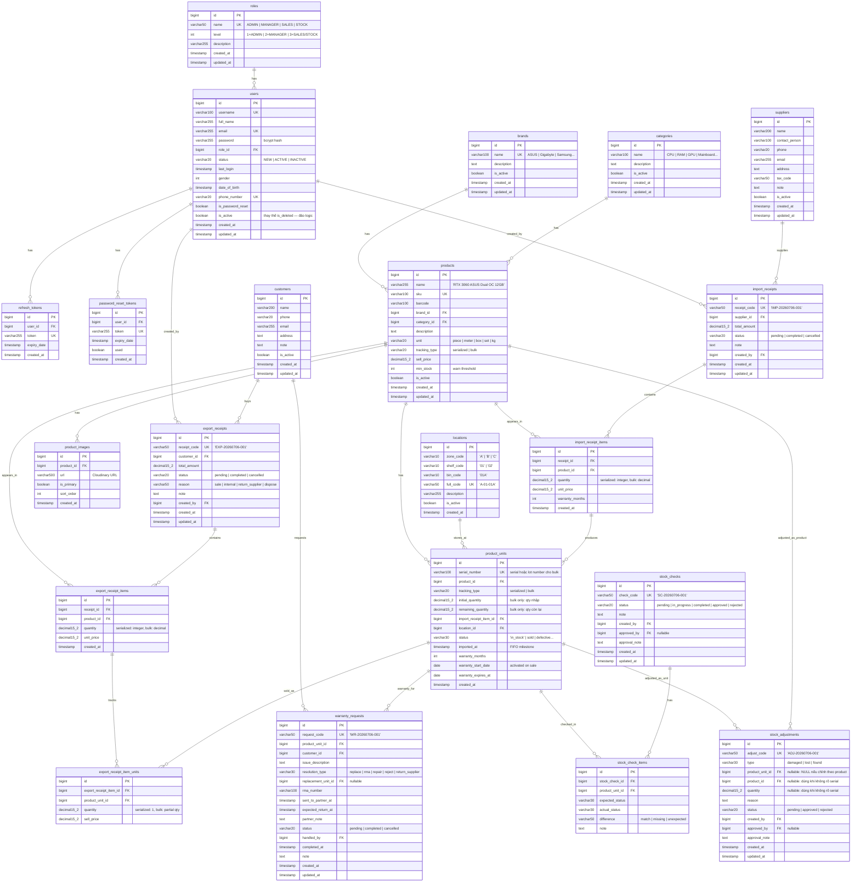

# Domain Model — Hệ thống Quản lý Kho Linh Kiện Máy Tính

> File này là bản copy phần domain từ `plan-du-an-quan-ly-kho.md`, tách riêng để dễ đọc và review.

---

## 1. Entity-Relationship Diagram



---

## 2. State Machine — Trạng thái `product_units`

```
                    ┌──────────────────────────────┐
                    │         in_stock              │
                    └──────┬───────────┬────────────┘
                           │           │
              ┌────────────┼────────────┼───────────────────┐
              │            │            │                   │
              ▼            ▼            ▼                   ▼
           sold      defective    damaged_in_storage      lost
              │            │            │
              │            ├──────────────────┐
              │            ▼                  ▼
              │     returned_to_      sent_to_manufacturer
              │     supplier               │
              │                         ┌──┴──┐
              ▼                         ▼     ▼
          returned                 sold   defective
              │                    (sửa   (không
              └──► in_stock        xong)  sửa được)
              (nếu trả lại kho,
              giữ nguyên
              imported_at gốc)
```

**Quy tắc chuyển trạng thái:**

| Từ                     | Sang                   | Điều kiện/Kích hoạt                                          |
| ---------------------- | ---------------------- | ------------------------------------------------------------ |
| `in_stock`             | `sold`                 | Xuất kho (bán hàng / nội bộ)                                 |
| `in_stock`             | `defective`            | Phát hiện lỗi khi nhập hoặc trong kho                        |
| `in_stock`             | `damaged_in_storage`   | Hỏng trong quá trình lưu kho (điều chỉnh)                    |
| `in_stock`             | `lost`                 | Mất hàng (điều chỉnh tồn, có duyệt)                          |
| `sold`                 | `returned`             | Khách trả hàng                                               |
| `sold`                 | `under_repair`         | Nhận bảo hành — sửa chữa                                     |
| `sold`                 | `sent_to_manufacturer` | Gửi hãng bảo hành (RMA)                                      |
| `under_repair`         | `sold`                 | Sửa xong, trả lại khách                                      |
| `under_repair`         | `defective`            | Không sửa được                                               |
| `sent_to_manufacturer` | `sold`                 | Hãng trả hàng đã sửa xong                                    |
| `sent_to_manufacturer` | `defective`            | Hãng từ chối BH                                              |
| `defective`            | `returned_to_supplier` | Trả nhà cung cấp                                             |
| `returned`             | `in_stock`             | Hàng trả đủ điều kiện nhập lại kho                           |
| `returned`             | `defective`            | Hàng trả bị lỗi                                              |
| `in_stock`             | `removed`              | Hủy phiếu nhập sau khi đã xác nhận (unit chưa từng xuất kho) |

> **`removed` là state cuối (terminal)** — không có transition đi ra khỏi `removed`. Nếu hủy phiếu nhập bị nhấn nhầm, giải pháp là tạo lại phiếu nhập mới, **không** revert `removed → in_stock` (để giữ tính một chiều của hành động hủy, tránh phá vỡ audit trail).
> `removed` **không tính vào tồn kho khả dụng** — loại trừ khỏi công thức COUNT/SUM bên dưới, tương tự `defective`, `lost`, `damaged_in_storage`.

> Tồn kho hiện tại của 1 sản phẩm:
>
> - `serialized`: COUNT `product_units` WHERE `product_id = ?` AND `status = 'in_stock'`
> - `bulk`: SUM `remaining_quantity` của các `product_units` WHERE `product_id = ?` AND `status = 'in_stock'`
>   Nếu query chậm (hàng nghìn serial), thêm cột denormalized `stock_count` trên `products` và cập nhật trigger khi nhập/xuất.

---

## 3. Quyết định kiến trúc

| Vấn đề                  | Quyết định                                                                                                                                                                                                                                 |
| ----------------------- | ------------------------------------------------------------------------------------------------------------------------------------------------------------------------------------------------------------------------------------------ |
| Quản lý tồn kho         | ✅ **Theo serial number** — mỗi sản phẩm vật lý có mã riêng (bảng `product_units`), phục vụ truy vết & bảo hành chi tiết                                                                                                                   |
| Xuất kho                | ✅ **FIFO tự động** — hệ thống tự chọn các `product_units` có `imported_at` sớm nhất để xuất, không cần nhân viên chọn thủ công                                                                                                            |
| Phạm vi kho             | ✅ **Chỉ 1 kho duy nhất** — không cần bảng/khái niệm `warehouse_id`                                                                                                                                                                        |
| Quản lý vị trí kho      | ✅ **Location-based** — mỗi `product_unit` gán 1 vị trí (`location_id`). Khi nhập: chọn vị trí. Khi xuất: FIFO trong cùng vị trí hoặc lấy gần nhau nhất                                                                                    |
| Điều chỉnh tồn thủ công | ✅ Hỗ trợ 3 loại: `damaged`, `lost`, `found` — tất cả đều cần duyệt + lý do + audit log                                                                                                                                                    |
| Ảnh sản phẩm            | ✅ **Nhiều ảnh / sản phẩm (gallery)** — tối đa 5 ảnh, đánh dấu 1 ảnh `is_primary` làm ảnh đại diện                                                                                                                                         |
| Đơn vị tính (UOM)       | ✅ Hỗ trợ: `piece`, `meter`, `box`, `set`, `kg` — mặc định `piece`                                                                                                                                                                         |
| Tracking type           | ✅ **`serialized`** (mỗi đơn vị có serial riêng, tồn = COUNT) hoặc **`bulk`** (tồn = SUM remaining_quantity, dùng cho meter/kg). Mapping bắt buộc: `piece`/`box`/`set` → serialized; `meter`/`kg` → bulk. Nếu sai → reject ở Service layer |
| Tồn âm                  | ✅ **Không cho phép** — mặc định chặn, có thể bật trong cài đặt hệ thống nếu cần                                                                                                                                                           |
| Kiểm kê lệch            | ✅ Chỉ Quản lý kho/Admin mới duyệt được, **bắt buộc nhập lý do**                                                                                                                                                                           |

> **Lưu ý kỹ thuật về FIFO + serial**: vì xuất kho tự động chọn theo `imported_at` sớm nhất, cần đảm bảo:
>
> - Cột `imported_at` trên `product_units` được set chính xác tại thời điểm tạo phiếu nhập (không phải lúc tạo record).
> - Khi tạo phiếu xuất, query `product_units` theo `product_id`, trạng thái `in_stock`, `ORDER BY imported_at ASC LIMIT n`, sau đó cập nhật trạng thái sang `sold` trong cùng transaction để tránh race condition khi nhiều phiếu xuất tạo đồng thời (nên dùng `SELECT ... FOR UPDATE` hoặc optimistic locking).
> - Vì nhập 1 sản phẩm có thể tạo ra nhiều `product_units` cùng lúc (vd nhập 50 RAM), cần sinh 50 serial — serial có thể do nhà sản xuất cung cấp (nhập tay/import file) hoặc hệ thống tự sinh mã nội bộ nếu sản phẩm không có serial gốc (linh kiện rời, phụ kiện...).

---

## 4. Nghiệp vụ chi tiết

### 5.1. Nghiệp vụ Nhập kho

1. **Khởi tạo phiếu nhập**: chọn nhà cung cấp, số hóa đơn/chứng từ tham chiếu (nếu có), ngày nhập.
2. **Thêm sản phẩm vào phiếu**: mỗi dòng gồm sản phẩm, số lượng, đơn giá nhập, **số tháng bảo hành** (`warranty_months`). Phiếu hỗ trợ nhiều dòng sản phẩm khác nhau (form động).
3. **Nhập serial number**: nhập tay, import file Excel/CSV, hoặc quét barcode (nếu có thiết bị). Nếu sản phẩm không có serial gốc, hệ thống tự sinh mã nội bộ duy nhất. Validate: số lượng serial khớp số lượng khai báo, không trùng serial đang tồn tại trong hệ thống. Nếu import file bị lỗi 1 phần (vd 2/100 dòng trùng serial), hệ thống **skip dòng lỗi và nhập các dòng còn lại**, trả về danh sách lỗi cho người dùng.
4. **Gán vị trí**: chọn vị trí (kệ/ngăn) cho từng dòng sản phẩm hoặc cho cả lô. Hệ thống gợi ý vị trí trống hoặc vị trí đã chứa sản phẩm cùng loại.
5. **Upload ảnh** (tùy chọn): gắn ảnh lô hàng/sản phẩm qua Cloudinary.
6. **Xác nhận phiếu nhập** (trong 1 transaction): tạo các `product_units` trạng thái `in_stock`, gắn `imported_at` = thời điểm xác nhận (mốc tính FIFO), gắn `location_id`; lưu phiếu nhập `completed`; ghi audit log.
7. **Sửa serial sau xác nhận** (nếu nhập sai): API riêng cho phép sửa serial của `product_unit` nếu chưa xuất và không trong bảo hành. Ghi audit log (giá trị cũ → mới).
8. **Duyệt** (tùy chọn): có thể thêm bước `pending` → Quản lý kho duyệt → `completed` nếu cần kiểm soát chặt.

### 5.2. Nghiệp vụ Xuất kho

1. **Khởi tạo phiếu xuất**: chọn lý do xuất (bán hàng, xuất nội bộ, trả nhà cung cấp, hủy hàng lỗi); nếu xuất bán, chọn khách hàng từ danh sách `customers` (hoặc tạo mới nếu chưa có).
2. **Thêm sản phẩm cần xuất**: chọn sản phẩm, số lượng; hệ thống kiểm tra tồn kho ngay tại bước này. Nếu tồn không đủ, hệ thống báo số lượng tối đa có thể xuất, nhân viên có thể chọn **xuất partial** (chỉ xuất số lượng có sẵn).
3. **Tự động chọn serial theo FIFO** (ưu tiên hàng nhập trước, gom theo vị trí để giảm di chuyển):
   ```sql
   SELECT * FROM product_units
   WHERE product_id = ? AND status = 'in_stock'
   ORDER BY imported_at ASC
   LIMIT <số lượng cần xuất>
   FOR UPDATE   -- khóa dòng, tránh phiếu khác xuất trùng
   ```
   > **Về gom vị trí:** sort chính luôn là `imported_at ASC` để đảm bảo FIFO. Sau khi có danh sách serial, UI gợi ý nhóm theo `location_id` để nhân viên lấy hàng cùng kệ một lượt, nhưng thứ tự ưu tiên xuất trước vẫn là hàng nhập trước.
   > Danh sách serial được chọn hiển thị cho nhân viên xem trước khi xác nhận.
4. **Xác nhận phiếu xuất** (trong 1 transaction): cập nhật `product_units.status` → `sold`; nếu lý do xuất là bán hàng, set `warranty_start_date` = ngày xuất và tính `warranty_expires_at`; lưu phiếu xuất `completed`; ghi audit log.
5. **Đối chiếu thực tế**: nhân viên lấy hàng theo đúng serial hệ thống đã chọn; cần cơ chế "đổi serial thay thế" trước khi hoàn tất nếu serial thực tế không khớp.

### 5.3. Nghiệp vụ Quản lý bảo hành

1. **Tra cứu bảo hành theo serial**: nhập/quét serial → hiển thị sản phẩm, ngày mua, còn/hết hạn bảo hành, lịch sử xử lý bảo hành trước đó.
2. **Tiếp nhận yêu cầu**: nhân viên nhập serial khách mang tới, hệ thống kiểm tra serial tồn tại và còn hạn bảo hành, ghi nhận mô tả lỗi. Nếu có thể, xác minh khách qua tên/SĐT trong hệ thống.
3. **Tạo phiếu yêu cầu bảo hành** (`warranty_requests`): serial, ngày yêu cầu, mô tả lỗi, trạng thái `pending`.
4. **Quyết định hướng xử lý**:
   - **Đổi mới**: serial cũ chuyển `defective`/`returned_to_supplier`; xuất serial mới trong kho cho khách, **kế thừa thời hạn bảo hành còn lại** của serial cũ (không tính bảo hành mới từ đầu). Hướng này được ưu tiên nếu còn tồn.

   - **Gửi hãng / NCC bảo hành (RMA)**: serial chuyển `sent_to_manufacturer`, lưu `rma_number`, `sent_to_partner_at`, `expected_return_at`. Khi nhận lại từ hãng: nếu sửa được → trả khách (chuyển lại `sold`), nếu không → chuyển `defective` và chọn hướng khác. Thường áp dụng cho linh kiện chính hãng còn bảo hành nhà sản xuất.

   - **Sửa chữa (tự làm hoặc gửi bên thứ 3)**: serial chuyển `under_repair`, không tính vào tồn kho. Nếu cửa hàng có xưởng sửa → sửa xong trả khách. Nếu gửi tiệm sửa ngoài → lưu thông tin đối tác, biên nhận. Kết quả: sửa được → `sold`, không → `defective`.

   - **Từ chối**: hết hạn bảo hành hoặc lỗi do người dùng — ghi rõ lý do.

   - **Trả nhà cung cấp**: nếu lỗi do nhà sản xuất, không sửa được tại chỗ và không có RMA, chuyển `product_unit.status = 'returned_to_supplier'` (transition đã định nghĩa ở mục 2, không cần cột timestamp riêng — nếu sau này cần biết chính xác ngày trả, dùng `updated_at` của `product_unit` hoặc bảng audit log).

5. **Hoàn tất**: cập nhật `warranty_requests.status = completed`, ghi hướng xử lý thực tế, nhân viên xử lý, ngày hoàn tất, ghi audit log.

### 5.4. Nghiệp vụ Điều chỉnh tồn kho thủ công

1. **Phát hiện vấn đề**: nhân viên phát hiện hàng hỏng, mất, hoặc thừa trong kho ngoài luồng kiểm kê.
2. **Tạo phiếu điều chỉnh**: chọn loại (`damaged` — hỏng trong kho, `lost` — mất, `found` — thừa), chọn sản phẩm/serial liên quan, nhập số lượng, mô tả lý do (bắt buộc), upload ảnh minh chứng (tùy chọn).
3. **Xử lý theo từng loại**:
   - `damaged`: chuyển `product_unit.status` → `damaged_in_storage`. Hàng hỏng được cách ly (có thể trả NCC hoặc thanh lý).
   - `lost`: chuyển `product_unit.status` → `lost`. Không thể khôi phục.
   - `found`: nếu serial đã tồn tại trong hệ thống và đang ở trạng thái `lost`/`sold` → kiểm tra đối chiếu. Nếu không có serial → tạo `product_unit` mới với trạng thái `in_stock`, ghi chú nguồn gốc "found during adjustment".
4. **Duyệt**: chỉ Quản lý kho/Admin mới duyệt được. Bắt buộc nhập lý do xác nhận.
5. **Hoàn tất**: cập nhật trạng thái phiếu `approved`/`rejected`, ghi audit log.

---

## 5. Tình huống biên cần xử lý

| Tình huống                                             | Cách xử lý đề xuất                                                                                                                                                                                                                                                                                                             |
| ------------------------------------------------------ | ------------------------------------------------------------------------------------------------------------------------------------------------------------------------------------------------------------------------------------------------------------------------------------------------------------------------------ |
| Hủy phiếu nhập sau khi đã xác nhận                     | Đánh dấu phiếu `cancelled`, set `product_units` liên quan sang `removed` (không xóa cứng)                                                                                                                                                                                                                                      |
| Hủy phiếu xuất sau khi đã xác nhận                     | Set lại `product_units` về `in_stock`, giữ nguyên `imported_at` gốc để không phá vỡ thứ tự FIFO                                                                                                                                                                                                                                |
| Trả hàng từ khách                                      | Tạo `product_units` mới (`in_stock`, `imported_at` = ngày trả) hoặc khôi phục serial cũ nếu xác minh hàng còn nguyên                                                                                                                                                                                                           |
| Sản phẩm lỗi phát hiện khi nhập                        | Set trạng thái `defective`, không tính vào tồn kho khả dụng nhưng vẫn hiển thị trong báo cáo                                                                                                                                                                                                                                   |
| Nhiều phiếu xuất tranh chấp serial cuối cùng           | Dùng `SELECT ... FOR UPDATE` trong transaction để đảm bảo chỉ 1 phiếu lấy được serial đó                                                                                                                                                                                                                                       |
| Đổi hàng bảo hành nhưng không còn tồn serial cùng loại | Giữ `pending` chờ nhập thêm hàng, hoặc chuyển sang gửi hãng (RMA) / từ chối                                                                                                                                                                                                                                                    |
| Serial đổi mới (replacement) lại tiếp tục lỗi          | Tra theo `replacement_unit_id` để thấy chuỗi lịch sử đổi trả, tránh đổi vòng lặp không kiểm soát                                                                                                                                                                                                                               |
| Bảo hành hết hạn nhưng khách yêu cầu hỗ trợ thiện chí  | Vẫn tạo `warranty_request` nhưng `resolution_type = reject` kèm ghi chú                                                                                                                                                                                                                                                        |
| Gửi hãng RMA bị mất/hư trong vận chuyển                | Ghi nhận trên `warranty_request`, chuyển `product_unit.status` → `lost`. Cửa hàng chịu trách nhiệm đền cho khách                                                                                                                                                                                                               |
| Hãng trả RMA nhưng lỗi cũ vẫn còn                      | Chấp nhận hoặc gửi lại lần 2 (re-RMA). Ghi chú số lần gửi trên `warranty_request`                                                                                                                                                                                                                                              |
| Nhập sai serial sau xác nhận                           | API sửa serial riêng, chỉ cho sửa nếu `product_unit` chưa xuất và không trong bảo hành. Ghi audit log (cũ → mới)                                                                                                                                                                                                               |
| Xuất không đủ hàng (partial)                           | Hệ thống báo số lượng tối đa có thể xuất, nhân viên chọn giảm số lượng hoặc hủy dòng. Không cho phép tồn âm                                                                                                                                                                                                                    |
| Hàng hỏng trong quá trình lưu kho                      | Tạo phiếu điều chỉnh loại `damaged` → chuyển `product_unit.status` → `damaged_in_storage`, cách ly hàng hỏng                                                                                                                                                                                                                   |
| Kiểm kê phát hiện hàng thừa                            | Nếu có serial cụ thể → tạo `product_unit` mới, ghi chú `found during stock check`. Nếu không rõ serial → tạo bản ghi tổng, chờ xử lý sau                                                                                                                                                                                       |
| Import serial file lỗi 1 phần                          | Skip dòng lỗi (trùng/định dạng sai), nhập các dòng còn lại. Trả về danh sách lỗi chi tiết cho người dùng                                                                                                                                                                                                                       |
| Ký tự serial gây nhầm lẫn                              | Khi tra cứu bảo hành, hỗ trợ tìm gần đúng: O/0, I/l. Hoặc chuẩn hóa đầu vào (vd loại bỏ ký tự đặc biệt)                                                                                                                                                                                                                        |
| Khách mất hóa đơn/không nhớ SĐT                        | Tra cứu theo serial, yêu cầu xác minh qua thông tin bổ sung (tên khách hàng, ngày mua gần đúng)                                                                                                                                                                                                                                |
| Cho phép tồn âm?                                       | Mặc định **không**, có thể bật trong cài đặt hệ thống dành cho trường hợp xuất trước nhập sau đặc biệt                                                                                                                                                                                                                         |
| Hàng tồn lâu (dead stock)                              | Tự động gắn nhãn sản phẩm tồn kho > 90 ngày (tham số cấu hình). Hiển thị cảnh báo trên dashboard                                                                                                                                                                                                                               |
| Cập nhật đơn giá nhập sau xác nhận                     | Không cho phép sửa giá sau khi đã xác nhận phiếu nhập. Nếu cần, tạo phiếu điều chỉnh giá riêng (có duyệt, ghi audit log)                                                                                                                                                                                                       |
| Xuất theo UOM meter (bán lẻ)                           | Ví dụ cáp mạng nhập 1 cuộn = 100 mét. Khi xuất 1.5m, cần cơ chế: traditional UOM (cuộn) không bán lẻ, hoặc quy đổi ra sub-unit (mét). Giải pháp: sản phẩm dạng meter có `unit = meter` + `tracking_type = bulk`, số lượng nhập là tổng mét, tồn kho = SUM(remaining_quantity), khi xuất cho phép số thập phân (xem 7.1 và 7.8) |
| Hủy phiếu xuất đã kích hoạt bảo hành                   | Khi hủy, ngoài việc set lại `product_units.status = in_stock`, cần reset `warranty_start_date = NULL` và `warranty_expires_at = NULL` để không tính bảo hành cho khoảng thời gian đã xuất                                                                                                                                      |

---

## 6. Phân quyền chi tiết

| Chức năng                        | Admin     | Quản lý kho     | Nhân viên          |
| -------------------------------- | --------- | --------------- | ------------------ |
| Quản lý người dùng               | ✅ CRUD   | ❌              | ❌                 |
| Xem audit log                    | ✅ Tất cả | ✅ Kho của mình | ❌                 |
| CRUD danh mục (SP, DM, NCC)      | ✅        | ✅              | ❌                 |
| Quản lý vị trí kho               | ✅        | ✅              | ❌                 |
| Quản lý khách hàng               | ✅        | ✅              | ✅ Xem + thêm      |
| Tạo phiếu nhập                   | ✅        | ✅              | ✅                 |
| Duyệt phiếu nhập (nếu cần)       | ✅        | ✅              | ❌                 |
| Sửa serial sau nhập              | ✅        | ✅              | ❌                 |
| Tạo phiếu xuất                   | ✅        | ✅              | ✅                 |
| Hủy phiếu nhập/xuất              | ✅        | ✅              | ❌                 |
| Xem tồn kho                      | ✅        | ✅              | ✅                 |
| Điều chỉnh min_stock             | ✅        | ✅              | ❌                 |
| Tạo phiếu kiểm kê                | ✅        | ✅              | ✅                 |
| Duyệt kiểm kê lệch               | ✅        | ✅              | ❌                 |
| Điều chỉnh tồn thủ công          | ✅        | ✅ Tạo + duyệt  | ✅ Tạo (cần duyệt) |
| Tra cứu bảo hành                 | ✅        | ✅              | ✅                 |
| Xử lý bảo hành (đổi/sửa/từ chối) | ✅        | ✅              | ❌                 |
| Dashboard & Báo cáo              | ✅        | ✅              | ❌                 |

---

## 7. Domain Review — Known Issues & Improvements

> Phân tích các vấn đề thiết kế hiện tại và đề xuất giải pháp.

### 7.1. Mâu thuẫn tracking: Serial number vs. Bulk (UOM meter)

**Vấn đề:** `product_units.serial_number VARCHAR(100) NOT NULL UNIQUE` — mỗi row = 1 vật phẩm vật lý. Với UOM = "meter" (cáp mạng nhập 1 cuộn 100m, xuất lẻ 1.5m), không thể gán 1 serial cho 1.5m.

**Root cause:** `products.unit` hỗ trợ `meter` nhưng cơ chế tồn kho = COUNT rows, không áp dụng được cho số thập phân liên tục.

**Giải pháp — Thêm `tracking_type` vào `products` + `product_units`:**

Tất cả domain tables chưa tồn tại (chưa tạo migration), nên các thay đổi được tích hợp thẳng vào CREATE TABLE:

```sql
-- products: thêm tracking_type
CREATE TABLE products (
    ...
    unit            VARCHAR(20) NOT NULL DEFAULT 'piece',
    tracking_type   VARCHAR(20) NOT NULL DEFAULT 'serialized' COMMENT 'serialized | bulk',
    sell_price      DECIMAL(15,2) NOT NULL DEFAULT 0,
    ...
);

-- product_units: tracking_type + initial/remaining_quantity, KHÔNG có export_receipt_item_id
CREATE TABLE product_units (
    ...
    serial_number           VARCHAR(100) NOT NULL,
    product_id              BIGINT NOT NULL,
    tracking_type           VARCHAR(20) NOT NULL DEFAULT 'serialized',
    initial_quantity        DECIMAL(15,2) NULL COMMENT 'bulk only',
    remaining_quantity      DECIMAL(15,2) NULL COMMENT 'bulk only',
    ...
    CONSTRAINT ck_pu_bulk_fields CHECK (
        (tracking_type = 'serialized' AND initial_quantity IS NULL AND remaining_quantity IS NULL)
        OR
        (tracking_type = 'bulk' AND initial_quantity IS NOT NULL AND remaining_quantity IS NOT NULL)
    )
);

-- export_receipt_item_units: thêm quantity
CREATE TABLE export_receipt_item_units (
    ...
    quantity  DECIMAL(15,2) NOT NULL DEFAULT 1.00,
    ...
);
```

**Luồng nhập:**

- `serialized`: sinh 1 `product_unit` / serial → COUNT để tính tồn
- `bulk`: tạo 1 `product_unit` với `serial_number = LOT-{receipt_code}-{line_no}`, `initial_quantity = remaining_quantity = 100`, `tracking_type = 'bulk'`

**Luồng xuất (FIFO cho bulk):**

```sql
SELECT * FROM product_units
WHERE product_id = ?
  AND ((tracking_type = 'serialized' AND status = 'in_stock')
    OR (tracking_type = 'bulk' AND status = 'in_stock' AND remaining_quantity > 0))
ORDER BY imported_at ASC
LIMIT <n>
FOR UPDATE
```

- Nếu row bulk và `remaining_quantity > qty_xuất`: trừ `remaining_quantity`, không chuyển status.
- Nếu row bulk và `remaining_quantity = qty_xuất`: set `status = 'sold'`.
- Tổng tồn = SUM `remaining_quantity` (bulk) + COUNT id (serialized).

> **Ghi chú về CHECK constraint:** MySQL không hỗ trợ subquery trong CHECK constraint, nên không thể enforce "serialized → quantity phải integer" ở DB bằng cách JOIN với `products.tracking_type`. Giải pháp: validate tại Service layer Java (kiểm tra `product.trackingType` trước khi insert). DB chỉ có `quantity > 0`.

### 7.2. Audit Log — Schema và danh sách hành động

**Vấn đề:** ERD không có bảng `audit_logs`, nhưng hầu hết nghiệp vụ (mục 4) đều yêu cầu "ghi audit log".

**Giải pháp — Schema (bảng đã được tạo ở V2, schema dưới đây để tham chiếu):**

```sql
CREATE TABLE audit_logs (
    id          BIGINT AUTO_INCREMENT,
    user_id     BIGINT,
    username    VARCHAR(100),
    ip_address  VARCHAR(45),
    request_id  VARCHAR(36),
    action      VARCHAR(100) NOT NULL,
    entity_name VARCHAR(100) NOT NULL,     -- V2 dùng entity_name (khác entity_type trong doc này)
    entity_id   VARCHAR(100),
    old_value   JSON,
    new_value   JSON,
    status      VARCHAR(20) NOT NULL DEFAULT 'SUCCESS',
    error_msg   TEXT,
    created_at  TIMESTAMP NOT NULL DEFAULT CURRENT_TIMESTAMP,
    ...
);
```

> Lưu ý: V2 thực tế dùng `entity_name` thay vì `entity_type` (cosmetic, không ảnh hưởng logic). Không có cột `description` trong V2 — có thể thêm sau nếu cần.

**Danh sách bắt buộc ghi audit log theo nghiệp vụ:**

| #   | Hành động                 | entity_type      | old_value        | new_value                    |
| --- | ------------------------- | ---------------- | ---------------- | ---------------------------- |
| 1   | Nhập kho (completed)      | IMPORT_RECEIPT   | null             | JSON phiếu + items + serials |
| 2   | Sửa serial sau nhập       | PRODUCT_UNIT     | serial cũ        | serial mới                   |
| 3   | Duyệt phiếu nhập          | IMPORT_RECEIPT   | status=pending   | status=completed             |
| 4   | Xuất kho (completed)      | EXPORT_RECEIPT   | null             | JSON phiếu + items + serials |
| 5   | Hủy phiếu nhập            | IMPORT_RECEIPT   | status=completed | status=cancelled             |
| 6   | Hủy phiếu xuất            | EXPORT_RECEIPT   | status=completed | status=cancelled             |
| 7   | Điều chỉnh tồn (approved) | STOCK_ADJUSTMENT | status=pending   | status=approved              |
| 8   | Kiểm kê (approved)        | STOCK_CHECK      | null             | diff summary                 |
| 9   | Bảo hành (hoàn tất)       | WARRANTY_REQUEST | trạng thái cũ    | resolution + serial thay đổi |
| 10  | Đổi role user             | USER             | role cũ          | role mới                     |
| 11  | Khóa/mở user              | USER             | is_active cũ     | is_active mới                |
| 12  | User đổi password         | USER             | null             | null                         |
| 13  | Admin reset password      | USER             | null             | null                         |
| 14  | Đăng nhập thất bại        | AUTH             | -                | - (optional)                 |

### 7.3. `stock_adjustments.product_unit_id` nullable + fallback

**Vấn đề:** Edge case "found không rõ serial" (mục 5) yêu cầu tạo bản ghi tổng chờ xử lý, nhưng `product_unit_id` là FK NOT NULL.

**Giải pháp — Cho NULL + thêm cột fallback (tích hợp vào CREATE TABLE):**

```sql
CREATE TABLE stock_adjustments (
    ...
    type            VARCHAR(30) NOT NULL COMMENT 'damaged | lost | found',
    product_unit_id BIGINT NULL COMMENT 'NULL nếu chỉnh theo product',
    product_id      BIGINT NULL COMMENT 'dùng khi không rõ serial',
    quantity        DECIMAL(15,2) NULL COMMENT 'dùng khi không rõ serial',
    ...
    CONSTRAINT fk_sa_unit    FOREIGN KEY (product_unit_id) REFERENCES product_units(id),
    CONSTRAINT fk_sa_product FOREIGN KEY (product_id) REFERENCES products(id),
    CONSTRAINT ck_sa_source CHECK (
        product_unit_id IS NOT NULL
        OR (product_id IS NOT NULL AND quantity IS NOT NULL)
    )
);
```

CHECK constraint đảm bảo: một adjustment phải reference **ít nhất 1** trong 2 cách. `quantity` là DECIMAL(15,2) để hỗ trợ bulk (vd found 1.5m cáp).

### 7.4. Trùng lặp FK: `product_units.export_receipt_item_id` vs `export_receipt_item_units`

**Vấn đề:** ERD cũ có cả FK trực tiếp trên `product_units` và bảng join `export_receipt_item_units` đều ghi quan hệ export ↔ unit. Rủi ro lệch dữ liệu.

**Giải pháp — Chỉ giữ `export_receipt_item_units`, bỏ `export_receipt_item_id` khỏi `product_units`:**

Vì `product_units` chưa tồn tại, chỉ cần **không include** cột `export_receipt_item_id` trong CREATE TABLE:

```sql
CREATE TABLE product_units (
    ...
    -- KHÔNG có export_receipt_item_id
    ...
);

-- Query thay thế: JOIN qua export_receipt_item_units
SELECT pu.* FROM product_units pu
JOIN export_receipt_item_units eriu ON eriu.product_unit_id = pu.id
WHERE eriu.export_receipt_item_id = ?;
```

### 7.5. Warranty Inheritance khi đổi serial

**Vấn đề:** Nghiệp vụ yêu cầu "kế thừa thời hạn BH còn lại" của serial cũ, nhưng `warranty_months` của serial mới có thể khác.

**Quy tắc:**

1. `warranty_months` = metadata gốc của unit (theo lô nhập) — không đổi.
2. `warranty_expires_at` = hạn BH thực tế — **copy cứng từ serial cũ khi đổi**.
3. `warranty_start_date` của serial mới = ngày đổi (tracking mốc).
4. Hiển thị: "Còn BH đến: `warranty_expires_at`" + "Chính sách gốc: `warranty_months` tháng".

### 7.6. Soft-delete không nhất quán

**Vấn đề:** users dùng `is_deleted`, products/locations dùng `is_active`, suppliers/brands/categories/customers không có cờ.

**Giải pháp — Đồng bộ `is_active` cho tất cả domain entities:**

`users` là bảng duy nhất đã tồn tại (V1) và đang dùng `is_deleted`:

```sql
-- users: migration ALTER TABLE (V4)
ALTER TABLE users ADD COLUMN is_active BOOLEAN NOT NULL DEFAULT TRUE AFTER status;
UPDATE users SET is_active = NOT is_deleted;

-- Verify trước khi drop: phải trả về 0 row lệch
SELECT COUNT(*) FROM users WHERE is_active = is_deleted;

ALTER TABLE users DROP COLUMN is_deleted;
```

> **Ranh giới `status` vs `is_active` trên `users` — bắt buộc phân biệt rõ để tránh code nhầm:**
>
> - `status` (`NEW | ACTIVE | INACTIVE`): trạng thái **workflow onboarding** — `NEW` = tài khoản mới tạo, chưa từng đăng nhập/đổi password lần đầu; chuyển `ACTIVE` sau khi user hoàn tất setup. Không dùng `status` để biểu diễn việc khóa/mở tài khoản.
> - `is_active`: cờ **bật/tắt truy cập** — Admin dùng để khóa/mở user bất kỳ lúc nào, độc lập với `status`.
> - Hệ quả: hành động "Khóa/mở user" trong audit log (mục 7.2, #11) phải ghi nhận thay đổi trên cột `is_active`, **không phải** `status`. Service layer khi khóa user chỉ toggle `is_active`, tuyệt đối không đụng vào `status`.

Các bảng domain khác (chưa tồn tại) — thêm `is_active BOOLEAN NOT NULL DEFAULT TRUE` vào CREATE TABLE:

```sql
CREATE TABLE suppliers ( ..., is_active BOOLEAN NOT NULL DEFAULT TRUE, ... );
CREATE TABLE brands ( ..., is_active BOOLEAN NOT NULL DEFAULT TRUE, ... );
CREATE TABLE categories ( ..., is_active BOOLEAN NOT NULL DEFAULT TRUE, ... );
CREATE TABLE customers ( ..., is_active BOOLEAN NOT NULL DEFAULT TRUE, ... );
```

`products` và `locations` đã có `is_active` trong ERD, giữ nguyên.

### 7.7. Transaction & Audit Log

**Vấn đề:** Audit log không được ảnh hưởng main transaction (không rollback lẫn nhau, không tạo race condition).

**Giải pháp (refactor `AuditLogAspect`):**

- **SUCCESS case**: `TransactionSynchronizationManager.registerSynchronization()` với `afterCommit()` callback — chạy sau khi main transaction commit thành công, **không thể xảy ra phantom log** (log ghi SUCCESS nhưng main rollback). Nếu không có transaction active, save synchronously.
- **FAILED case**: `@Async @Transactional(propagation = REQUIRES_NEW)` — gọi trước khi rethrow exception. Sub-transaction commit độc lập, không bị cuốn theo rollback của main.
- **Khi chính audit log bị lỗi**: swallow exception + log ra file fallback — **không fail request chính**.
- **Thứ tự log**: afterCommit chạy trên cùng thread → FIFO tự nhiên. Không cần sequence_number.

```java
@Around("@annotation(auditLog)")
public Object logExecution(ProceedingJoinPoint pjp, AuditLog auditLog) throws Throwable {
    String oldValue = captureOldValue(pjp, auditLog);
    try {
        Object result = pjp.proceed();
        if (TransactionSynchronizationManager.isActualTransactionActive()) {
            TransactionSynchronizationManager.registerSynchronization(
                new TransactionSynchronization() {
                    @Override public void afterCommit() {
                        try { auditLogService.saveLog(... SUCCESS ...); }
                        catch (Exception ex) { log.error("Audit log sau commit thất bại", ex); }
                    }
                });
        } else {
            auditLogService.saveLog(... SUCCESS ...);
        }
        return result;
    } catch (Throwable e) {
        auditLogService.saveFailedLog(... FAILED ...);  // @Async + REQUIRES_NEW
        throw e;
    }
}
```

### 7.8. Unit ↔ Tracking Type mapping rule

**Vấn đề:** Không có ràng buộc giữa `products.unit` và `products.tracking_type` — có thể tạo sản phẩm `unit='meter'` nhưng `tracking_type='serialized'`, dẫn đến tồn kho tính sai.

**Quy tắc mapping cứng:**

| `unit`  | `tracking_type` | Ví dụ                            |
| ------- | --------------- | -------------------------------- |
| `piece` | `serialized`    | CPU, RAM, mainboard              |
| `box`   | `serialized`    | Hộp linh kiện (mỗi hộp 1 serial) |
| `set`   | `serialized`    | Combo bàn phím + chuột           |
| `meter` | `bulk`          | Cáp mạng, dây điện               |
| `kg`    | `bulk`          | Hàn thiếc, hóa chất              |

**Enforce ở Service layer** — MySQL không thể cross-table CHECK:

```java
// ProductService.java — gọi khi create/update product
private void validateUnitTrackingType(Product product) {
    boolean requiresBulk = List.of("meter", "kg").contains(product.getUnit());
    boolean requiresSerialized = List.of("piece", "box", "set").contains(product.getUnit());

    if (requiresBulk && product.getTrackingType() == TrackingType.SERIALIZED) {
        throw new InvalidRequestException(
            "Sản phẩm đơn vị " + product.getUnit() + " bắt buộc tracking_type = bulk");
    }
    if (requiresSerialized && product.getTrackingType() == TrackingType.BULK) {
        throw new InvalidRequestException(
            "Sản phẩm đơn vị " + product.getUnit() + " bắt buộc tracking_type = serialized");
    }
}
```

**Lưu ý:** Khi thêm UOM mới trong tương lai, phải cập nhật cả mapping này và các service xuất/nhập/kiểm kê có logic phân nhánh theo tracking_type.
